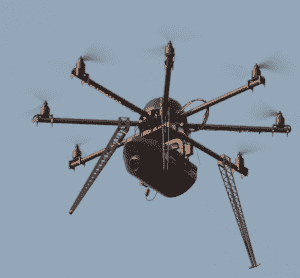

# 无人机如何改变我们的世界

> 原文：<https://thenewstack.io/adapting-drones-uavs-changing-world/>

来源:维基百科

本月见证了一批关于无人机如何改变我们世界的新故事。有充满希望的可能性，也有令人不安的警告，每一个都展示了颠覆性技术的真实面貌。与此同时，超过一百万的无人机爱好者正在幸福地享受这种新的神奇的会飞的机器。这一切都传达了一个明确无误的信息:我们仍在学习如何生活在一个充满无人机的世界里。

据《国际商业时报》报道，上周，我们了解到无人机可以在印度用于运输器官。肝脏、心脏和其他重要器官将被运送到头顶，穿过城镇，同时保存在一个特殊的盒子里——甚至可能在无人机本身的体内。

来自孟加拉国国家设计和研究论坛的一组工程师计划首先专注于移植心脏，因为其他器官可以保存更长时间。目前，它的团队正在最终确定医生和工程师的规范，随后(希望)由政府资助。研究人员表示，无人机送货将减少 50%以上的运输时间，节省关键的几分钟，最终还会拯救更多的生命。最大的困难可能只是达到适当的范围——超过 60 英里。

与此同时，加拿大广播公司上周报道称[两架无人驾驶飞机在不列颠哥伦比亚省的巨大野火](http://www.cbc.ca/news/canada/british-columbia/drones-reportedly-spotted-near-two-large-b-c-wildfires-1.3572267)附近被发现。它让读者想起了去年 8 月的一起事件，据报道，无人机[阻碍了消防工作](http://www.cbc.ca/news/canada/british-columbia/drone-operators-blast-irresponsible-and-selfish-flight-that-grounded-firefighters-1.3193540)，八架直升机和五架消防飞机在地面上停留了三个多小时，因为担心在火焰上空与一架娱乐无人机相撞。

虽然加拿大的无人机飞行员不需要执照，但加拿大广播公司指出，联邦法规禁止在野火附近使用无人机，最高罚款 25000 美元和 18 个月监禁。

不列颠哥伦比亚省总理去年 8 月宣布，“我想请所有拥有无人机的人保持停飞，因为你在上面时，我们无法灭火。”这篇文章让读者想起了 2015 年 8 月的一起事件，另一架消防直升机也因为一架无人机而停飞。“我们想强调的事实是，这是非法的，”消防信息官员梅利莎·克拉森告诉加拿大广播公司。

但就在同一天，路透社报道称，[无人机将在大火](http://www.reuters.com/article/us-canada-wildfire-drones-idUSKCN0XY0LK)后*投入使用，以精确定位起火点——使用“与业余爱好者使用的无人机大小相同”的无人机据路透社报道，无人机配备了特殊的红外和紫外摄像机，其照片将用于重建距离火源 30 英尺以内的火灾路径细节，在这种情况下，直升机叶片的下降气流会干扰地面上的证据。*

新闻服务指出，这些无人机的飞行将“与其他空中交通协调，包括空中加油机和直升机。”

但有些人在别人的问题中看到了商机。一家名为 DeTect 的公司计划通过发布一款名为 DroneWatcher 的免费众包应用来监控天空中的无人机控制无线电信号。它的用户将通过智能手机中的 wifi 接收器被动地收集数据，然后这些数据将被自动转发给安全官员——例如，在体育场活动或机场。

“虽然基于 Android 的应用程序是免费的，但开发者将从音乐会、体育场馆和机场的组织者那里获得报酬，以访问众包数据……”路透社报道称，并补充道，“如果有足够的用户，DroneWatcher 可能是朝着正确方向迈出的一步。”

这份报告也有自己的提醒，提醒人们过去行为恶劣的无人机的例子。10 月，一架无人机穿越土耳其与叙利亚的边境，促使出动战机将其击落。2014 年，一架携带国旗的无人机干扰了塞尔维亚的一场国际足球比赛，引发了球员和球迷之间的争吵，此后比赛从未结束。

但是无人机可能会变得更成问题。上周，堪萨斯州通过了新的立法，将反跟踪法扩展到无人机领域。该州对“骚扰”的定义进行了更新，包括用遥控无人机监视他人——显然是为了回应一名妇女在[与邻居](http://fox4kc.com/2016/04/29/olathe-womans-push-to-change-drone-law-a-signature-away-from-victory/)的经历。无人机有望最终成为[数十亿美元的产业](http://www.businesswire.com/news/home/20160425006334/en/Global-Drones-Commercial-Applications-Report---Small)。管理这项技术的新法规可能是不可避免的。

下一个无人机技术可能开始进入军事演习领域。美国海军刚刚为他们的一艘超级航母[配备了一个新的无人机控制室](http://www.popsci.com/navy-puts-first-drone-command-on-an-aircraft-carrier)。最近，一名荷兰活动家在《新闻周刊》上撰文指出，无人机已经被用于伊拉克、叙利亚、加沙和乌克兰的武装冲突，主要用于瞄准火炮和迫击炮。Wim Zwijnenburg(来自裁军组织 PAX)分享了一个来自《海军陆战队时报》的故事，暗示 ISIS [已经拥有了自己的监视无人机](http://www.marinecorpstimes.com/story/military/tech/2016/04/17/islamic-state-drones-target-american-coalition-forces/83096864/)，并警告说，假设有“几十架配备炸药或化学品的无人机”的群体场景。他的结论？是时候进行“关于如何应对技术的严肃对话”了。

与此同时，在密歇根州，一名监狱报告称一架价值 14 美元的无人机飞过他们的墙壁——一个[忍者神龟直升机球](http://www.freep.com/story/news/local/michigan/2016/04/28/drone-jackson-michigan-prison/83665338/)。

专题图片:忍者神龟合力球。

<svg xmlns:xlink="http://www.w3.org/1999/xlink" viewBox="0 0 68 31" version="1.1"><title>Group</title> <desc>Created with Sketch.</desc></svg>