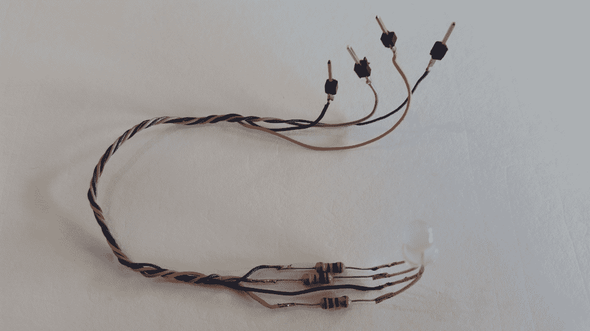

# 向您的项目添加基本的 LED 视觉界面

> 原文：<https://thenewstack.io/add-basic-visual-interface-data-hub/>

亚马逊 Echo Dot 本周到货。它在我的桌子上找到了一个舒适的位置，紧挨着我建造的 [Mosquitto Under Glass MQTT 数据中心](https://thenewstack.io/off-shelf-hacker-mosquitto-glass/)。但是我有具体的[现成的黑客](/tag/off-the-shelf-hacker/)订购点的原因。

首先，我想学习“语音驱动”技术。我们拥有台式机和笔记本电脑已经有几十年了。为什么我们不和我们的电脑说话呢？这个圆点是一台电脑。它有 WiFi、安全、音频处理、可视界面、网络服务器等等，所有这些都被楔入一个漂亮的 50 美元的冰球形状的小包装中。它是如何工作的？为什么我们对着圆点说话，而不是我们的 Linux 笔记本？

另一个原因是研究接口。接口是现成的黑客物理计算堆栈工具箱中不可或缺的一部分。Dot 的主要界面是通过麦克风/扬声器进行语音识别和回复。它还可以通过一个网络界面进行交流，这个界面可以在附近的笔记本电脑或超级手机上使用。

[](https://www.amazon.com/gp/product/B01DFKC2SO/ref=as_li_qf_sp_asin_il_tl?ie=UTF8&tag=the0757-20&camp=1789&creative=9325&linkCode=as2&creativeASIN=B01DFKC2SO&linkId=38fcd12a883e1339d5e9c036a63b09d4)

而且，亚马逊 Echo Dot 光环很迷人。它是多种颜色的，当圆点做它的事情时，小光绕着圆环运行的方式有不同的含义。最重要的是，我想知道如何在我自己的物理计算原型项目中使用 Dot 的各种接口模型。

## **连接硬件**

我想我应该从简单开始。让我们从圆点中汲取灵感，探索如何将简单的三色 LED 与 [Mosquitto Under Glass 数据中枢](https://thenewstack.io/off-shelf-hacker-mosquitto-glass/)配合使用。我们已经有了 MQTT 代理和订阅/发布部分。LED 连接虚拟和视觉。

给芯片供电的数据中枢添加一个三色 LED 非常简单。

有两种类型的 4 线三色 led。公共阳极和公共阴极。一条引线是公共的，其他三条连接到红色、绿色和蓝色元素。我用的是普通的阴极。

当连接到微控制器上的引脚时，应该始终为每个 LED 使用限流电阻。在 3.3 伏电压下，芯片可以安全地处理通过每个引脚的约 25 毫安的电流。使用 100 欧姆的电阻，我们可以将电流限制在 20 mA 左右。每个微控制器可以处理不同的电流和电压，具体取决于它们的规格。

在这个练习中，我简单地在 LED 的每个引脚上焊接了一个电阻。电阻器的另一端连接到一个公连接器引脚，使用 24 号线插入芯片的母通用输入/输出(GPIO)插头。

下图显示了 LED、电阻和引脚的细节。注意电线的颜色。黑色是常见的。蓝色对应于蓝色 LED 元件。可悲的是，我手边没有任何红色或绿色的电线，所以我用橙色代替红色，用灰色代替绿色。这是一种比喻。



电阻器、插头引脚和三色 LED。

公共端插入内部右侧芯片接头上的 VCC-3.3 V 引脚。蓝去了 XIO-P0 槽。同样，橙色的电线连接到西欧-P2，灰色的连接到西欧-P4。

我暂时将电线缠绕在芯片支撑框架的上部黄铜横梁上，并将很快建立一个装饰支架，以将 LED 固定在电路板上方。

## **Python 的灵活性**

MQTT/芯片数据集线器的主要功能是从边缘设备来回传递消息。由于 Mosquitto Under Glass 设备位于我的桌子上，它的第二个功能是让我看到周围发生的各种物理事件，就像点一样。

例如，如果有人来到前门，数据集线器上的红色 LED 闪烁会很有用。或者，如果车库里的湿度传感器检测到热水器漏水，我们可以点亮红色 LED。这种功能有很多用途。别忘了我们使用的是三色 LED，所以我们不仅仅局限于一种颜色。

下面的 Python 代码展示了如何使用来自 MQTT 代理的消息打开和关闭 led。实际上，代理和程序运行在芯片本身上。如果您有另一个芯片或 Raspberry Pi，您也可以点亮这些设备上的 led，只需在芯片数据中心订阅“mqtt”主题。在这里获得关于泛美卫生组织图书馆和例子[的信息。](https://eclipse.org/paho/clients/python/) 

```
#!/usr/bin/python
import CHIP_IO.GPIO as GPIO
import paho.mqtt.client as mqtt
GPIO.setup("XIO-P0",  GPIO.OUT)
GPIO.setup("XIO-P2",  GPIO.OUT)
GPIO.setup("XIO-P4",  GPIO.OUT)
GPIO.output("XIO-P0",GPIO.HIGH)  #HIGH actually turns LED off since operating as current sink
GPIO.output("XIO-P2",GPIO.HIGH)  
GPIO.output("XIO-P4",GPIO.HIGH)

# The callback for when the client receives a CONNACK response from the server.
def on_connect(client,  userdata,  rc):
    # print("Connected with result code "+str(rc))
    # Subscribing in on_connect() means that if we lose the connection and
    # reconnect then subscriptions will be renewed.
    client.subscribe("mqtt")

# The callback for when a PUBLISH message is received from the server.
def on_message(client,  userdata,  msg):
    # print(msg.topic+" "+str(msg.payload))
    if str(msg.payload)  ==  "b-on":
 GPIO.output("XIO-P0",GPIO.LOW)
    elif str(msg.payload)  ==  "b-off":
 GPIO.output("XIO-P0",GPIO.HIGH)
    elif str(msg.payload)  ==  "r-on":
 GPIO.output("XIO-P2",GPIO.LOW)
    elif str(msg.payload)  ==  "r-off":
 GPIO.output("XIO-P2",GPIO.HIGH)
    elif str(msg.payload)  ==  "g-on":
 GPIO.output("XIO-P4",GPIO.LOW)
    elif str(msg.payload)  ==  "g-off":
 GPIO.output("XIO-P4",GPIO.HIGH)
    else:
 print(msg.payload)

client  =  mqtt.Client()
client.on_connect  =  on_connect
client.on_message  =  on_message

client.connect("172.20.0.1",  1883,  60)

# Blocking call that processes network traffic, dispatches callbacks and
# handles reconnecting.
# Other loop*() functions are available that give a threaded interface and a
# manual interface.
client.loop_forever()

```

注意，在通常的库导入和初始化之后，我们将三个输出引脚(XIO-P0 到 XIO-P4)设置为“高”这可确保 led 关闭。输出引脚的吸电流模式实际上相当于微控制器引脚和地之间的开关。我们通常认为输出引脚能够在器件开启时向其提供电流。像芯片这样的许多微控制器通常只能提供几十微安范围的电流作为“供电”输出。即使是 led(大约 20 mA)也会从引脚吸取过多的电流。

解决这个问题的方法是在电流吸收器配置中连接 LED。LED 的一端通过 100 欧姆电阻连接到 3.3 伏电压，另一端连接到输出引脚。当引脚为“高”时，它实际上具有高电阻，LED 关闭。将输出切换到“低”或低电阻，LED 亮起。吸电流模式(片内)可以处理大约 25 mA 的电流。我们的 led 在 3.3 伏电压下消耗的电流不到 20 毫安，因此一切运行无忧。

我还使用了一个简单的 IF-ELIF 结构来匹配 MQTT subscribe 语句的输入。随着程序变得越来越复杂，我们可能会考虑使用[状态机](https://en.wikipedia.org/wiki/Finite-state_machine)或[查表](https://en.wikipedia.org/wiki/Lookup_table)。

代码必须在芯片上运行，可以从下面一行开始。

```
chip%  sudo python gpio2.py

```

通过在我的 Linux 笔记本上从命令行发布各种 MQTT 消息来测试代码。

```
drtorq-notebook%  mosquitto_pub  -h  172.20.0.1  -t  mqtt  -m  b-on

```

“b-on”在这种情况下表示“打开蓝色 LED。”相反，“b-off”关闭 LED。请随意设置一个控制方案来满足您自己的要求。

在物理计算项目中使用像 CHIP(或 Raspberry Pi)这样的 nano-Linux 系统和 Python 这样的编程语言的一个令人高兴的结果是，程序复杂性不是问题。基于固件的微控制器，如 Arduino 或 ESP8266，程序空间有限，将所有代码放入这些空间通常是一项挑战。因此，Arduino 对物理计算能力的态度非常专一。

我总是喜欢指出 Arduinos(基于固件)和 Raspberry Pi/CHIP(基于 Linux)微控制器阵营之间的巨大差异。有了这种芯片，Linux 可以同时运行多个程序，每个程序可能有数百甚至数千行代码，没有任何问题。Arduinos 是单程序硬件，程序被烧录到固件中。

许多技术人员仍然不明白其中的区别，也不知道什么时候该使用其中的一个。请随意传播消息。

## 更进一步

我们已经谈到了控制三色 LED 的基础知识。有很多扩张的机会。

可以通过在一个小循环中编码来实现 LED 的闪烁，该小循环在一定数量的周期内快速打开/关闭 LED。或者，也许您想在每个 MQTT 消息的颜色之间轮换。使用另一个循环来打开 LED，等待一段时间，然后关闭它，然后对其他颜色做同样的事情。

您还可以尝试通过基于云的 MQTT 代理[来设置您的消息传递，比如 Adafruit。](http://io.adafruit.com)

看看你想出了什么，并确保从现有的已经工作的设备(如 Dot)中获得灵感。

<svg xmlns:xlink="http://www.w3.org/1999/xlink" viewBox="0 0 68 31" version="1.1"><title>Group</title> <desc>Created with Sketch.</desc></svg>