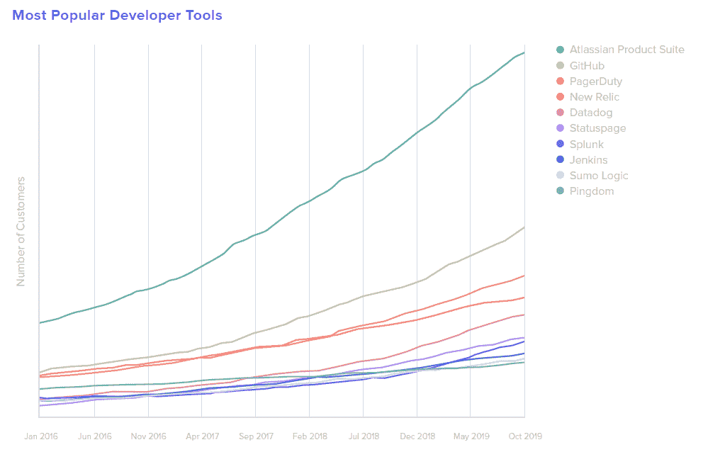

# 加起来:Atlassian 凭借企业集成脱颖而出

> 原文：<https://thenewstack.io/add-it-up-atlassian-rises-above-crowd-with-enterprise-integrations/>

[根据其“](https://www.atlassian.com/)[2020 business @ Work](https://www.okta.com/businesses-at-work/2020)”报告，Atlassian 的核心产品套件吉拉、Confluence 和 Bitbucket 等软件开发组件是众多 [Okta](https://www.okta.com/) 客户中安装量第五大的应用类型。考虑到领头羊是微软 Office 365、Salesforce、AWS 和 G Suite，还不算太寒酸。

该报告仅基于身份管理供应商的 7，400 名使用其 6，500 多个集成之一的客户，提供了有关 Atlassian 和许多其他企业应用程序采用情况的线索。

根据“[2020 business @ Work](https://www.okta.com/businesses-at-work/2020)”报告，Atlassian 的核心产品套件集成到 Okta 客户环境中的数量是第二大开发工具的两倍。Okta 对开发工具的定义相当宽泛，实际上包括了警报和监控软件。注意，虽然 [Atlassian 在 2016 年购买了 Statuspage](https://techcrunch.com/2016/07/14/atlassian-acquires-statuspage/) ，但是在报告中是单独包含的。

Atlassian 在其他工具方面也做得很好。 [Opsgenie](https://www.atlassian.com/software/opsgenie/what-is-opsgenie) 于 2018 年[被 Atlassian](https://techcrunch.com/2018/09/04/atlassian-launches-jira-ops-for-managing-incidents/) 收购，使 Atlassian 在其他 IT 服务和事故管理工具中占据了重要地位。

资料来源:“2020 年企业@工作”

该公司不会告诉我们有多少公司正在使用它的集成，但 Okta 的数据和分析副总裁吴明向我们保证，鉴于它作为“客户获得其他技术的大门”的角色，这个比例相当高该报告的另一个限制是，图表没有显示每个应用程序的具体客户数量的 y 轴。Okta 向我们保证，每个图表的 y 轴都在 0-100 的范围内标准化，但这使得整个报告中的比较几乎是不可能的。

尽管数据有限，但该报告是成功的早期指标。 [Slack](https://slack.com/) 、 [Zoom](https://zoom.us/) 和现在的 [Jamf](https://www.jamf.com/) 已经加入 Atlassian，成为上一份报告中“增长最快的应用”的获胜者，并因此宣布 IPO。

通过 Pixabay 的特征图像。

<svg xmlns:xlink="http://www.w3.org/1999/xlink" viewBox="0 0 68 31" version="1.1"><title>Group</title> <desc>Created with Sketch.</desc></svg>