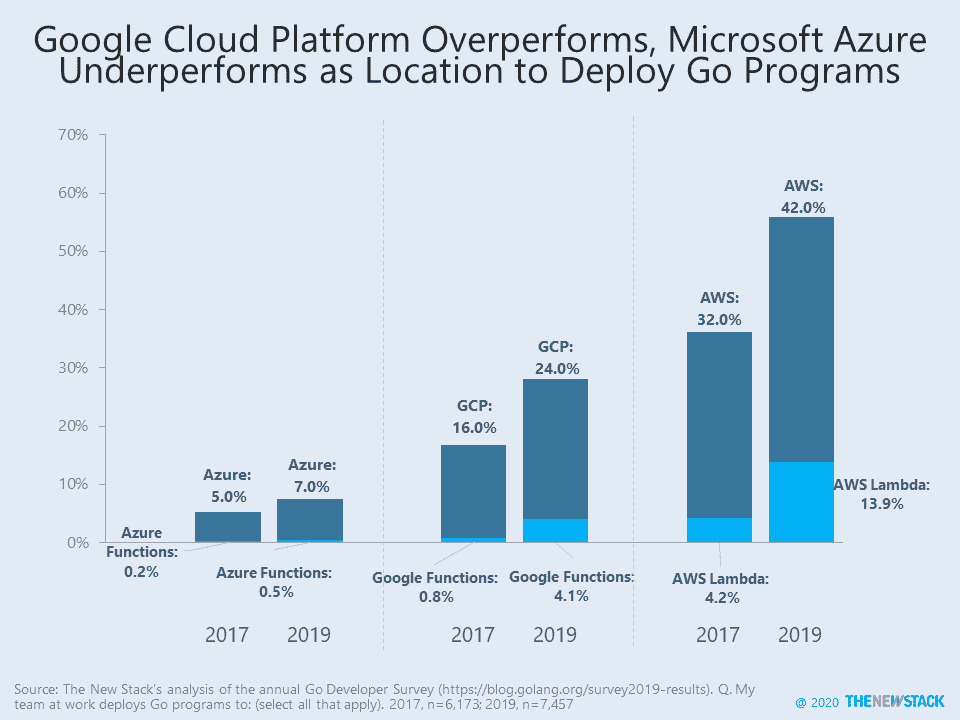

# 加起来:Azure 的 Golang 问题

> 原文：<https://thenewstack.io/add-it-up-azures-golang-problem/>

微软 Azure 在 500 多名使用其平台和 Go 编程语言的被调查开发者中存在一个问题。根据[最新的 Go 开发者调查](https://blog.golang.org/survey2019-results)，在过去的一年中，这个群体中只有 49%的人对在 Azure 上使用 Go 至少感到满意。相比之下，分别有 73%和 71%的人对亚马逊网络服务(AWS)和谷歌云平台(GCP)的围棋体验有同感。

在一个开放式的问题中，Azure 用户一再表示，云提供商没有为该语言提供一流的支持，该语言仍被广泛用于 T2 的项目中的云原生计算工作，如莫比 T3。

来源:《2019 Go 开发者调查》

尽管 GCP 用户更有可能感到满意，但他们确实抱怨了在他们的无服务器部署中对最新 Go 运行时的支持。这可能只是成长的烦恼，因为谷歌云功能在 2019 年初才开始提供 Go 支持。17%使用 Go 的 GCP 开发者正在将代码部署到谷歌云功能中，这是 AWS Lambda 从其安装群中吸引 Go 应用程序的一半。与微软形成鲜明对比。Azure Functions 仍然不支持 Go，在[分析](https://thenewstack.io/add-it-up-prepare-for-an-onslaught-of-go-language-serverless-functions/)一份早些年的调查时，我们就已经预料到了。因此，只有 0.5%的研究部署了带有 Azure 功能的 Go——7%的研究部署了 Go 到 Azure，其中 7%将 Go 应用程序部署到 Azure 功能。

在这项研究中，与其他市场分析相比，GCP 更接近 AWS。谷歌优势的一个原因是其在容器用户中的先发优势，GCP 64%的 Go 部署使用了谷歌 Kubernetes 引擎。最近 Go 调查报告的作者([托德·库勒萨](https://www.linkedin.com/in/toddkulesza/)和[史蒂文·法兰克王国](https://twitter.com/spf13))都是谷歌的员工，但很少有证据表明这对研究结果有重大影响。

微软 Azure 确实为 Go 语言提供了[支持](https://azure.microsoft.com/en-us/develop/go/)，Azure Kubernetes 服务在被调查的客户中被广泛采用。然而，微软在 go 社区的影响力要赶上它在更广泛的云市场取得的进步，还有很长的路要走。

数字海洋的 Go 部署稳步下降，这反映了整个云计算市场的趋势。来源:《2019 Go 开发者调查》

<svg xmlns:xlink="http://www.w3.org/1999/xlink" viewBox="0 0 68 31" version="1.1"><title>Group</title> <desc>Created with Sketch.</desc></svg>