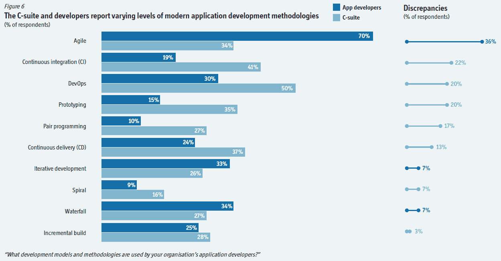
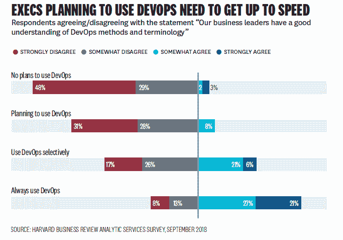
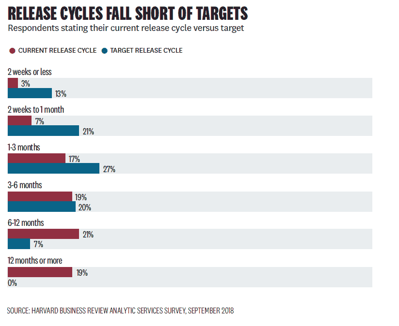

# 加起来:C-suite 对应用程序开发一无所知

> 原文：<https://thenewstack.io/add-it-up-c-suite-doesnt-have-a-clue-about-app-dev/>

说到 it 和应用程序开发，c 级主管通常没有一点头绪。15 年来，我一直在分析来自 IT 最终用户的调查数据，从业务经理甚至首席信息官那里得到的反馈往往与实际从业者所说的大相径庭。

根据上周的[帖子，](https://thenewstack.io/digital-transformation-it-and-the-rest-of-the-company/)我们知道，与其他业务主管相比，IT 领导认为他们更多地参与创新，并与业务的其他部分保持一致。根据经济学人智库(Economist Intelligence Unit)最近一项由谷歌赞助的调查，应用程序开发人员和高管之间似乎也存在类似的脱节。这种差异可能会对高级管理人员在软件工具上的花费产生真正的影响。

一半的 C 级高管认为 DevOps 方法被他们的开发人员使用，而只有 30%的应用程序开发人员有同样的想法。同样，在持续集成(CI)方面也有 22 个百分点的差距。高管们都听说过他们公司在数字化转型和采用新 IT 实践方面所做的努力。如果这些高管在被告知旅程才刚刚开始，需要在 CI 和 DevOps 工具上花钱时表现出恼怒，会发生什么？请注意，开发人员说公司使用敏捷方法的可能性是说的两倍。在这种情况下，我们认为 c-suite 混淆了敏捷方法和 DevOps 实践，因为后者在过去几年里一直是一个时髦词。

来源:“管理应用程序开发以释放其全部潜力”

由谷歌赞助的另一项[调查](https://hbr.org/sponsored/2019/01/competitive-advantage-through-devops)，哈佛商业评论(HBR)社区的这一调查证实了混乱的程度。事实上，在只选择性使用 DevOps 的公司中，43%的公司认为业务领导没有很好地理解 DevOps 的方法和方法论。这种混乱的影响可能是高管们认为软件发布周期应该比实际快得多的原因之一。

同样的 HBR 调查发现，61%的人预计软件发布周期为三个月或更短，但只有 27%的公司真正实现了这一目标。结论是，高管们没有足够的实践经验，不知道软件开发需要多少时间。如果没有更深入的了解，他们就是推销数字化转型天堂的销售人员的主要目标。

77%不打算使用 DevOps 的受访者也认为他们的业务领导理解 DevOps 的含义。如果消息更灵通，他们的计划会改变吗？

通过 Pixabay 的特色图片。

<svg xmlns:xlink="http://www.w3.org/1999/xlink" viewBox="0 0 68 31" version="1.1"><title>Group</title> <desc>Created with Sketch.</desc></svg>