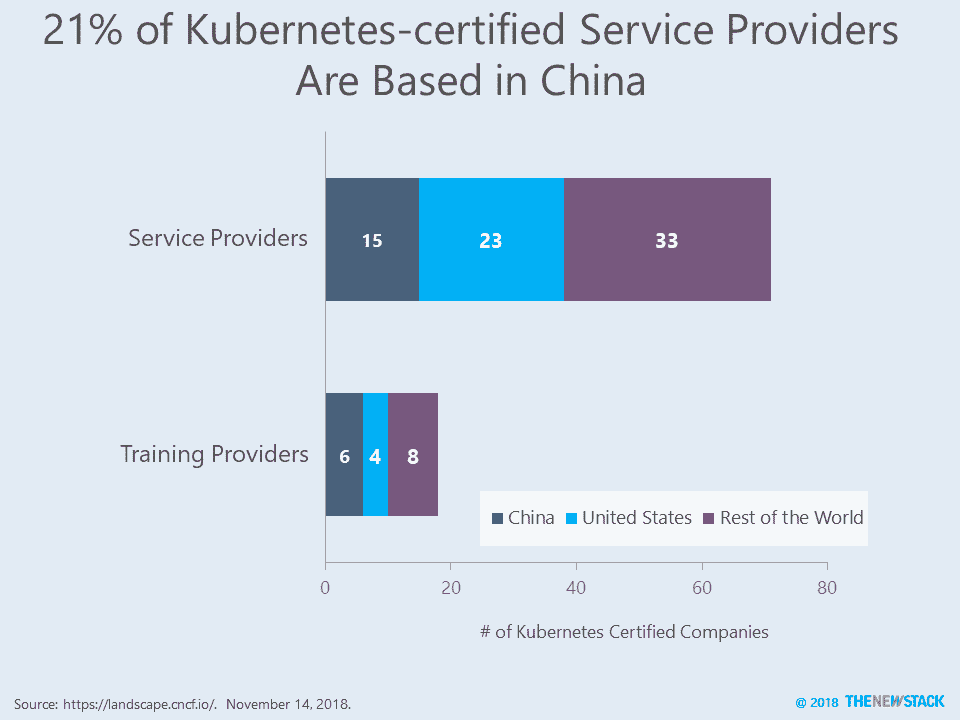

# 加起来:中国使用开源来提供云服务

> 原文：<https://thenewstack.io/add-it-up-china-uses-open-source-to-deliver-cloud-services/>

随着 Kubecon China 的上市，我们有更多的证据证明中国公司在开源云计算领域是仅次于美国的第二强。

总体而言，中国和美国占了云计算原生计算基金会(CNCF)认证的提供 Kubernetes 相关服务和培训的所有公司的一半以上。具体来说，71 家认证服务提供商中有 21%来自中国，三分之一的公司在中国提供 Kubernetes 培训。中国对开放堆栈的采用似乎更加强劲，根据 [2018 年开放堆栈用户调查](https://www.openstack.org/user-survey/2018-user-survey-report)，49%的部署在亚洲。

采用开源已经成为中国云故事的一个关键组成部分。然而，我们强烈认为这不是一个国家为了获得竞争优势而抄袭或窃取知识产权的例子。事实上，中国工程师积极参与开源社区，并与世界其他地方分享他们的创新。在过去的四年里，中国一直是 GitHub 贡献者的第二大来源。此外，阿里巴巴、腾讯、百度和华为启动了许多积极的项目，这些项目被 Apache 软件基金会以及 Eclipse 和 Linux 基金会等组织采用。

最后，尽管我们一开始就强调中国在 CNCF 世界中有多强大，但即使是它的[统计数据](https://all.devstats.cncf.io/d/50/countries-stats?orgId=1)也显示项目出资者仍绝大多数来自美国，德国略微超过中国。今年早些时候，我们在 *[中国与世界:库伯内特和集装箱视角](/china-vs-the-world-a-kubernetes-and-container-perspective/)* 中写道，中国落后于美国和西欧同行。就在本周，[一项用中文完成的跟踪调查报告了新的数据](https://www.cncf.io/blog/2018/11/13/cncf-survey-china-november-2018/)，仍然描绘了一幅关于技术采用率的复杂画面。尽管使用“无服务器”的受访者比例翻了一番，但使用 Kubernetes 管理容器的比例仅增长了 4 个百分点。此外，报告发现，自上次调查以来，中国在生产中使用的容器下降了 32 %,至 20%。然而，由于在测试环境中容器的使用从 24%上升到 42 %,总体“暴露”容器的情况确实增加了。

云计算原生计算和 Linux 基金会是新堆栈的赞助商。

通过 [Pxhere](https://pxhere.com/en/photo/454371) 的特征图像。

<svg xmlns:xlink="http://www.w3.org/1999/xlink" viewBox="0 0 68 31" version="1.1"><title>Group</title> <desc>Created with Sketch.</desc></svg>