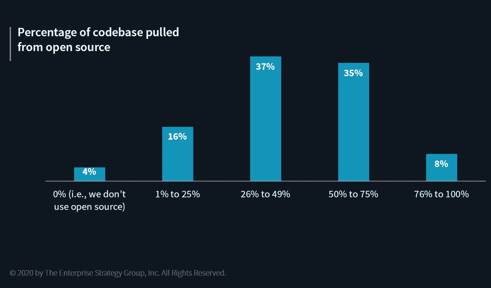

# 加起来:开源成分的竞争性估计

> 原文：<https://thenewstack.io/add-it-up-competing-estimates-of-open-source-composition/>

根据对软件供应链的 [Sonatype](https://www.sonatype.com/) 的[状态下的 1700 个应用的分析，普通应用中 10 个组件中有 9 个是开源的在自己的报告中，Synopsys](https://www.sonatype.com/2020ssc) [称其审计的客户代码库中有 70%是开源的。这些都是高端估计。由 ESG](https://thenewstack.io/unmaintained-dependencies-and-other-ways-to-measure-ci-cd-security/)对熟悉应用程序安全性的人进行的调查提供了一个更低的数字——只有 43%的人认为他们企业的代码库一半以上是开源的。

为什么数字差异如此之大？语义学。哈佛商学院的 Frank Nagle 共同撰写的一份[报告](https://thenewstack.io/the-new-stack-context-two-views-of-open-source-security/)指出，软件组合分析供应商对于什么构成“组件”没有一个共同的定义例如，在某些数据集中，包含许多子组件的包被视为一个单独的实体。此外，定义什么构成了一个应用程序是一个内在的主观努力。

在 ESG 研究中，只有三分之一的受访者认为他们 75%以上的代码库受到应用程序安全工具的保护。这是好是坏？我们应该关心代码、组件或应用程序的行数吗？

这不仅仅是一场学术辩论。购买软件的决策是基于软件的风险程度做出的。如果一个产品应该识别并解决依赖关系中的问题，那么潜在的购买者应该如何衡量供应商的表现呢？最近宣布的[开源安全基金会](https://openssf.org/)正在解决这些类型的问题。请继续关注更多关于开源组件的增长如何影响企业 IT 的数据和分析。

Sonatype 是新堆栈的赞助商。

通过[维基媒体](https://commons.wikimedia.org/wiki/File:I_Am_Sending_This_to_Prove_My_Fish_Story._You_Know_the_Stroy,_They_Grow_Them_Big_in_Northern..._(NBY_429018).jpg)发布的特写图片。

<svg xmlns:xlink="http://www.w3.org/1999/xlink" viewBox="0 0 68 31" version="1.1"><title>Group</title> <desc>Created with Sketch.</desc></svg>