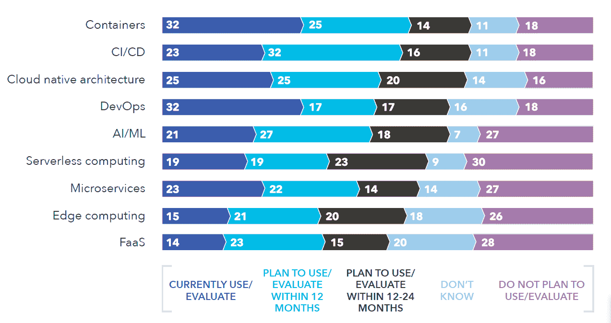

# 加起来:容器部署仍然超过“无服务器”

> 原文：<https://thenewstack.io/add-it-up-container-deployment-still-outpaces-serverless/>

去年，我们已经四次分析了无服务器采用的数据。本周，当我们进行我们自己的 [TNS 无服务器调查](https://www.surveymonkey.com/r/tns-serverless-v)时，我们来看看最近来自 Cloud Foundry 的[报告](https://www.cloudfoundry.org/multi-platform-trend-report-2018/)。根据一个 IT 决策者小组(不是自行选择的网络调查)，该报告发现，32%的受访者正在使用或积极评估容器，相比之下，无服务器计算的比例为 19%，FaaS(功能即服务)的比例为 14%。这是自 2017 年 8 月以来，我们第一次看到高水平的调查数据显示，容器的采用远远领先于无服务器。

值得注意的是，19%的数字实际上描述了那些使用或“评估”无服务器计算的用户。换句话说，很多“用户”真的在进行试用。虽然调查没有深入到无服务器的细节，但它确实将容器用户分为初始、有限和广泛部署，只有五分之一实际上属于“广泛”类别。

读者可能认为下表中的许多类别相互重叠。他们是正确的。事实上，该报告得出的一个主要结论是，许多受访者在他们的路线图中使用或计划使用 PaaS、容器和无服务器。这三者是否会同时使用有待讨论。

Cloud Foundry Foundation 是新堆栈的赞助商。

通过 Pixabay 的特征图像。

<svg xmlns:xlink="http://www.w3.org/1999/xlink" viewBox="0 0 68 31" version="1.1"><title>Group</title> <desc>Created with Sketch.</desc></svg>