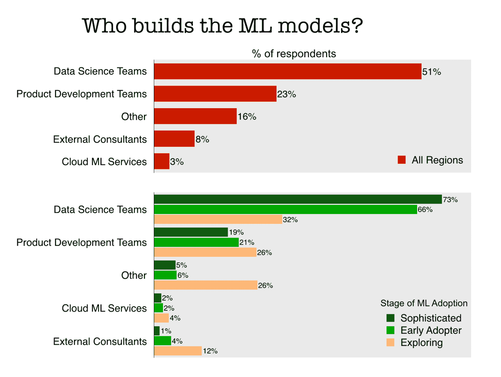

# 加起来:领导机器学习工作的是数据科学家，而不是开发人员

> 原文：<https://thenewstack.io/add-it-up-data-scientists-not-developers-lead-machine-learning-efforts/>

开发人员并不是增长最快的技术领域——机器学习(ML)和人工智能(AI)——的决策者。虽然 [TensorFlow](https://github.com/tensorflow/tensorflow) 、 [Sckit-Learn](https://github.com/scikit-learn/scikit-learn) 和 [Spark MLLib](https://github.com/apache/spark/tree/master/mllib) 在 GitHub 上很受欢迎，但它们是数据科学家用来建立模型的核心库，这些模型可以实现机器学习和各种人工智能功能。

事实上，根据最近的 [O'Reilly 调查](https://www.oreilly.com/data/free/state-of-machine-learning-adoption-in-the-enterprise.csp?utm_medium=content+synd&utm_source=oreilly.com&utm_campaign=awareness&utm_content=5+findings+from+machine+learning+adoption+survey+body)，51%从事 ML 的人说他们的模型是由内部数据科学团队创建的。从创建数据产品的专业人士的角度来看，使用来自云提供商的 ML 服务几乎从来没有考虑过。然而，AI/ML 作为一种服务，可能通过 API 访问，通常被定位为开发人员参与该领域的主要方式。

如果你认为开发人员的需求驱动着 ML 最高级用户的优先级，请三思。几乎一半(46%)的人说产品经理设定优先级，成功是基于商业标准来衡量的。

虽然开发人员可能是 AI/ML 的数据科学和工程世界的客人，但就这些团队使用的方法论而言，他们是领导者。48%的 ML 实践者使用敏捷方法，另外 8%使用看板。尽管如此，修正数据科学的软件实践的需求如此明显，以至于 O'Reilly 将在即将到来的会议上就此主题发表一篇演讲。

对于开发人员对 AI/ML 的看法，我们回顾了 DZone 最近的一项调查,该调查发现 ML“采用”仍然更多地是针对个人项目，而不是专业项目。在使用 ML 的企业中，70%的企业将它用于预测分析，较少的企业(46%)尝试自动化任务和实施客户建议(38%)。如果这些用例继续下去，我们预计业务部门和产品经理将继续与数据科学家争夺 AI/ML 传奇中的主角。

通过 Pixabay 的特征图像。

<svg xmlns:xlink="http://www.w3.org/1999/xlink" viewBox="0 0 68 31" version="1.1"><title>Group</title> <desc>Created with Sketch.</desc></svg>