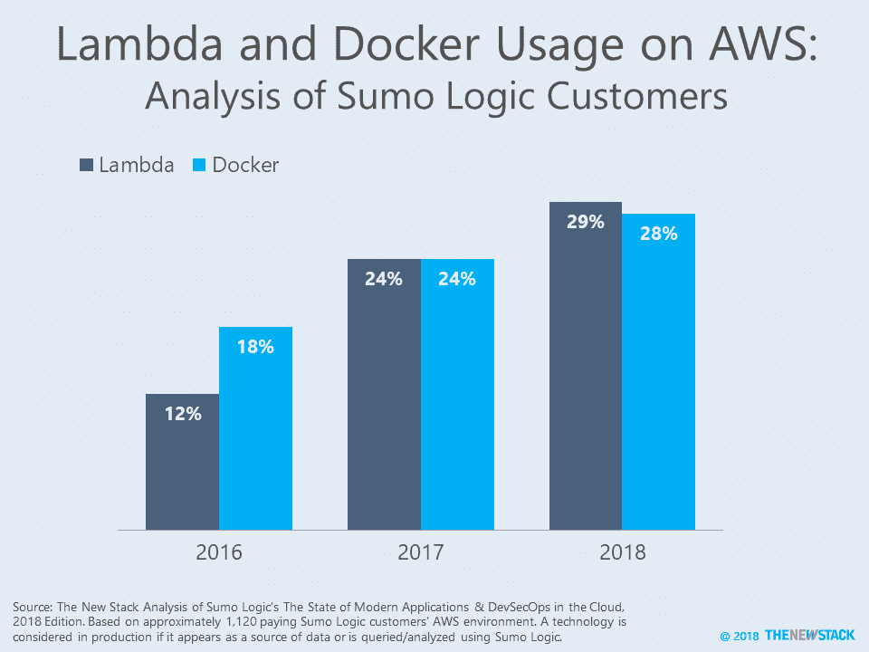
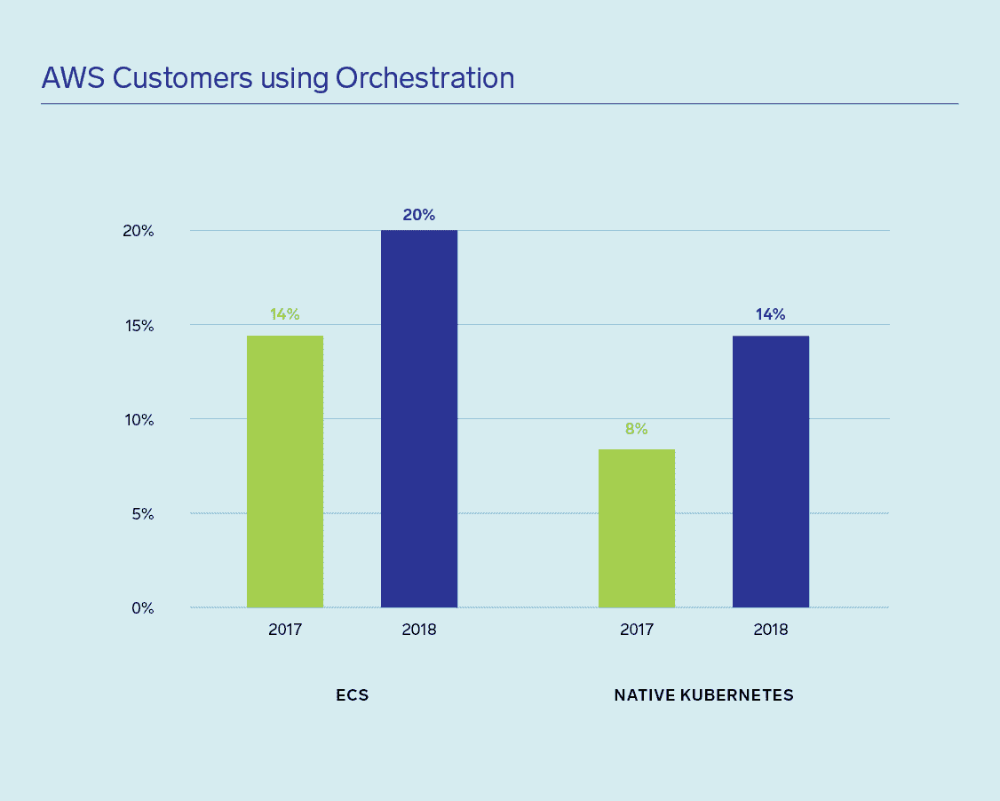
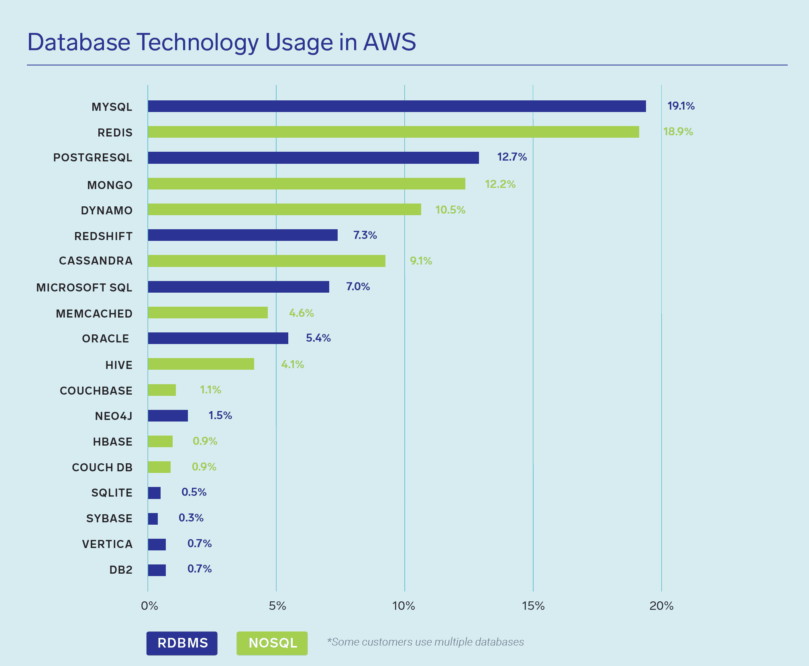

# 加起来:Docker 和 Lambda 在 AWS 环境中不相上下

> 原文：<https://thenewstack.io/add-it-up-docker-and-lambda-on-par-in-aws-environments/>

Docker 在 2014 年冲出了大门，Lambda 在 2017 年飙升，这些“竞争对手”现在在 2o18 年并驾齐驱。赛马类比是 SumoLogic 第三届年度[云](https://www.sumologic.com/blog/business-insights/modern-apps-devsecops-report-2018/)中现代应用和发展状况的一种看待结果的方式。这个简化的视图并没有告诉我们支持哪些类型的应用程序，也没有提供对这些部署规模的深入了解。它确实告诉我们，分析云原生技术的采用模式是棘手的。

Sumo Logic 没有使用调查数据来确定采用情况，而是分析了有关应用程序的匿名数据，这些数据包含在客户的日志和 AWS 云环境报告中。该报告没有显示有多少客户同时使用容器和函数，但我们预计这个数字会很高。由于这种方法的局限性，如果在评估中包括本地和多云环境，则无法确定容器的采用是否会比 FaaS(功能即服务)高得多。相比之下，最近的一项调查[发现容器的采用发现容器的使用超过了无服务器计算，可能是因为它询问了整个组织的采用情况，不管它在什么环境中使用。](https://thenewstack.io/add-it-up-container-deployment-still-outpaces-serverless/)

新堆栈的最新无服务器调查询问容器或函数是否是首选的抽象级别。请继续关注后续文章中的结果。

* * *

看看报告的其余部分，AWS 品牌的技术相对于通用的开源产品继续表现良好。例如，尽管 Kubernetes 的采用率激增，但 AWS ECS 在 AWS 客户中继续保持 6 个百分点的优势。在未来，如果对以 Kubernetes 为先的容器编排方法有真正的需求，AWS EKS(弹性 Kubernetes 服务)和 AWS Fargate(托管 Kubernetes)可能会被广泛采用。

离开容器世界一步，我们发现线索表明，如果由 AWS 服务提供，AWS 客户更有可能采用开源技术。具体来说，当包括 AWS 的 ElasticCache 品牌产品时，Redis 的采用率超过了 MongoDB，而我们分析的大多数调查都显示 Mongo 遥遥领先。这指向了一个备受争议的情况，开源商业模式受到了云提供商的挑战，他们将开源捆绑到更广泛的产品中。

下图显示了 MySQL 和 PostgreSQL 的采用情况，包括本机安装以及 AWS Aurora 托管的数据库。

在雷达下，AWS ECS 被大量客户使用。

NoSQL 数据库出现在 45%的 AWS 客户环境中，而关系数据库管理系统出现在 39%的 AWS 客户环境中。

*[Lawrence Hecht](https://twitter.com/lawrencehecht) 近二十年来一直致力于企业 IT 市场的分析和报告。他使用调查、访谈和非传统的市场研究技术来分析分布式和分散式技术。*

通过 Pixabay 的特征图像。

<svg xmlns:xlink="http://www.w3.org/1999/xlink" viewBox="0 0 68 31" version="1.1"><title>Group</title> <desc>Created with Sketch.</desc></svg>