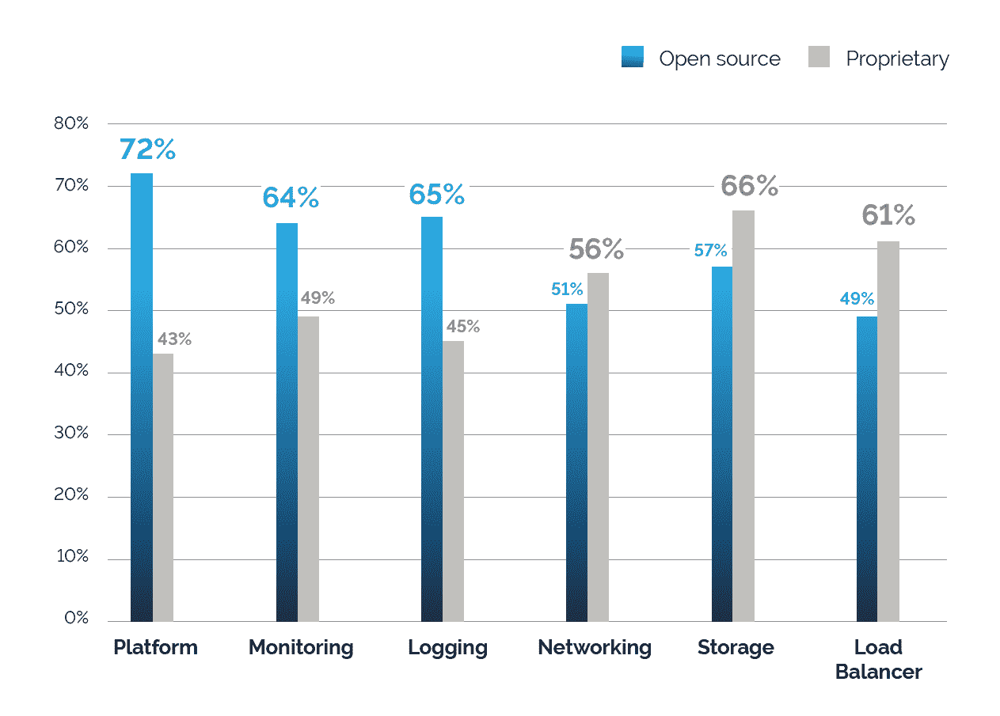
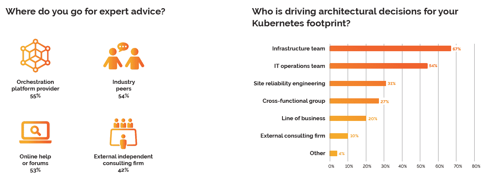

# 加起来:企业对 Kubernetes 的采用正在增长

> 原文：<https://thenewstack.io/add-it-up-enterprise-adoption-of-kubernetes-is-growing/>

监控软件提供商 [Datadog](https://www.datadoghq.com/) 最近[更新的用户调查](https://www.datadoghq.com/container-orchestration/)证实了 Kubernetes 采用率的增加。我们认为这是三个因素的结果:1)更多的组织在生产中使用容器；2) Kubernetes 已经成为领先的编排平台；3)组织选择在云原生航程中更早采用 Kubernetes。还有一些证据表明，在部署了更多容器的组织中，采用 Kubernetes 的可能性更大。这篇文章强调了与 [KubeCon + CloudNativeCon 北美](https://thenewstack.io/tns-context-kubecon-preview-and-kubernetes-custom-controllers/)联合发布的几项研究结果，这是本周在西雅图举行的 Kubernetes 用户大会。

Cloud Foundry 最近对 IT 决策者的调查显示，容器生产使用率从 2016 年初的 22%跃升至 2018 年末的 38%，这些部署越来越多地被描述为“广泛”Cloud Foundry 报告还发现部署的容器数量有所增加——2016 年，只有 37%的容器组织部署了 100 个以上的容器，但今天这一数字上升到了 47%。

将容器化的应用程序部署到生产环境需要新的管理工具。根据新堆栈[调查](/tns-research-present-state-container-orchestration/)，在 2016 年，在生产中使用容器的人中只有 45%使用任何类型的容器编排平台。我们 2017 年的调查显示，这一数字跃升至 61%。[云计算原生计算基金会在 2018 年进行的调查](https://www.cncf.io/blog/2018/08/29/cncf-survey-use-of-cloud-native-technologies-in-production-has-grown-over-200-percent/)表明，超过 80%的组织在生产中使用容器编排工具。

Kubernetes 越来越成为集装箱用户的首选，Datadog 报告其使用率从 2017 年 10 月的 22.5%增加到 2018 年 10 月的 32.5%。同样的数据表明，AWS 提供的非 Kubernetes 编排选项——亚马逊弹性容器服务(ECS)和 Fargate——也有所增长，但速度慢得多。如果这一趋势继续下去，到 2019 年初，更多的 AWS 容器用户将使用本地或托管的 Kubernetes (AWS EKS)解决方案，而不是 ECS/Fargate。

Kubernetes 采用率相对上升的原因是，越来越多的组织将 Kubernetes 作为其工具包的一部分，开始了他们的容器之旅。Datadog 只跟踪最近开始使用容器的组织，发现 29%的组织使用 Kubernetes，而 2017 年初只有 18%的组织使用 Kubernetes。在同一时期，AWS ECS 保持在 13 %,没有跟上。这指出了 Kubernetes 组织与其他人之间的分歧。从运行的主机数量、运行在这些主机上的容器数量以及员工数量来看，Kubernetes 组织往往更大。事实上，在 Kubernetes 使用公司上，平均每个主机上运行 14 个容器，而这个数字是 AWS ECS 的一半。

尽管 Kubernetes 在容器部署过程的早期被选中，但这并不意味着公司必须关注他们需要帮助实现的内部人才或外部公司。根据 Heptio 的【2018 年 Kubernetes 状态报告，41%的 Kubernetes 用户表示，架构设计是他们最需要帮助的采用阶段，远远超过那些需要部署或日常管理帮助的用户。

换句话说，云架构师技能是一个比找人管理 Kubernetes 或提供容器即服务产品的公司更大的难题。事实上，Kubernetes 用户面临的[痛点通常与构建能够有效利用现有存储和网络资源的云相关。也许这是因为堆栈的这些部分更有可能是专有的。事实上，三分之二的 Kubernetes 用户说他们使用专有存储软件。](/week-numbers-kubernetes-implementations-good-bad-ugly/)

资料来源:赫普蒂奥。在使用 Kubernetes 的组织中，监控和日志记录更多地依赖于开源。专有软件更常见于与存储和负载平衡相关的任务。

Heptio 是 VMware 最近收购的一家提供 Kubernetes 服务的公司。对 it 部门来说，不幸的是，这个需求最大的领域——设计/架构——不是大多数公司外包的。只有 10%的组织表示，外部咨询公司正在推动他们的 Kubernetes 足迹的架构决策。积极的一面是，几乎一半的 Kubernetes 用户向咨询公司寻求建议。我们认为，VMware 能够通过提供比基础架构团队更高级别的咨询服务来实现这一建议的盈利，基础架构团队最有可能处理 Kubernetes 的日常运营。

来源:[赫普西奥](https://blog.heptio.com/the-results-are-in-the-state-of-k8s-2018-d25e54819416)。基础设施和 IT 运营团队主要做出与现有 Kubernetes 足迹相关的决策。

<svg xmlns:xlink="http://www.w3.org/1999/xlink" viewBox="0 0 68 31" version="1.1"><title>Group</title> <desc>Created with Sketch.</desc></svg>