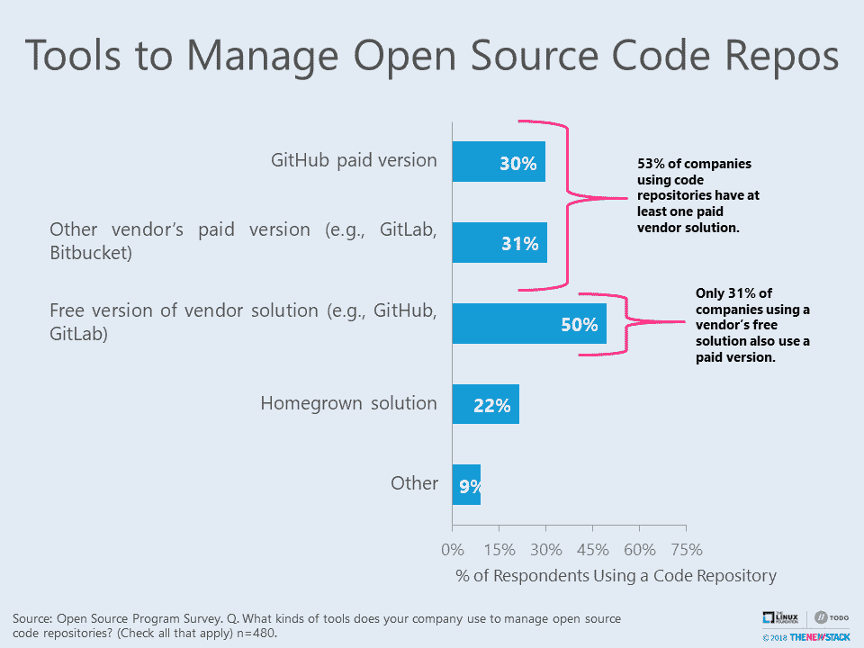

# 加起来:甚至开放源代码者也为代码库付费

> 原文：<https://thenewstack.io/add-it-up-even-open-sourcers-pay-for-code-repositories/>

主要通过商业软件包或服务来管理开源代码会有什么后果？你的公司应该只使用一个代码库吗？这些是参与关于开源的调查的 480 名代码库用户被问到的问题。当被问及他们如何管理开源代码时，一半的人说他们使用免费的供应商提供的解决方案，如 GitHub，但 53%的人也为代码库软件或服务付费。

许多人也使用自制的设置，通常基于 [git](https://git-scm.com/) 。在那些引用国产系统的人中，多达 60%的人还引用了另一种正在使用的产品类型。供应商的解决方案似乎经常与两个或更多其他版本控制系统拼凑在一起，其中一些可能是开源的，如 [Apache Subversion (SVN)](https://subversion.apache.org/) 。在拥有超过 10，000 名员工的大公司中，多代码回购的使用更为普遍。这组人引用了 2.6 种代码回购，而研究平均值为 1.4 种。

微软宣布收购 GitHub 引起了担心对开源社区产生负面影响的开发者的恐慌。一些纯粹主义者声称，由于 GitHub 的核心是专有的，具有讽刺意味的是，GitHub 已经成为独立开发者在开源项目上合作的主要方式。其他人仍然无法将今天的开源友好的微软与其世纪之交的前身相协调。

微软对其尚未批准的收购将使其处于垄断地位的指控非常敏感。即使微软将其 Team Foundation Server 与 GitHub 的商业产品相结合，对我们自己的调查以及由 [SmartBear](https://smartbear.com/resources/ebooks/the-state-of-code-review-2017/) 和 [Stack Overflow](https://insights.stackoverflow.com/survey/2018) 所做的调查的分析表明，微软在不久的将来几乎不可能主宰代码库市场。反对者会声称 GitHub 免费服务的用户进行追加销售的时机已经成熟，尤其是如果微软在未来捆绑更多的免费服务。

虽然这是一种可能性，但有三个原因可以解释为什么这仍不会给市场份额带来巨大变化。首先，许多 GitHub 用户只是将它用于个人项目。第二，开源项目可以使用免费资源进行高水平的管理，同时使用付费解决方案来处理每分钟的版本控制。最后，尽管像脸书和谷歌这样的公司采用了 mono repository 系统，但至少有传闻称许多公司仍在使用[多回购系统](https://www.linkedin.com/pulse/tips-multi-repo-companies-steven-acreman/)，并且很可能会继续这样做。如果是这样的话，那么很有可能免费的 GitHub 和付费的 Atlassian Bitbucket 或 GitLab 会并存。

替代供应商的产品仍然普遍用于管理开源代码。目前还不知道他们是否会因为 GitHub 的付费版本而失去客户。需要进行更多的研究来确定公司是否更愿意单一来源他们的代码库。与此同时，由于有如此多的公司依赖 GitHub 来管理他们的开源代码，因此值得考虑将免费的 GitHub 转换为由基金会管理的社区资源。

微软是新堆栈的赞助商。

特征图片:[十二凯撒金銮殿](https://www.metmuseum.org/art/collection/search/255253)，公元 69-96 年，[纽约大都会艺术博物馆](https://www.metmuseum.org)。

<svg xmlns:xlink="http://www.w3.org/1999/xlink" viewBox="0 0 68 31" version="1.1"><title>Group</title> <desc>Created with Sketch.</desc></svg>