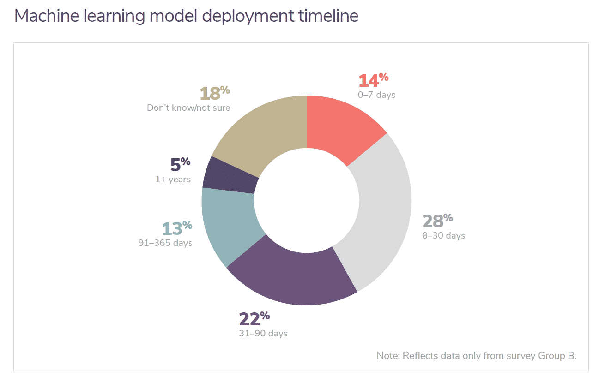
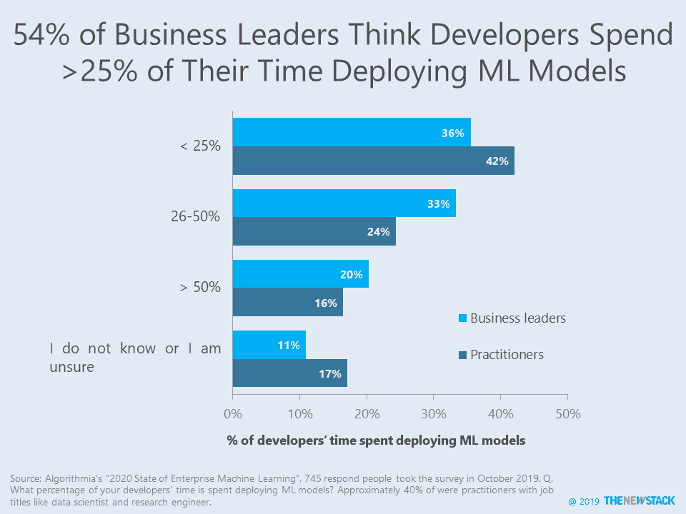
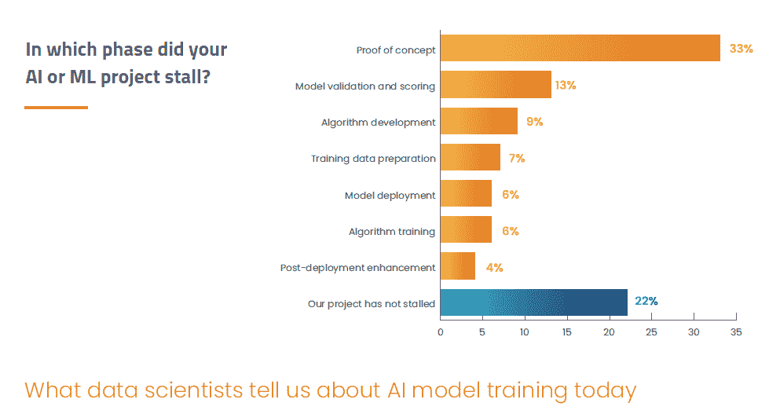
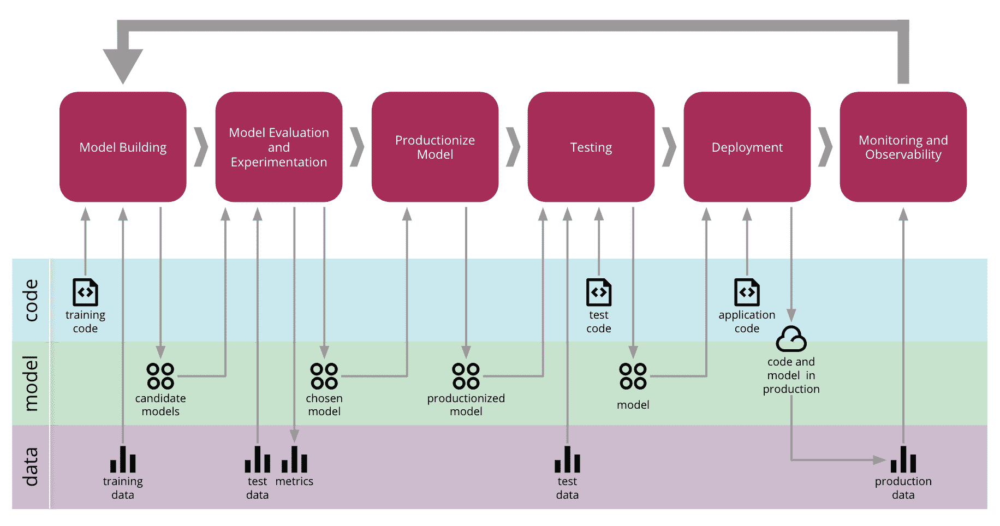

# 加起来:一个机器学习部署需要多长时间？

> 原文：<https://thenewstack.io/add-it-up-how-long-does-a-machine-learning-deployment-take/>

创建和部署机器学习(ML)模型可能需要太多时间。量化这个问题是困难的，尤其是因为机器学习管道中涉及到如此多的工作角色。带着这样的告诫，让我们来介绍一下 [Algorithmia 的](https://algorithmia.com/)“[2020 年企业 ML 状态](https://info.algorithmia.com/2020)在 2019 年 10 月进行的调查中，745 名受访者中有 63%已经开发了机器学习模型并将其部署到生产中。平均而言，40%的公司表示将 ML 模型部署到生产中需要一个多月的时间，28%的公司在 8 到 30 天内完成，而只有 14%的公司可以在 7 天或更短时间内完成。

我们相信 Algorithmia 的估计比今年早些时候 [Dotscience](https://dotscience.com/) [调查](https://dotscience.com/assets/downloads/Dotscience_Survey-Report-2019.pdf)中报告的更接近现实，该调查报告称 80%的受访公司需要超过 6 个月的时间将人工智能(AI)或 ML 模型部署到生产中。该数据点具有误导性，因为它包括了仍在评估用例并正在部署其第一个 ML 模型的受访者。当然，这本身就是一个大问题。事实上，根据另一项 2019 年[调查](https://content.alegion.com/dimensional-researchs-survey)，这是数据标签公司 [Alegion](https://www.alegion.com/) 的 277 名数据科学家和人工智能专业人员之一，78%的人工智能或人工智能项目涉及在部署前的某个时间点训练人工智能模型。

来源:Algorithmia 的《2020 年企业 ML 状态》。这个关于将 ML 模型部署到生产中需要多长时间的问题只问了一个拥有 ML 模型生产的公司中的一部分受访者。

这项研究还测量了数据科学家和开发人员部署 ML 模型所花费的努力。在已经部署了模型的公司中，52%的业务领导和 ML 实践者(例如，数据科学家、开发人员)认为他们的数据科学家一天中有超过四分之一的时间用于部署模型。当谈到开发人员的时间时，就不那么确定了，54%的商业领袖说这花费了他们开发人员四分之一的时间，而 41%的 ML 从业者认为开发人员付出了那么多努力。

来源:Algorithmia 的《2020 年企业 ML 状况》。

Algorithmia 的调查没有具体说明“部署过程”中包括什么，而且行业似乎也没有就机器学习管道各个部分的具体术语达成一致。Algorithmia 声称有一个“人工智能层”，负责准备、测试和管理训练好的模型的过程。在这种情况下，模型选择以及模型、培训工具(如[数据机器人](https://www.datarobot.com/)和 [MLflow](https://www.mlflow.org/) )和运行模型所需的基础设施(即计算、数据存储/摄取)。尽管存在语义上的挑战，但 2018 年 Kaggle [的一项调查](https://www.kaggle.com/kaggle/kaggle-survey-2018)还是具有可比性的。它发现 41%的数据科学项目致力于收集和清理数据，20%的时间用于构建和选择模型，只有 9%的时间用于将模型投入生产和运行。

根据 Algorithmia 的研究，模型的规模扩大和“版本化和可再现性”将是 2020 年机器学习的最大挑战。对于已经将 ML 整合到现有产品和运营中的公司来说，其他问题，如成本和模型的预测能力，似乎将退居其次。为了应对版本挑战，ThoughtWorks 最新的[技术雷达](https://www.thoughtworks.com/radar/techniques?blipid=201911037)建议企业寻找一种他们定义为机器学习连续交付(CD4ML)的软件工程方法。来自 Martin Fowler 网站的一篇关于 CD4ML 的详细的[文章](https://martinfowler.com/articles/cd4ml.html)解释了“*跨职能团队*如何基于*代码、数据和模型*以小而安全的增量生产机器学习应用程序，这些应用程序可以在短的适应周期内随时重现和可靠发布。”使用这种方法，作者建议未来的研究可以跟踪“数据管道”和“模型训练管道”的自动化速度和水平，与传统的“连续交付管道”分开。

## **零零碎碎**

新的 Stack 有很多文章详细介绍了开发人员和 DevOps 团队是如何处理机器学习的。下面是一个例子:

以下图表支持文章的分析:

来源:Alegion 和 Dimensional Research 的《今天数据科学家告诉我们的关于 AI 模型训练的事情》。三分之一的人工智能/人工智能项目停滞在概念验证阶段，而只有大约五分之一的人工智能模型培训项目没有被推迟。

来源: [2018 Kaggle ML & DS 调查](https://www.kaggle.com/kaggle/kaggle-survey-2018)的 Vilmos müller[分析](https://towardsdatascience.com/essential-data-skills-supply-and-demand-on-the-job-market-4f7dffa23b70)。图表给出了这个问题的答案:“在一个数据科学项目中，大约有多少时间用于以下活动？”

"机器学习端到端过程的连续交付."来源:[马丁·福勒](https://martinfowler.com/articles/cd4ml.html)

<svg xmlns:xlink="http://www.w3.org/1999/xlink" viewBox="0 0 68 31" version="1.1"><title>Group</title> <desc>Created with Sketch.</desc></svg>