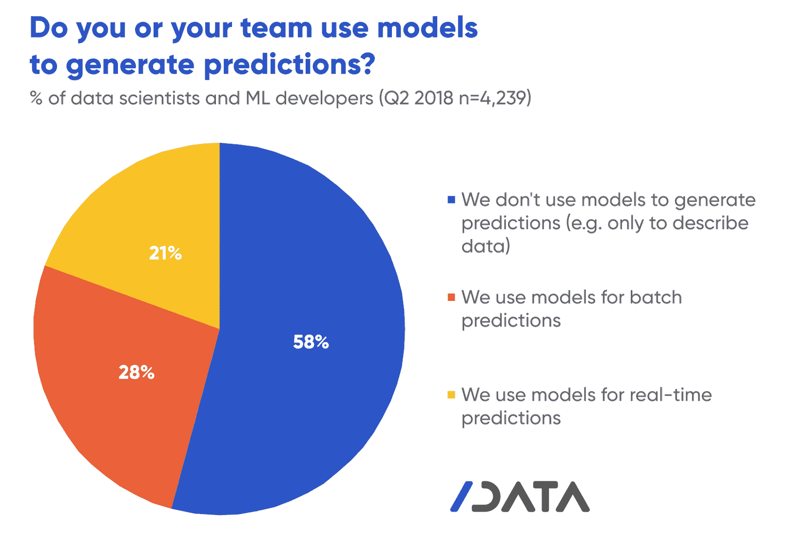
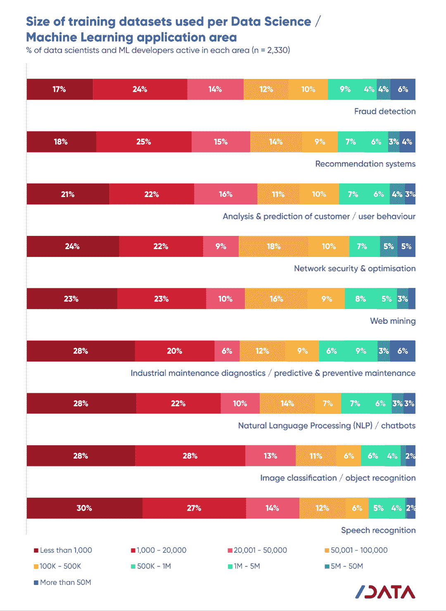

# 加起来:机器学习开发者不预测

> 原文：<https://thenewstack.io/add-it-up-machine-learning-developers-dont-predict/>

大多数参与机器学习的开发人员不使用模型来生成预测。即使是那些直接或通过 API 处理训练数据集的人，也只有 10%的人处理超过一百万行的数据。专注于实时大数据分析的技术专家最好缩小一点关注范围。这只是基于 SlashData 的《开发者国家第 15 版的*状态的两个发现，该报告询问了超过 4200 名涉及机器学习(ML)和数据科学的开发者的详细问题，而不仅仅是使用其他人的算法、构建框架或与 ML 无关的人工智能(AI)。*

当被问及他们的团队是否使用模型来生成预测时，58%的人说不，他们最多使用模型来描述数据。28%的人使用批处理进行预测，而 21%的人进行实时预测。批处理和实时数据可能略高。该问题不允许多个回答，但我们仍然相信，这种采用水平证明了对连续快速分析数据的流处理的需求。

提醒一下， [DZone 对人工智能开发者的调查](https://dzone.com/guides/artificial-intelligence-automating-decision-making)发现，预测分析是迄今为止一个组织采用人工智能或人工智能最可能的原因。然而，SlashData 的调查显示，大多数 ML 开发者并不生成预测。企业高管应该警惕对 ML 技术的巨额预算提案，这些提案夸大了预测分析的指数收益，因为预测分析尚未广泛部署，即使在那些表示已经在使用 ML 的公司中也是如此。

* * *

缺乏合适的数据可能会抑制预测分析的大规模使用。有时候，可用的数据太“脏”而没有用。在其他情况下，数据集仍然很小。不管是什么原因，超过一半的 ML 开发人员训练数据集使用的数据少于 20，000 行。具有语音识别和图像分类用例的开发人员比其他人使用更小的数据集。这意味着 ML 在这些领域的影响更有可能是由于自动化，而不是来自随着数据量的增加而变得更加强大的深度学习模型。

> 警惕那些夸大预测分析带来的指数收益的 ML 技术大预算提案…

处理工业维护和预测数据的开发人员更有可能使用大型数据集，18%的人处理超过一百万行的数据。这些数据通常是系统数据或从物联网信标中收集的数据。大量数据的可用性意味着涉及网络安全或性能的开发人员训练一些最大的数据集，其中 10%处理超过 500 万行。

*[Lawrence Hecht](https://twitter.com/lawrencehecht) 在近 20 年的时间里，一直致力于企业 IT 市场的分析和报告。他使用调查、访谈和非传统的市场研究技术来分析分布式和分散式技术。*

专题图片来自《发展中国家》第 15 版封面艺术。

<svg xmlns:xlink="http://www.w3.org/1999/xlink" viewBox="0 0 68 31" version="1.1"><title>Group</title> <desc>Created with Sketch.</desc></svg>