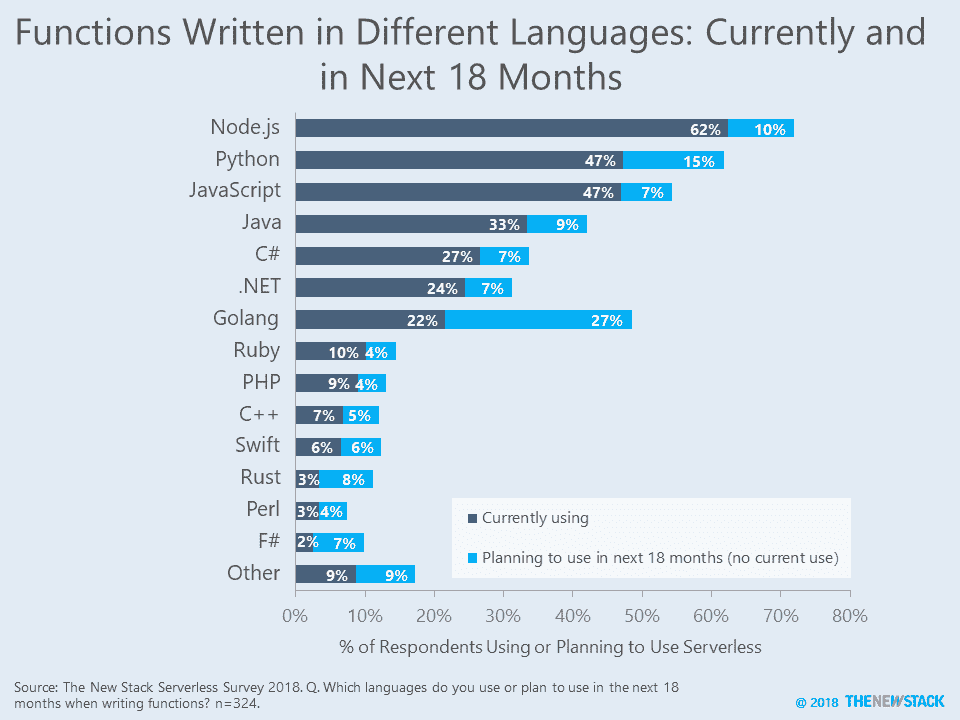

# 加起来:准备迎接 Go 语言无服务器功能的冲击

> 原文：<https://thenewstack.io/add-it-up-prepare-for-an-onslaught-of-go-language-serverless-functions/>

无服务器开发人员对自己说，“准备，设置，开始！”根据 2018 年 8 月 New Stack 的一项调查，超过四分之一正在使用或计划使用无服务器架构的人希望在未来 18 个月内使用 Go 语言(Golang)编写一个函数。这项研究的完整结果，包括一个清理过的数据集，将在无服务器技术 指南 *[发布时公布。](https://thenewstack.io/ebooks/serverless/guide-to-serverless-technologies/)*

总的来说，Golang 的使用量只是 Node.js 的三分之一，node . js 是由几家 FaaS 提供商支持的第一个环境。大部分人计划编写 Golang 函数的原因是 AWS Lambda [在 2018 年 1 月开始支持](https://aws.amazon.com/blogs/compute/announcing-go-support-for-aws-lambda/) Golang。谷歌云功能可能会效仿，因为它们目前正在为 Golang 提供[实验性支持](https://medium.com/google-cloud/google-cloud-functions-for-go-57e4af9b10da)。看到微软 Azure Functions 将 Golang 添加到其[支持路线图](https://docs.microsoft.com/en-us/azure/azure-functions/supported-languages)中并不奇怪，因为语言支持是评估时的一个关键标准。由于 Golang 在容器生态系统中的中心地位，这些开发人员似乎渴望将他们的技能应用于无服务器架构。

未来的文章将着眼于每个应用程序使用的函数数量，以及使用其他语言编写函数更容易的框架。敬请关注。

* * *

### 关于无服务器使用的语言的第三方数据

我们将新堆栈的调查数据与其他研究报告的数据进行了比较。

*   Node.js 的使用水平与 Serverless，Inc. 进行的[调查中发现的一致，该调查询问了无服务器开发的总体情况。Python 和 Go 的使用率要低得多。](https://serverless.com/blog/2018-serverless-community-survey-huge-growth-usage/)
*   基于 2017 年 11 月在 AWS Lambda 中观察到的函数，New Relic 发现运行 Python 的函数比运行 Node.js 的函数更多，我们预计随着运行的函数数量和类型的增加，这些统计数据将发生巨大变化。
*   一项针对 Golang 用户的 [2017 年调查](https://blog.golang.org/survey2017-results)发现，与部署用 Go 编写的应用程序的人相比，受访者使用将非 Go 程序部署到 FaaS 服务的可能性是前者的两倍。

来源:2017 年关于 AWS Lambda 函数的新遗迹数据

新遗迹是新堆栈的赞助商。

专题图片:罗塞塔石碑由[托马斯·奎因](https://www.flickr.com/photos/quinet/17374496333)、[创意共同 2.0](https://creativecommons.org/licenses/by/2.0/) 授权。

<svg xmlns:xlink="http://www.w3.org/1999/xlink" viewBox="0 0 68 31" version="1.1"><title>Group</title> <desc>Created with Sketch.</desc></svg>