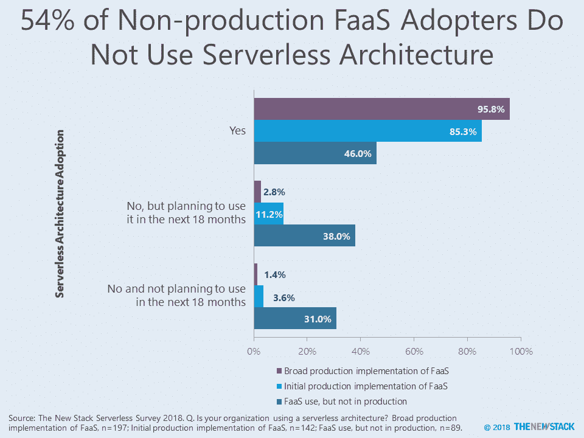
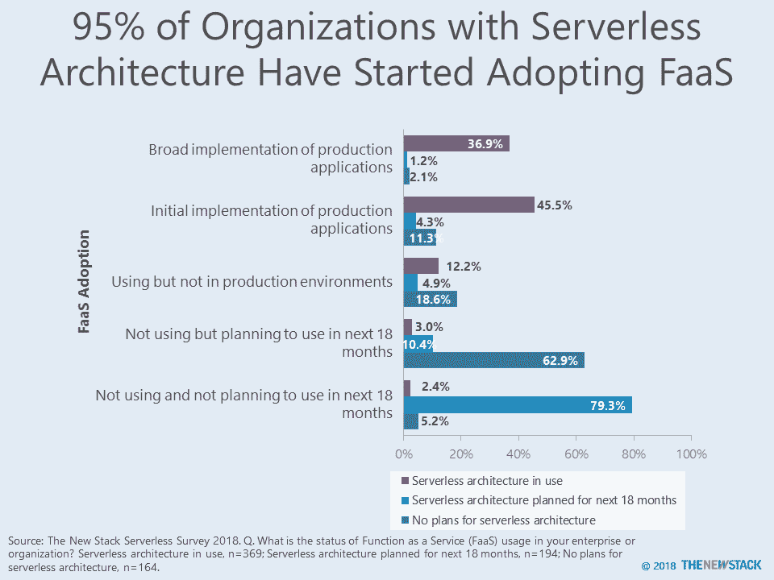

# 加起来:FaaS ≠无服务器

> 原文：<https://thenewstack.io/add-it-up-serverless-faas/>

我们不能阻止人们宣称无服务器和 FaaS 是同义词，但有数据表明它们不是一回事。

不需要[无服务器架构](https://medium.com/@PaulDJohnston/serverless-its-much-much-more-than-faas-a342541b982e)来使用功能即服务 FaaS。事实上，根据 2018 年 8 月进行的一项调查，54%没有生产部署的 FaaS 用户表示，他们的组织没有利用无服务器架构。相比之下，96%广泛部署了 FaaS 的组织表示他们使用无服务器架构。我们即将推出的 *[无服务器技术指南](https://thenewstack.io/ebooks/serverless/guide-to-serverless-technologies/)* 涵盖了无服务器架构、技术和计算，并将包括完整的研究结果。

该调查将 FaaS 定义为典型的提供事件驱动的计算，开发者通过事件或 HTTP 请求触发的功能运行和管理应用程序代码。无服务器架构广义地描述了一种应用程序设计，其结合了第三方后端即服务(BaaS)服务，和/或包括在 FaaS 平台上的托管环境中运行的定制代码。在许多方面，无服务器架构看起来类似于其他专注于事件和微服务的应用程序设计。

将 FaaS 用于孤立的用例或玩 it 测试环境并不要求组织重新思考它编写代码或管理基础设施的方式。但是，如果不重新分解应用程序，FaaS 很容易增加生产应用程序的计算成本。当 FaaS 进入生产阶段时，会出现许多其他挑战，因此，几乎所有广泛部署的组织都在为无服务器应用程序使用独特的体系结构也就不足为奇了。

由于术语定义的方式，95%采用无服务器架构的组织在某种程度上使用 FaaS 是不足为奇的。尽管试图教育市场，我们仍然认为“无服务器”一词包含许多不同的含义，尤其是对于 79%计划采用无服务器架构但在未来 18 个月内没有计划使用 FaaS 的组织而言。对于这些人来说，我们相信他们迷恋于云原生开发的更大好处，而不是使用 AWS Lambda 这样闪亮的新玩具。在未来的调查中，我们将从定义中移除 FaaS，并了解 FaaS 的采用如何与事件驱动和微服务架构相关联。

虽然 63%没有无服务器架构计划的受访者计划开始使用 FaaS，但很难确定这些计划实现的可能性。这让我们对采用 FaaS 的速度和规模提出了最后的警告。开发团队自下而上的探索只是第一阶段，在 FaaS 投入生产之前，需要解决架构方面的问题。

*无服务器顾问[迈克·罗伯特](https://twitter.com/mikebroberts)协助定义调查中使用的术语。*

<svg xmlns:xlink="http://www.w3.org/1999/xlink" viewBox="0 0 68 31" version="1.1"><title>Group</title> <desc>Created with Sketch.</desc></svg>