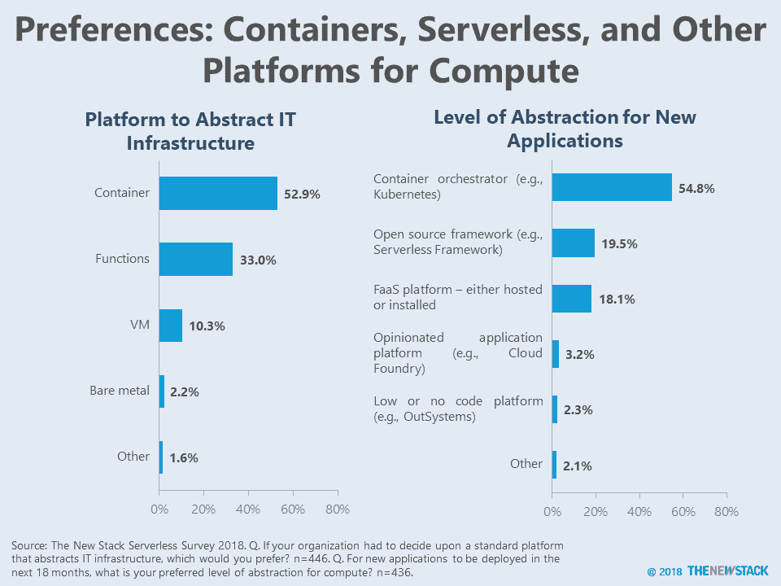
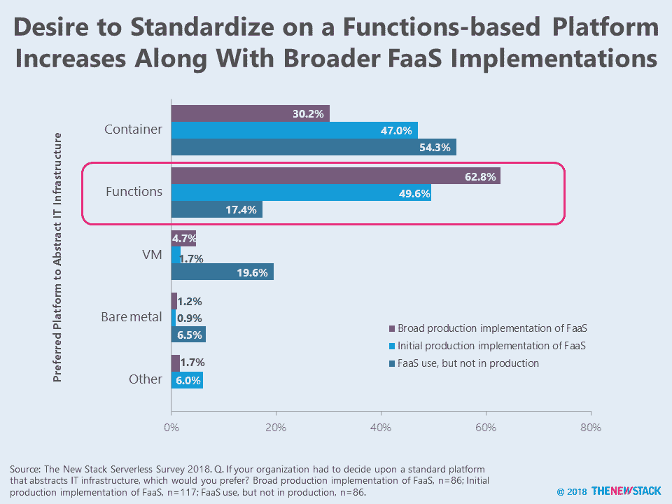
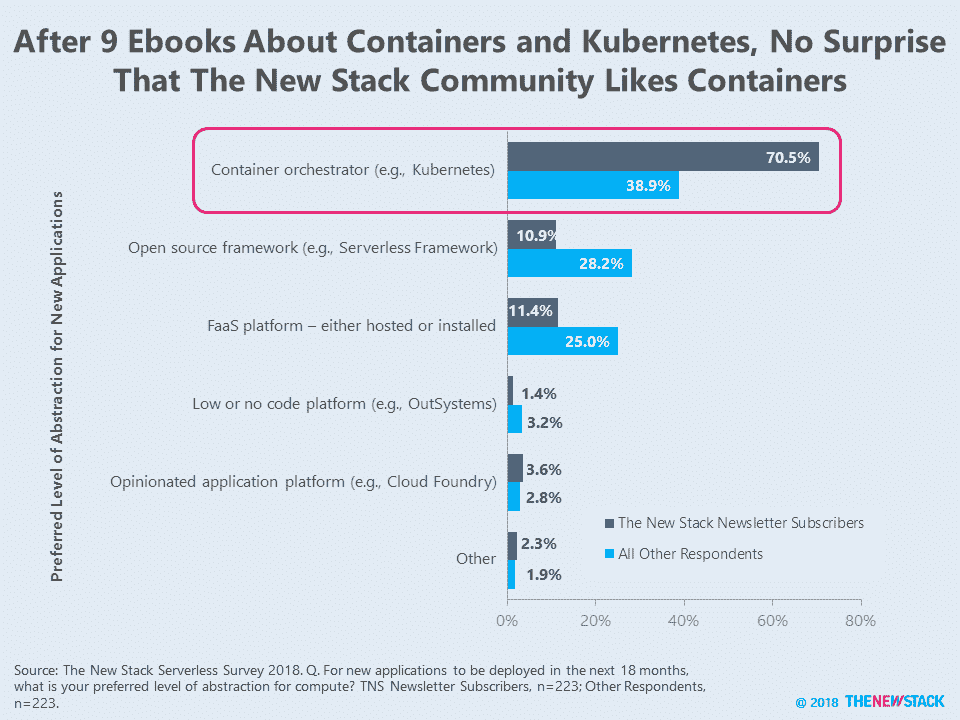

# 加起来:无服务器 vs. Kubernetes vs. Containers

> 原文：<https://thenewstack.io/add-it-up-serverless-vs-kubernetes-vs-containers/>

“无服务器”是否已经超越了容器？Kubernetes 会成为开发者的宇宙中心吗？不考虑技术优势，你个人对技术的投资会影响你的观点。

根据为我们关于无服务器的电子书所做的一项调查，容器拥有优势。总体而言，53%的受访者倾向于将容器作为平台来标准化其组织如何抽象 IT 基础架构，33%的受访者选择功能，10%的受访者选择虚拟机。换一种方式问，55%的人倾向于在未来一年半内部署像 Kubernetes 这样的新应用程序。

FaaS 的经验可以预测一个人是否更喜欢函数。事实上，63%的大规模生产 FaaS 实现将功能标准化。在那些最初生产使用 FaaS 的人中，容器和功能之间的投票基本上是不相上下的。这些早期采用者的经验可能会影响未来的架构决策。如果函数有太多的问题，那么容器甚至虚拟机将仍然是开发人员首选的抽象级别。

新的堆栈覆盖容器的历史对结果有影响。几乎一半的受访者最初订阅了我们的时事通讯，因为他们阅读了我们关于 [Docker 和容器生态系统](https://thenewstack.io/ebooks/docker-and-containers/the-docker-container-ecosystem/)以及 [Kubernetes 生态系统](https://thenewstack.io/ebooks/kubernetes/)的九本电子书中的一本。在部署新应用程序时，这一群体倾向于容器编排的可能性几乎是前者的两倍。

那些深入无服务器世界的人倾向于函数，而更广泛的云原生群体倾向于容器。那些尚未采用云原生架构的功能是否会超越容器还有待观察。

FaaS 的广泛使用并不意味着将整个 IT 基础设施抽象为功能会有任何障碍。然而，FaaS 最普通的用户实际上更喜欢容器和虚拟机，而不是函数。

已经学习过容器和 Kubernetes 的人不太可能指望 FaaS 或开源框架来部署新的应用程序。

<svg xmlns:xlink="http://www.w3.org/1999/xlink" viewBox="0 0 68 31" version="1.1"><title>Group</title> <desc>Created with Sketch.</desc></svg>