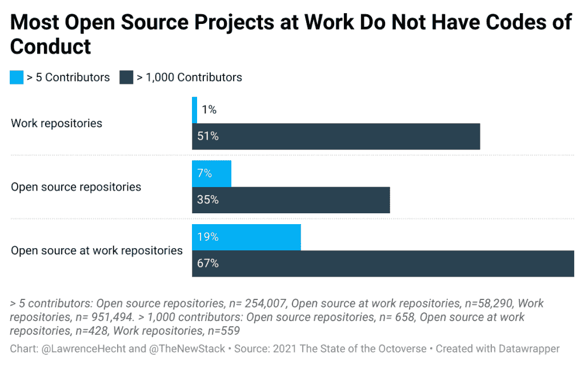
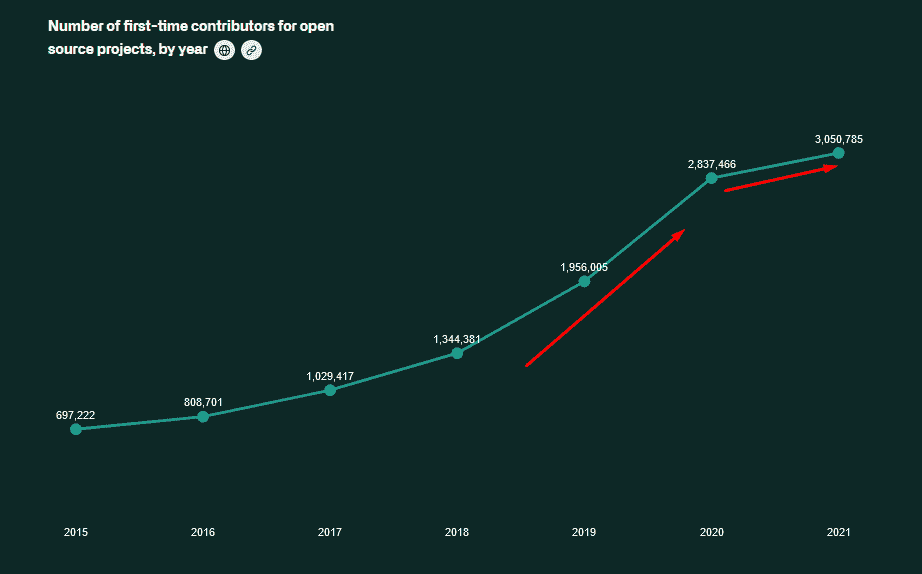
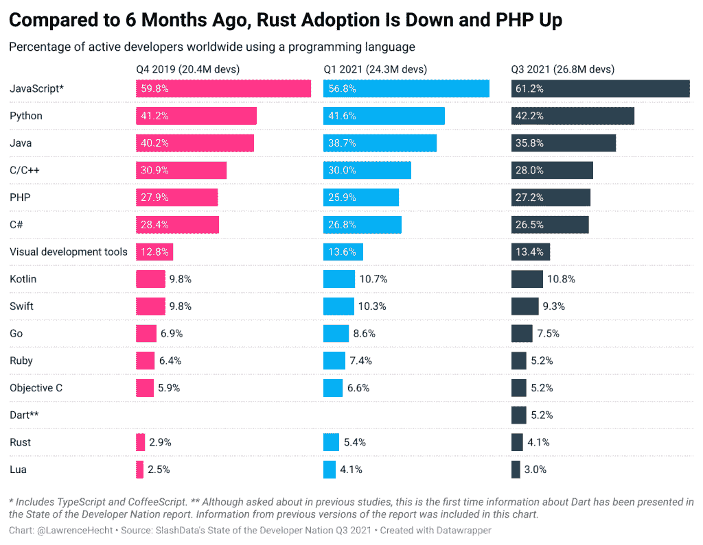

# 把它加起来:GitHub 的 Octoverse 报告摘录

> 原文：<https://thenewstack.io/add-it-up-takeaways-from-githubs-octoverse-report/>

GitHub octo verse 系列的[状态的最新条目是一项基于对超过 12，000 名开发人员的调查的大规模任务，并分别分析了来自 400 万个存储库的数据，其中包括许多来自付费 GitHub 团队或企业云帐户的数据。](https://octoverse.github.com/)

贯穿研究结果的一个主题是，那些将大部分时间花在为私人公司的存储库进行软件开发(47%)或在为私人公司工作时专注于开源项目(5.5%)的开发人员的行为与那些仍然参与开源社区的其他专业开发人员(13.5%)和学生(29%)不同。

三分之二(67%)的受访开发者表示，没有法律风险的创新能力是一个重要的优先事项。然而，只有 24%的人认为政府对开源的投资和贡献是重要的。

在这两个公共政策目标之间，几乎一半(47%)的人支持健康的在线协作，并努力确保每个人都有平等的机会成为开发者。GitHub 的分析提供了额外的证据，即添加和改进现有文档可以帮助开发人员变得更有效率，更快地编写代码，同时维持持久的社区。

私有与公共，工作与开源。精英统治与正义。这些普遍的迷因不会消失。

这些发现建立在之前[同行评审的](https://ieeexplore.ieee.org/document/8643844)工作的基础上，其中包括流行的[多拉指标](https://www.devops-research.com/research.html)的基础。然而，我们无法具体量化报告中的许多结论。本着开放科学的精神，我们鼓励 GitHub 向公众发布调查数据，以便研究人员可以尝试复制和测试，这样世界就可以进一步了解开发者世界。除此之外，以下是一些要点:

## **更快地编写和发布代码**

*   对于主要在私营公司从事项目的开发人员来说，越来越多地使用自动化来交付代码提高了软件交付性能。对其他人来说，统计上的显著好处是他们会更经常地感到满足。
*   对于由付费 GitHub 帐户管理的开源项目，合并拉取请求的平均时间从 2019 年的 14 小时下降到 2020 年的 13 小时，再到 2021 年的 10 小时。同时，对于所有的开源项目，合并一个 PR 的时间从 11 到 10。采用 GitHub Actions 似乎有助于提高公司的效率。

## 创建文档以支持开发人员

*   除了在最大的开源项目中，很难找到行为准则(CoC)和贡献者指南。当 GitHub 审查超过 400 万个公共和私有存储库时，它很少找到这些文档的例子。让我们假设只有超过五个贡献者的项目才需要 CoC。即便如此，只有 7%的非付费 GitHub 账户组织管理的开源库拥有 GitHub 账户。在由一个拥有付费 GitHub 账户的组织管理的超过 1000 个贡献者的开源项目中，这个数字上升到 67%。这些项目通常由大型科技公司或基金会运营。
*   虽然 24%由工作账户管理的开源项目有贡献者指南，但是只有 6%的其他项目有。同时，根据定义，超过 86%的开源项目有 README 文件，只有 15%的非开源项目有 README 文件。
*   **专注于工作项目的开发人员看到了 clear 可用文档的直接好处**，但是对于其他开源开发人员没有任何好处。
    *   受访者被问及文档 a)对于项目或团队之外的人来说容易阅读的频率；b)明确依赖性；c)描述代码的每个部分是如何工作的。
    *   好处是被授权工作(例如，你的团队允许你做决定)和花更多的时间朝着你的目标前进和工作。

*   对于专注于非工作开源项目的开发人员来说，一切都不会失去。说很容易找到项目信息的开发人员也说，他们更有可能朝着与工作相关的目标取得进展。新贡献者或新员工轻松找到解决方案或知道去哪里寻求帮助的能力似乎与朝着你的工作目标取得进展的能力没有直接关系，但这可能是研究人员分析模型中缺失的东西的代理。

## **社区如何维持生产力**

*   就像清晰的文档一样，公司有更多的动机来促进清晰的治理。在大多数与私营公司一起从事项目的开发人员中，知道谁对项目决策有影响以及谁有权执行诸如提交之类的任务有显著的好处。回报是，这些开发人员更有可能认同团队、社区及其使命。
*   在“工作”开发人员中存在清晰的文档可以增加改进治理的可能性，如果通过描述谁负责制定提交和影响决策。如果你把大部分时间花在社区开源项目上，那么你更有可能说你的团队通过分担责任来运作，有跨职能的协作，并且总体上促进了所谓的 [Westrum 组织文化](https://cloud.google.com/architecture/devops/devops-culture-westrum-organizational-culture)。
*   **GitHub 在新用途和项目贡献者方面的增长可能正在放缓。**与去年相比，新用户账户数量增长了 28%,与前几年相比，这一增长速度实际上有所放缓。中国的增长率明显低于平均水平，为 16%。
*   首次投稿者的招募似乎也有所降温。总体而言，2021 年的新贡献者比 2020 年多 8%。如果有 300 万新的首次贡献者，有 1600 万新的 GitHub 帐户，那么 19%的新 GitHub 用户是首次贡献者。这是一个[开源社区指标](https://chaoss.community/metrics/)，开发者支持者和其他人可以用它来进行基准测试。
*   GitHub 用户账户的数量似乎只是随着全球开发者人数的增长而增长，SlashData 的第 21 期《开发者国家状况报告》估计，去年全球开发者人数增长了 28%。

来源:[2021 年的八分星状态](https://octoverse.github.com/sustainable-communities/)。2020 年，开源项目的新贡献者数量增加了 45%，达到 280 万人。2021 年，净增长仅为 8%，但这仍然意味着超过 300 万人对开源项目做出了贡献。

## 评估开发商市场

本文前面提到过，SlashData 的第 21 期《开发国家状况报告》显示，随着时间的推移，不同编程语言的采用发生了变化。GitHub 的报告公布了至少一个看起来相似的图表，但他们的数据并非来自调查结果。

根据我们对 SlashData[第 21 届开发人员国家状况报告](https://slashdata-website-cms.s3.amazonaws.com/sample_reports/_TPqMJKJpsfPe7ph.pdf)的分析，在过去的六个月中，JavaScript 和 Dart 是唯一在全球开发人员的规模和比例方面都有显著增长的主要编程语言。如果我们将调查数据与去年同期(2020 年第三季度)进行比较，那么 Rust 开发者的数量上升了 38%，但作为全球所有开发者的比例，Rust 仅占 4.1%，低于 2021 年 Q1 的 5.4%。尽管这与传统智慧的预测相反，另一项[大规模调查](https://thenewstack.io/fewer-rust-developers-target-webassembly/)也发现 Rust 的采用率最近有所下降。实际 Rust 代码的部署持续上升，因此这些可能是调查数据中的亮点。或者，现在 Rust 基金会已经重振了[的领导地位](https://foundation.rust-lang.org/news/2021-11-17-news-announcing-rebecca-rumbul-executive-director-ceo/)，可能会有新一轮的采用。

SlashData 的原始报告基于使用每种语言的开发人员的数量，而不是使用每种语言的全球开发人员的百分比。这种差异很重要，因为开发人员的数量在持续增长。虽然整个市场的规模可能会一直增长，但这并不意味着一种语言/技术的地位或排名会发生变化。有时候，这些东西在虚荣心指标方面很重要，有时候它们适用于财务分析。只是一些需要注意的事情。

<svg xmlns:xlink="http://www.w3.org/1999/xlink" viewBox="0 0 68 31" version="1.1"><title>Group</title> <desc>Created with Sketch.</desc></svg>