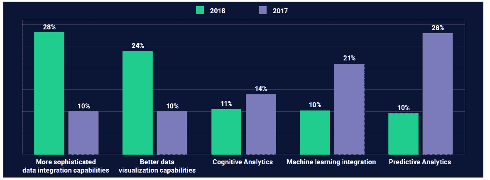
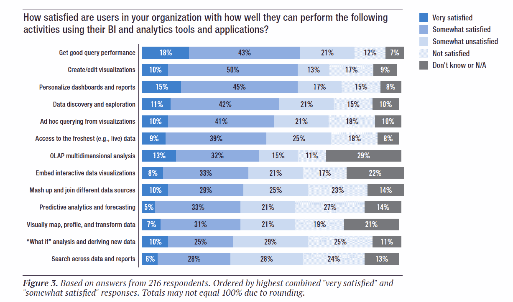

# 加起来:为什么 Salesforce 和谷歌收购 Tableau 和 Looker

> 原文：<https://thenewstack.io/add-it-up-why-salesforce-and-google-bought-tableau-and-looker/>

Salesforce 正在收购 Tableau，Google Cloud 正在为其家族增加一个新成员，这就是 T2。在审查了一系列关于商业智能(BI)、分析和数据仓库的研究后，我们发现很明显，这两项收购都将提供同类最佳的功能，满足业务分析师和 it 部门的需求，以及在与人工智能和机器学习关系不大的高增长市场中的领导地位。

根据 shares post 2018 年 10 月的[调查](https://sharespost.com/insights/research-reports/2018-business-intelligence-and-data-analytics-survey/)，28%的 IT 专业人士认为，在未来五年内，更复杂的数据集成能力将是商业智能和分析软件开发的重点。这与 2017 年调查中只有 10%的人这么说相比，有了大幅上升。人们对数据可视化能力的关注度也有所提高。明显的输家是机器学习集成和预测分析。这并不意味着 ML 和预测分析的使用有所下降，同一项研究发现，在同一时期，BI 工具中预测分析的使用从 41%上升到 67%。相反，开发人员可能认为新技术的预测能力不如实际管理和可视化探索正在分析的数据重要。

> 对于使用监控应用程序和 IT 系统的工具的用户来说，权衡业务用户的简单性和编写定制功能的能力是很常见的。

收购 Looker 将解决数据整合问题，并与谷歌云的 BigQuery 和其他数据服务合作。正如 Amalgam Insights [的](https://amalgaminsights.com/2019/06/12/market-milestone-google-to-buy-looker-to-transform-business-analytics/) [Hyoun Park](https://www.linkedin.com/in/hyounpark/) 解释的，Looker 有能力跨混合和多云环境大规模支持通用数据模型，并支持查询时的数据转换，而不是通过托管 ETL(提取、转换和加载)作业。

Salesforce 已经通过收购 Mulesoft 的[解决了数据集成的痛点。虽然 Tableau 拥有强大的数据自助服务和数据驱动的发现能力，但它是数据可视化的市场领导者，尤其是在大型企业客户中。与前一年相比，SharePost 研究中 Tableau 的使用率几乎翻了一番，从 18%上升到 33%。其他研究显示增长速度较慢，但表明 Tableau 现在可以与微软、SAP 和传统 BI/分析公司的产品相媲美。](https://www.mulesoft.com/press-center/salesforce-acquisition-completed)

来源:SharesPost Research2018 年调查，n = 3022017 年调查，n=250。问题:您认为未来 5 年商业智能和分析软件开发的重点在哪里？

TDWI 2018 年秋季[对业务和 IT 专业人士的调查](https://tdwi.org/research/2018/12/adv-all-best-practices-report-bi-analytics-age-of-ai-and-big-data.aspx)发现，他们对集成、预测分析和高级可视化功能都不满意。几乎一半(48%)的受访者对他们的 BI/分析工具进行预测性分析和预测的能力至少有些不满意；同样比例的人担心他们混搭和连接不同数据源的能力。用户通常对他们能够创建和编辑基本的可视化感到满意，但对嵌入交互式图形以及可视化映射和转换数据的能力不太满意。对预测性分析的担忧可能与对数据管道和准备程序的担忧有关，这些都是使分析项目取得成功所必需的。

来源:TDWI 最佳实践报告|人工智能和大数据时代的商业智能和分析

当这些系统被一个业务单位购买，但随后需要技术人员定期维护时，开发人员和 IT 部门怨声载道。由于需要手动编写查询和脚本，BI 软件不可避免地受到限制，但 Tableau 和 Looker 等工具使业务用户能够更轻松地自助处理定制。在这方面，BI 和分析工具长期以来一直处于[低代码和公民开发](https://thenewstack.io/low-code-platform-adoption-gets-a-boost-from-digital-transformation/)的最前沿。

## 供应商和开源

对于使用监控应用程序和 IT 系统的工具的用户来说，权衡业务用户的简单性和编码定制功能的能力是很常见的。Nagios、Zabbix、Grafana 和 Kibana 都是开源项目，开发人员使用它们来创建监控解决方案，这些解决方案通常有一个仪表板作为前端。公司纷纷涌现，将这些项目货币化，但在更大的产品中使用这些组件的供应商也是如此，这些产品在组织中既易于操作又易于扩展。

开源技术在数据管理相关领域非常成功，是[流处理栈](https://thenewstack.io/vendors-compete-for-users-of-stream-processing-technologies/)的核心。[Joseph Jacks](https://twitter.com/asynchio),[OSS Capital](https://oss.capital/)的创始人和普通合伙人认为，商业智能应用层平台的下一次重大变革浪潮将与商业开源公司相关联，如 [Redash](https://redash.io/) 和 [Metabase](https://www.metabase.com) 。Apache 超集是另一个广泛使用的项目。它是由 push metrics[提供的托管服务，并明确作为 Tableau、Looker 和 PowerBI 的开源替代品进行营销。虽然我们无法预测“开放核心”作为一种商业模式的未来，但我们相对有信心，在未来的几年中，开放源代码技术将被纳入许多供应商的产品中。](https://pushmetrics.io/)

## 推荐阅读

*   **商业应用研究中心的[《2019 顶级商业智能趋势》](https://bi-survey.com/top-business-intelligence-trends) :** 对 2，679 名 BI 专业人士的调查。这项研究每年进行一次，大多数参与者生活在欧洲。深入的供应商评级只对付费客户开放，但是大范围的数据是[可访问的](https://bi-survey.com/bi-survey-analyzer)。
*   [**《Dresner Wisdom of Crowds 商业智能 2019 报告》**](https://looker.com/learn/dresner-wisdom-of-crowds-report) :一项历史悠久、备受推崇的研究。它有详细的宏观问题以及特定供应商的客户评级。
*   **[埃克森集团](https://www.eckerson.com/) :** 这家研究公司的博客是商业分析、数据管理和数据科学的绝佳分析来源。

来自 Pixabay 的 bernswaelz 的特写图片。

<svg xmlns:xlink="http://www.w3.org/1999/xlink" viewBox="0 0 68 31" version="1.1"><title>Group</title> <desc>Created with Sketch.</desc></svg>