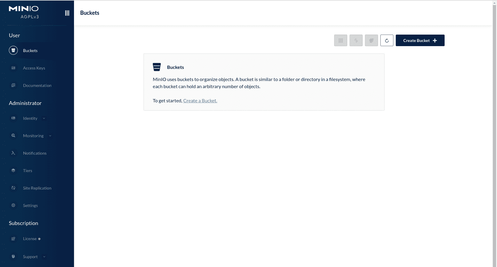

# 使用 MinIO 向 Rocky Linux 添加对象存储

> 原文：<https://thenewstack.io/add-object-storage-to-rocky-linux-with-minio/>

***编者按:MinIO 是新栈的赞助商。***

对象存储使得存储大量只写一次、多次读取的非结构化数据成为可能。对象存储用于存放视频、照片、音乐和在线协作文件。在对象存储中，数据被分割成单元(也称为“对象”)，存储在平面环境中。每个对象包括:

*   数据
*   [计]元数据
*   唯一标识符

文件的所有数据块作为一个对象包含在一起，并存储在所谓的存储池中。为了访问数据，存储系统使用唯一标识符和元数据来查找对象。可以使用 RESTful APIs、HTTP 和 HTTPS 来访问数据。

对象存储对于云服务和应用程序的运行至关重要。由于对象存储的工作方式，您可以非常快速地扩展，最高可达 Pb 和 EB(只要相关机器有空间)。

有一个方便的开源平台可以满足您的对象存储需求。那个项目叫做 [MinIO](https://min.io/?utm_content=inline-mention) ，用 Go 编写，兼容亚马逊 S3 对象存储。更好的是，你可以在你的机器上安装 MinIO。我将带你完成在 Rocky Linux 上安装 MinIO 的过程。您可以在数据中心(或开发人员网络)的硬件上安装 Rocky Linux 来实现这一点，也可以将这一过程带到云和您喜欢的云主机上。不管你走哪条路，这个过程都不会太难。

也就是说，让我们来看看这个过程。

## 你需要什么

要成功实现这一点，您需要具备以下条件:

*   一个运行中的 [Rocky Linux](https://rockylinux.org/) 实例。我将在 Rocky Linux 9 上演示。
*   拥有 *sudo* 权限的用户。
*   您的驱动器上有足够的空间来容纳存储空间(稍后会详细介绍)。

就是这样。该工作了。

## 如何安装 MinIO

我们要做的第一件事是安装 MinIO。登录到 Rocky Linux 实例，用命令下载二进制文件:

```
sudo curl  -o  /usr/local/bin/minio https://dl.min.io/server/minio/release/linux-amd64/minio

```

该命令将下载 minio 可执行文件并保存到 */usr/local/bin* 。然后，您需要授予文件可执行权限:

```
sudo chmod  u+x  /usr/local/bin/minio

```

使用命令
确保 */usr/local/bin* 位于您的用户路径中

您应该会看到这样的输出:

```
-bash:  /home/jack/.local/bin:/home/jack/bin:/usr/local/bin:/usr/bin:/usr/local/sbin:/usr/sbin:

```

如果在你的路径中没有找到/usr/local/bin，可以加上:

```
echo  'export PATH="$PATH:/usr/local/bin"'  &gt;&gt;  ~/.bashrc

```

用:
重新加载 bashrc

现在，当你检查你的路径时，你应该看到 */usr/local/bin* 被列出。

使用
验证安装

您应该会在输出中看到类似这样的内容:

```
minio version RELEASE.2022-11-11T03-44-20Z  (commit-id=bdcb485740ee2cf320c9b331ebd354df5bf6d826)
Runtime:  go1.19.3  linux/amd64
License:  GNU AGPLv3  &lt;https://www.gnu.org/licenses/agpl-3.0.html&gt;
Copyright:  2015-2022  MinIO,  Inc.

```

牛逼。我们继续吧。

## 如何为 MinIO 对象存储设置驱动器

如果您的本地存储空间不足以容纳所有数据，您需要连接一个外部驱动器并安装它。假设您有一个名为 */dev/sdb1* 的驱动器，您想将它挂载到 */data* 。

首先，用
创建了*/数据*目录

接下来，使用
安装驱动器

```
sudo mount  /dev/sdb1  /data

```

在我们的下一个技巧中，我们将在 *fstab* 中添加一个条目，这样即使在重启后，驱动器也会一直被挂载。用
打开 *fstab*

在该文件的底部，添加以下内容:

```
/dev/sdb1  /data ext4 defaults  0  0

```

请注意，如果您的驱动器使用另一种分区格式，请确保用正确的类型替换 ext4。

保存并关闭文件。使用
重新挂载所有可用分区

您应该看不到任何错误。

## 如何配置 MinIO

首先，我们必须用命令添加一个特定的用户:

```
sudo useradd  -r  minio  -s  /sbin/nologin

```

使用
更改数据文件的所有权，使其属于 minio 用户

```
sudo chown  -R  minio:minio  /data

```

现在，用
创建一个目录来存放 MinIO 配置

使用
赋予该目录适当的所有权

```
sudo chown  -R  minio:minio  /etc/minio

```

使用命令:
为 MinIO 创建一个配置文件

```
sudo nano  /etc/default/minio

```

在该文件中，粘贴以下内容:

```
MINIO_ROOT_USER="minio"
MINIO_VOLUMES="/minio-data"
MINIO_OPTS="-C /etc/minio --address :9000 --console-address :9001"
MINIO_ROOT_USER=admin
MINIO_ROOT_PASSWORD="PWORD"

```

其中 PWORD 是一个强/唯一密码。

保存并关闭文件。

使用
赋予该文件适当的权限

```
sudo chown minio:minio  /etc/default/minio

```

## 为 MinIO 创建 systemd 文件

我们现在必须为 MinIO 创建一个 systemd 文件。使用命令:
执行此操作

```
sudo nano  /lib/systemd/system/minio.service

```

在该文件中，粘贴以下内容:

```
[Unit]
Description=Minio
Documentation=https://docs.minio.io
Wants=network-online.target
After=network-online.target
AssertFileIsExecutable=/usr/local/bin/minio

[Service]
WorkingDirectory=/usr/local/
User=minio
Group=minio

EnvironmentFile=-/etc/default/minio
ExecStartPre=/bin/bash  -c  "if [ -z \"${MINIO_VOLUMES}\" ]; then echo \"Variable MINIO_VOLUMES not set in /etc/default/minio\"; exit 1; fi"
ExecStart=/usr/local/bin/minio server  $MINIO_OPTS  $MINIO_VOLUMES

# Let systemd restart this service always
Restart=always

# Specifies the maximum file descriptor number that can be opened by this process
LimitNOFILE=65536

# Disable timeout logic and wait until the process is stopped
TimeoutStopSec=infinity
SendSIGKILL=no

[Install]
WantedBy=multi-user.target
Save and close the file.

```

使用
重新加载 systemd 守护进程

```
sudo systemctl daemon-reload

```

使用
启动并启用 MinIO 服务

```
sudo systemctl enable  --now minio

```

## 打开防火墙

没有打开防火墙，我们无法访问 MinIO，这需要打开 9000 和 9001 TCP 端口。使用命令:
执行此操作

```
sudo firewall-cmd  --zone=public  --add-port=9000/tcp  --permanent
sudo firewall-cmd  --zone=public  --add-port=9001/tcp  --permanent

```

使用
重新加载防火墙

```
sudo firewall-cmd  --reload

```

## 如何访问 MinIO

在同一网络上打开一个 web 浏览器，并将其指向 http://SERVER:9000(其中 SERVER 是托管服务器的 IP 地址或域)。您应该会看到登录屏幕(图 1)，在这里您将使用用户名“admin”和您在配置文件中创建的密码进行身份验证。

成功通过身份验证后，您会发现自己在主 MinIO 窗口上(图 2)，在这里您可以创建您的第一个存储桶，并管理访问密钥、身份、监控、通知、层、复制等内容。



图 2:主 MinIO 窗口已经可以使用了。

这就是在 Rocky Linux 上创建对象存储的全部内容。享受新发现的存储非结构化数据的能力。

<svg xmlns:xlink="http://www.w3.org/1999/xlink" viewBox="0 0 68 31" version="1.1"><title>Group</title> <desc>Created with Sketch.</desc></svg>