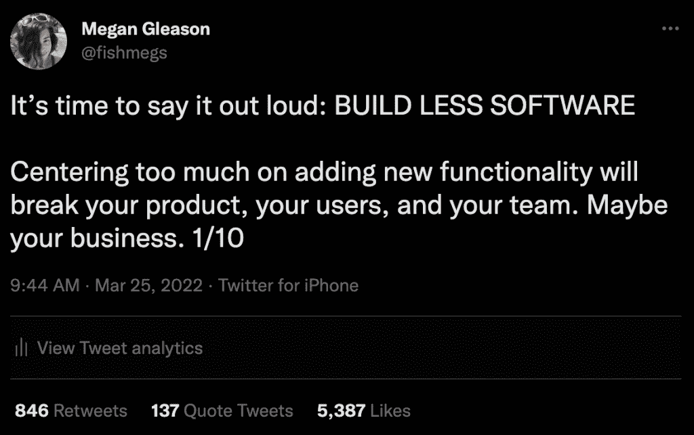
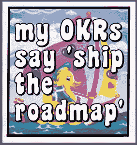
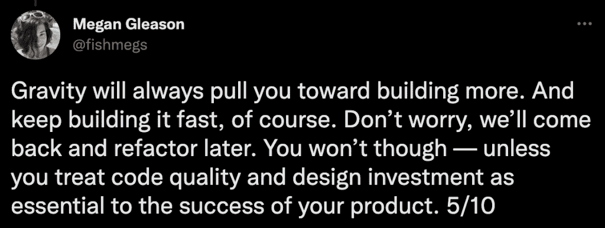
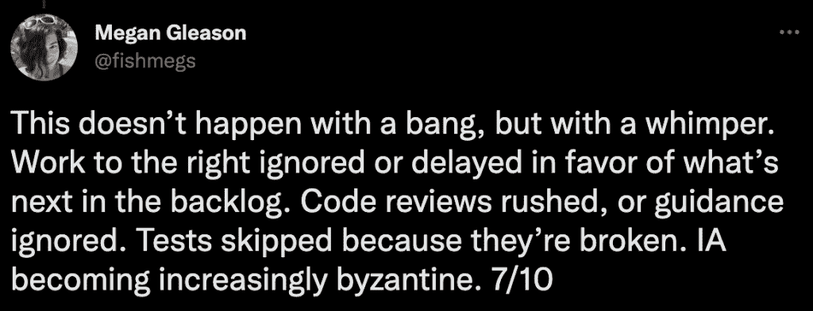

# 添加太多的功能会破坏你的产品、用户和团队

> 原文：<https://thenewstack.io/adding-too-many-features-will-break-your-product-users-and-team/>

不久前，我在 Twitter 上发表了一篇咆哮，众所周知我时不时会这么做:

这似乎引起了共鸣——650，000+印象之后，我被邀请进一步探索这些想法。

## 什么是产品价值？

 [梅根·格里森

Megan 是 Honeycomb.io 的产品副总裁。20 多年来，她一直与团队合作，交付优秀的软件。她特别热衷于为技术受众构建产品，之前在 Chef Software 和 Auth0 领导过产品团队。](https://twitter.com/fishmegs) 

如果你和我一样，来自马蒂·卡根的产品开发学院，你应该熟悉负责定义和交付产品的核心团队的结构。Triad 是三种角色的简写，这三种角色相互平衡，各自负责不同类型的宣传:

1.  **UX 设计师:**确保产品可用。这可以包括从可发现性到工作流一致性，从解决实际的用户目标到设计一个漂亮的 UI。
2.  工程师:生活在可行性的王国里。根据用户的预期需求，推动技术决策并确保实施可测试、可操作、可扩展和可维护。
3.  **产品经理:**对价值负责。这包括对业务的价值(推动采用或收入是常见的例子)以及对用户的价值。

如果我们，作为产品经理，对价值负责，有什么比给产品增加新的特性更能创造价值呢？在许多软件公司中，这是成功的最终衡量标准，激励机制不成比例地围绕着新功能的交付(输出)而不是用户和业务目标的实现(结果)。

我认为，那些将自己对价值的理解局限于这种简单定义的产品经理，无论是对他们自己还是对他们的业务，都会感到心痛。

认识到三位一体的角色及其各自关注点之间的相互依赖性是足够直观的。作为产品经理，我们明白没有工程，我们将无法交付任何东西。或者，如果没有设计，我们可能会在实现中以“开发人员艺术”告终，这不会让我们的用户感到兴奋。

没有产品经理对商业价值负责，工程和设计部门会知道什么投资最有影响力吗？但是我们对彼此的依赖远不止于此。

## 离开你的车道

在技术领域，产品经理拥有“什么”,工程师拥有“如何做”是一种常见的说法。粗略来看，这是一个很好的指导方针，但是如果我们希望我们的产品长期成功，我们最好都关心如何成功。(我不是在谈论围绕技术堆栈的决策，这些决策最好留给工程领域的专家来做。)

对于产品经理来说，过度关注发布新功能而不考虑这样做的成本是非常危险的。除了少数例外，我们为产品增加的每一平方英寸的表面积都增加了它的复杂性，降低了我们快速移动的能力。所有这些代码都需要审查、测试、保护、升级、修补、维护、操作，并最终弃用。随着条件逻辑被嵌入(希望)使所有这些特性很好地配合，通过代码库的途径变得越来越紧张。

这也适用于设计。信息架构是一个在匆忙生产新特性时经常遭受损失的领域。

当我们的产品很小的时候，我们可以故意设计优雅的导航和工作流程。在我们急于添加下一个很酷的东西的过程中，我们经常会减少为用户保持一致性所需的投资。

有一种健康的张力存在于三元模型中，我并不是建议我们把它扔出窗外。如果作为一名产品经理，我对工程或设计的关注反应过度，我就有放弃创造价值的主要责任的危险。

然而，我确实认为产品经理在三位一体中有一个独特的角色，这个角色要求他们考虑其他角色的关注点，因为事实上，他们与产品本身的成功是不可分割的。

## 债务会让你沉沦

如果我们不仅要对新功能的短期交付负责，还要对我们为用户构建的产品的持续健康和质量负责，我们需要考虑我们在构建时不断创造的设计和技术债务。我们有时会以未来的质量为抵押借款，因为上市时间至关重要，这不仅仅是可以，交付时间是我们评估产品价值的重要部分。但过一段时间后，债务就会到期，忽视它实际上就像把煤渣块拴在我们的腿上，然后跳进海里。

理解和管理债务需要产品经理和他们在 triad 中的同事之间的高度信任。如果承担一些债务是好的(甚至是好的)，我们怎么知道它什么时候走得太远了？

首先，我们需要真正认识并关心产品健康的这些长期维度。作为产品经理，我们**必须**将此视为我们创造价值责任的一部分。其次，当我们的工程和设计合作伙伴倡导偿还债务时，我们需要倾听。我们需要支持他们并创造空间，而不是对这些担忧是否真的重要表示怀疑。

## 没有质量冲刺

除非我们已经债台高筑，以至于编写新代码感觉像在糖蜜中游泳，或者我们的团队花了一半(或更多)的时间在生产中灭火，否则我不鼓励任何团队安排“质量冲刺”或类似的事情。这将是一个有具体目标的时间间隔，围绕修复错误、升级依赖关系或进行其他类型的重构。

我也不喜欢对不同类型的工作使用目标百分比——比如留出团队 20%的时间用于维护的流行做法。我们的工作会有自然的起伏，像这样的方法会导致浪费甚至戏剧。

我所推荐的是，triad 定期讨论平衡特性交付和其他关注点，并且无论他们的团队使用什么系统来跟踪工作，都要使跨投资领域的优先级非常清晰。(更多关于流量和时间窃取的内容，请看[多米尼克·德格兰迪斯](https://www.amazon.com/Making-Work-Visible-Exposing-Optimize/)的优秀作品。)当团队在这方面变得熟练时，我们可以观察到稳定的交付流，这有益于用户，同时使代码库变得更好。

## 我们为用户而建

一个离别的想法:如果我们很幸运，我们的产品甚至取得了适度的成功，来自用户的反馈和想法将永远不会停止。这太棒了！想要帮助我们把产品做得更好的用户是一份难以置信的礼物。这些用户希望我们的产品易于使用、功能强大、快速可靠，他们并不需要在匆忙添加闪亮的新东西与技术和设计债务的阴影之间进行平衡。

我们是。

<svg xmlns:xlink="http://www.w3.org/1999/xlink" viewBox="0 0 68 31" version="1.1"><title>Group</title> <desc>Created with Sketch.</desc></svg>