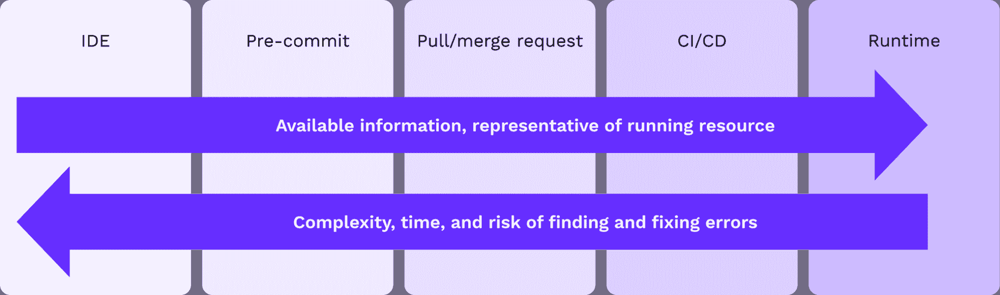

# 解决基础架构开发运维生命周期中的安全性问题

> 原文：<https://thenewstack.io/addressing-security-throughout-the-infrastructure-devops-lifecycle/>

 [巴拉克·肖斯特

Barak Schoster 是 Bridgecrew 的联合创始人兼首席技术官。Barak 住在特拉维夫，他花时间帮助团队保护云基础设施、编写代码以及谈论编写代码。他是 Checkov 的创建者，经常为其他开源项目做出贡献。在推特@BarakSchoster 上关注他。](https://www.linkedin.com/in/barakschoster/) 

不，这不是另一篇关于安全开发生命周期的文章。这是一篇关于为什么以及如何在基础设施开发生命周期的每一步解决云安全问题的实用文章，从 IDE 中的基础设施即代码到运行云资源。

随着云安全态势管理(CSPM)供应商和云工作负载保护平台(CWPPs)扩展其产品并[收购像我们这样的开发者优先公司](https://www.paloaltonetworks.com/company/press/2021/palo-alto-networks-announces-intent-to-acquire-bridgecrew)，在开发生命周期的早期解决云安全最佳实践的想法正在流行。我们认为这是有充分理由的。

无论您将其称为开发人员第一的安全性、DevSecOps 还是“左移”，这种方法都为开发运维与云原生方法的两个普遍挑战提供了解决方案:

1.  开发人员工作站的软件缺陷越多，它们就变得越昂贵。研究表明，在生产中发现并修复一个软件缺陷，可能要比[贵 100 倍](https://www.isixsigma.com/industries/software-it/defect-prevention-reducing-costs-and-enhancing-quality/)。
2.  由于人为错误造成的错误配置导致了 [95%的云安全事件](https://www.gartner.com/smarterwithgartner/why-cloud-security-is-everyones-business)。云提供了增强的可扩展性、移动性和灵活性，同时也增加了出错的风险。尽管云服务提供商(CSP)本身非常安全，但 API 和服务的复杂性大大增加了安全错误配置的风险。

借助云配置框架和基础设施即代码(IaC)的增加使用,“左移”方法有望提高效率并降低风险。但是，正如大多数新的和破坏性的想法一样，必须在真实的云环境、真实的开发人员工作流和真实的业务风险的背景下看待它。

随着生命周期的延长，错误配置确实变得更加危险和昂贵。然而，同样真实的是，生命周期越早，关于基础设施将会是什么样子的信息就越少，因此，可能存在什么样的错误配置。

这就是在运行时和构建时解决基础设施安全问题非常重要的原因。我们会更进一步说，根据你的团队、环境和过程的性质，在开发生命周期的每个阶段之间都有细微的差别需要考虑。

## 运行时间/生产

请记住，开发人员第一的安全性并不排除“传统的”云安全方法，即监控正在运行的云资源的安全性和合规性错误配置。

首先，除非你已经在 IaC 和云之间实现了 100%的对等(不太可能)，否则运行时扫描对于完全覆盖是必不可少的。您可能仍然有团队或环境的一部分—可能是遗留资源—仍然通过遗留系统或直接在您的控制台中手动配置，因此需要持续监控。

即使你大部分时间都被 IaC 覆盖，人类还是会犯错，再发生也是必然的。我们最近写了[云漂移检测](https://thenewstack.io/cloud-drift-detection-how-to-resolve-out-of-state-changes/)的重要性，以捕捉导致代码配置和运行云资源之间无意差异的手动更改。深入了解生产中的这些资源对于确定潜在的风险差距至关重要。

运行时扫描也有一些优点。因为它遵循配置的实际状态，所以当用多种方法管理配置时，它是评估配置随时间变化的唯一可行的方法。

仅仅依靠构建时的发现，而不将它们归因于运行时的实际配置状态，可能会导致配置冲突。例如，尝试加密以前未加密的数据库实例可能无法提供更改，或者清除当前实例并用新的空实例替换它们，因为一些托管数据库服务(如 RDS)不允许事后加密。

这也是满足要求持续变更控制审计和跟踪的合规性审计的一个很好的方法。通过映射到合规性基准和部分，您可以将扫描报告用作基线证据，以满足大多数行业特定的要求和审核。

## CI/CD 和拉取请求

IaC 的美妙之处在于，它允许在部署基础架构之前对其进行先发制人甚至主动的监控。CI/CD 管道对于编译基础设施和在交付和部署之前测试编译后的代码至关重要。在这个阶段，IaC 很好地代表了部署后将如何配置它。

例如，对于 Terraform 代码，terraform 计划输出包含的细节完整性要比之前的阶段高得多。扫描这个抽象层次是很重要的，这样可以看到在将要供应的核心资源及其变量和依赖模块中是否存在错误配置。

将基础设施安全性嵌入 CI/CD 管道的另一个好处是，它是自动化的，并且可以针对您的工作流进行完全定制。您可以直接在您的 CI/CD 提供程序中确定哪种检查没有通过构建和表面反馈。这也是一个协作过程，您的整个团队都在使用它来审查、拒绝和批准变更。

类似地，对于依赖于他们的版本控制系统(VCS)的团队来说，将安全性嵌入到拉请求和批准的代码审查过程中有很多好处。根据触发 CI/CD 构建的因素，这种方法可以与通过 CI/CD 进行的扫描配合使用，也可以取代后者。

您的 VCS 还可以提供一些独特的控制来实施内部控制。所有三个主要平台(GitHub、GitLab 和 Bitbucket)都提供版本控制、分支和嵌入式代码审查和授权控制，允许开发人员在不影响运行生产系统的情况下进行测试，并在合并之前继续进行代码更改。

例如，您可能希望设置代码审查设置，以便在检查失败时阻止合并，从而进一步确保错误配置的 IaC 不会到达您的主分支。

无论您是在 CI/CD 中扫描还是在 VCS 中扫描，这种级别的控制都促进了开发人员的协作和可访问性。如果您除了能够检测到同一个阶段之外，还能够提供修复，那么您的任务就简单多了。

## 预提交和 IDE

在 CI/CD 被触发之前扫描集成代码的主要好处之一是能够在不等待构建完成的情况下进行更改。对于我们许多人来说，等待构建完成是我们生存的祸根。重新运行由于安全错误配置而失败的构建是一个巨大的时间消耗，可以通过将安全性向左移动一步来避免。预提交单元和集成测试是普遍接受的最佳实践，但是作为基础设施开发人员，预提交安全测试可能还不在您的优先事项列表中。

在本地扫描 IaC 的错误配置是在您自己的工作空间中安全解决错误的最佳方式，而不必浪费时间使构建失败(并延迟您队友的构建)或在拉请求检查中出错。

在它到达您的共享存储库之前就发出标记是左移安全性的缩影，但是开发人员有责任运行扫描并做出更改。

唯一比在提交 IaC 之前扫描它更好的事情是在你实际编写代码的任何地方获得在线反馈。因为它最大限度地减少了上下文切换(不需要运行特别扫描)，所以这是识别错误配置的最便宜和最简单的方法。

要将云安全尽可能地“向左”转移(除了设计和计划阶段)，将 guardrails 嵌入到您的 IDE 中是最好的方法。这可能会以插件或扩展的形式出现，比如 [Checkov VS 代码扩展](https://bridgecrew.io/blog/vs-code-extension-inline-iac-scanning-fixes)。Checkov 扩展通过在编码时提供实时和连续的扫描和内嵌修复，使扫描过程更加无缝。无论您是接受反馈并立即实施更改，还是使用 IDE 建议作为编写安全基础结构的教育工具，都不会有什么负面影响。

有了被动分析和可操作反馈的正确平衡，您无需付出过多的努力就能成为更好的安全倡导者。

最终，这将推动开发人员实现基础设施的安全性和合规性。让这些工具变得可访问，同时在不同的检查点集体实施护栏，这是安全左移的真实表现。

通过 Pixabay 引导图像。

<svg xmlns:xlink="http://www.w3.org/1999/xlink" viewBox="0 0 68 31" version="1.1"><title>Group</title> <desc>Created with Sketch.</desc></svg>