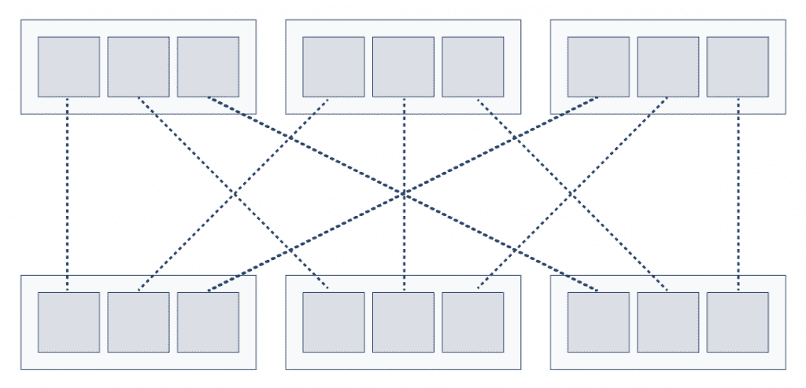
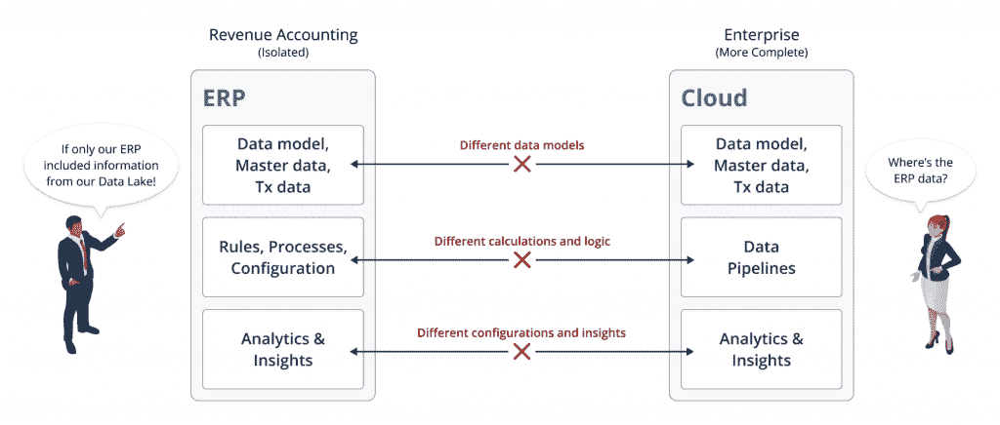
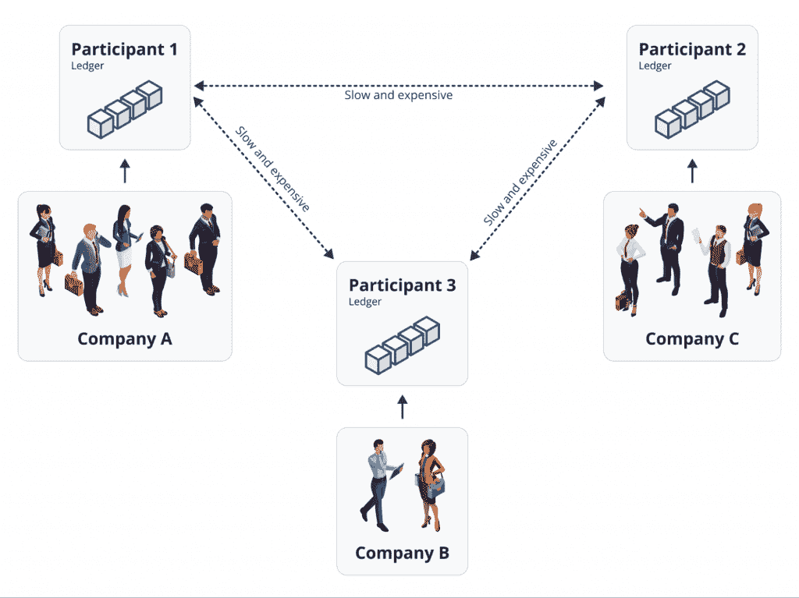

# 应对实时数据共享的挑战

> 原文：<https://thenewstack.io/addressing-the-challenges-of-real-time-data-sharing/>

虽然传统的数据仓库和数据湖已经成为分析工作负载的常见做法，但它们并没有解决在部门或公司之间共享实时运营数据的更广泛的企业问题。这个由三部分组成的系列探讨了在现代 IT 堆栈中跨不同应用程序、云和组织集成业务数据时出现的挑战和解决方案。

*   *第 1 部分强调了实时数据共享的挑战，讨论了操作数据与分析数据，以及遗留解决方案及其局限性。*
*   *[第 2 部分](https://thenewstack.io/the-real-time-data-mesh-and-its-place-in-modern-it-stacks/)定义了实时数据网格，并讨论了将其融入现代 IT 堆栈的关键原则。*
*   *[第 3 部分](https://thenewstack.io/vendor-checklist-for-real-time-data-meshes/)关注有效评估实时数据共享解决方案需要什么。*

## 跨越峡谷—基础 IT 挑战

 [蒂姆·瓦格纳

Tim 是 AWS Lambda 的发明者，也是 AWS Lambda 和亚马逊 API 网关服务的前总经理。他还曾在比特币基地担任工程副总裁，管理设计、安全和产品管理团队。蒂姆联合创立了 Vendia，以帮助各种规模的组织更有效地跨云和公司共享数据，他担任其首席执行官。](https://www.linkedin.com/in/timawagner) 

对于 IT 专业人员来说，无论其组织规模或行业如何，最持久和最基本的挑战之一就是将数据放在该放的地方。尽管计算和其他类型的工作负载处理至关重要，但如果驱动它们的数据不可用，则根本无法考虑它们。虽然自 20 世纪 50 年代商业数字计算出现以来，这个问题就以某种方式存在，但结构性趋势(包括 SaaS 式应用程序、公共云的出现和对多云策略的相应需求，以及日益复杂的全球业务合作伙伴关系)大大增加了这些数据共享和“跨越峡谷”问题的规模和复杂性。

在现代 IT 体系中，这些“峡谷”可以采取多种形式:

*   **多种云** —无论是通过明确的多种云策略，还是通过多年的并购活动，公司很少会永远“全押”在单一的公共云上。相反，希望能够在服务级别选择最佳解决方案的愿望以及合作伙伴和子公司经常跨越云边界的事实意味着处理不同的云基本上是必然的。随着这种认识而来的是管理数据传输费用、多重身份验证和授权技术的挑战，以及任何大规模跨云数据共享方法中固有的所有固有的安全性和信息安全挑战。
*   **多个部门和公司** —对于 IT 专业人员来说，在公司内的多个组织之间共享数据，以及与供应商、物流提供商、联合制造商、分销商、SaaS 供应商等业务合作伙伴共享数据，是一项越来越大的挑战。这些不同的方面还通过不同的安全策略、保证和监管计划呈现“边界”，从而导致对复杂的访问控制、治理要求和审计制度的需求。无论是否真正“分散”,在这些团体中创建单一的真实来源是一个重大的 IT 挑战，随着数据逃离内部数据中心和中央 IT 团队的控制，流向 SaaS 供应商并在合作伙伴和云之间传播，这一挑战只会越来越大。
*   **多个地理位置和帐户** —容错/高可用性、低访问延迟和区域隔离安全边界的综合需求要求应用程序及其数据越来越多地跨越多个地理位置和数据中心，包括在公共云解决方案中建立区域帐户壁垒。这些运营需求极大地增加了 IT 解决方案开发的复杂性，将传统的整体式单区域解决方案转变为复杂的分布式系统，这些系统需要跨越多个区域，并且需要在一个或多个区域发生故障时继续运行。大多数 IT 团队都没有准备好交付这些越来越具有挑战性的平台考虑事项，甚至外包的定制开发也会随着需求的增加而增加预算和交付风险。
*   **多应用**—IT 部门管理的大部分运营数据一直以第一和第三方应用的形式存在。但是，随着这些应用程序越来越多地从内部自我管理的部署迁移到 SaaS 交付的解决方案中，IT 可以轻松访问(并受其控制)的数据被提取到(大部分)由供应商管理的公共云存储库中。在前几代中有效的解决方案——内置的 ERP 共享解决方案、EAI(企业应用集成)产品和以 API 为中心的解决方案，如 Mulesoft——在基于云和 SaaS 的环境中不再可行。与此同时，即使是市场上最现代的 SaaS 感知 ETL 解决方案也是以分析解决方案为目标，而不是运营数据共享，这使得企业几乎没有选择来处理其任务关键型运营数据。

数据共享最初以数据仓库的形式出现，最近通过数据湖出现，当应用于驱动商业智能(BI)、AI/ML(人工智能/机器学习)模型培训和类似活动的分析数据时，这是 IT 架构师熟知的模式。雪花等供应商在其解决方案中纳入了多云数据共享，使 IT 专业人员能够更轻松地组合和共享他们的分析工作负载。

然而，数据湖仅代表其权限范围内的一小部分数据；事实上，IT 系统存储、传输和计算的大部分数据实际上都是运营数据。运营数据在几个方面不同于分析数据:

*   **实时** —运营数据反映了一个动态过程，例如航空旅客购票、登机或使用忠诚度积分购买商品和服务。读取和写入的延迟要求以及对高吞吐量的需求是运营数据以及生成和使用这些数据的系统的常见“非功能性”要求。
*   **以应用为中心的数据模型** —运营数据的数据模型或“形状”由工作负载的性质和/或对数据进行操作的特定应用决定，而不是由对数据执行的查询的性质决定。
*   **细粒度的访问控制** —保证和监管计划、信息安全和安全政策以及合作伙伴关系决定了哪些数据可以(或必须)共享，哪些数据不能共享。与分析工作负载不同，在分析工作负载中，数据集通常完全可用(或保持私有)，运营数据的可访问性可能“逐行”变化由于运营数据为任务关键型应用程序提供支持，因此运营数据通常高度敏感，因此操作这些数据的系统需要符合最高的安全性、合规性、治理和审计标准。
*   **多个读取器和写入器** —数据湖和其他分析解决方案通常具有高度结构化的模式:要么将多个数据源聚合成一个单一的组合数据集，要么与一个或多个消费者共享一个由单一公司或部门拥有的数据集。然而，运营数据可能具有高度复杂的“共享拓扑”，其中多个组织贡献并消费不断发展的数据集合，正如供应链中多个产品、供应商、制造商和分销商都在“共享的真实来源”上并行运作的情况一样

## 解读围绕实时数据共享的各种术语

虽然运营数据和共享数据的需求无处不在，但以前方法的分散性意味着没有一套清晰、明确的术语来描述问题或解决方案。数据本身可能被称为“实时”、“操作”、“事务”、“OLTP”(在线事务处理)或“应用程序”聚合解决方案可以描述为实时数据湖、实时数据仓库、实时数据共享解决方案或实时数据网格。

老一代方法通常被称为 EAI(企业应用集成),偶尔也称为 EiPaaS(企业集成平台即服务),或者基于它们的协议(EDI——电子数据交换，或者新兴的行业特定协议，如 FHRE)。

相邻的策略包括“多云”(或“跨云”或“多云”)架构和 ETL/EL 解决方案，它们可以被描述为 SaaS 或“无代码”)。“反向 OLAP”是一个术语，有时用来描述使用在数据湖中执行的计算的结果来创建反馈循环，通知或更新操作系统(不严格地说，是更典型的从操作到分析的 ETL 流的逆过程)。

## 传统解决方案及其局限性

鉴于公司运营数据共享的悠久历史，多年来开发出各种方法也就不足为奇了。这些传统方法中的大部分都是最初构思时的产物。下面，我们将探讨每个传统供应商类别，并检查它们在应用于现代(通常基于云)工作负载时的缺点。

*   **EAI/EiPaaS 方法** —企业应用集成(EAI)，也称为企业集成平台即服务(EiPaaS)，是在应用程序间共享数据的经典方法。EAI 方法，如 Boomi 或 Mulesoft，试图提取和产品化集成平台本身，使其与应用程序及其数据模型无关。这些解决方案及其相关的工具集可以降低构建解决方案的成本，但是它们没有解决点对点集成的基本问题；也就是说，每个数据源都需要连接到每个数据接收器(参见图 1)。

图 1:用基于 EAI 的解决方案创建的点对点架构

*   **ERP 系统** —与 EAI 系统密切相关，企业资源规划(ERP)解决方案通常包括某种类型的“应用程序内”集成和在其组件之间工作的数据共享功能。拥有 SAP 或其他 ERP 解决方案的大型跨 IT 部署的客户可能会利用平台原生 ERP 功能解决很大一部分“内部”数据共享和集成挑战。当然，这种方法的挑战在于它终止于 ERP 解决方案的边界:如果业务合作伙伴或最近收购的子公司没有在 ERP 解决方案中做出相同的选择(或者甚至根本不拥有经典的 ERP 部署)，那么系统共享数据或集成应用程序组件的能力实际上是无效的(参见图 2)。这些在前云时代开发的解决方案也是他们那个时代的产物，通常需要复杂的、特定于平台的数据模型，并限制了采用现代云服务的灵活性。

图 2:跨不同技术堆栈的数据共享挑战

*   **公共云平台** —公共云(如 AWS)提供多种服务，从基础设施租赁(“基础设施即服务”)到数据库、数据存储、计算等全面管理的解决方案。他们的产品范围是他们的主要优势之一，但讽刺的是，这也是他们的弱点之一。作为实时数据共享解决方案，它们存在两个困难:

1.  1.  将一个“乐高积木盒子”式的个人服务套件转变为一个安全、可扩展、能够跨越上述各种缺口的解决方案。
    2.  更令人担忧的是，就其本质而言，它们是“有围墙的花园”简而言之，简化或精简与任何其他公共云的数据共享不符合公共云提供商的最佳利益。从它们的功能集到数据传输定价模型，一切都旨在促进在它们自己的本地服务之间共享数据和集成解决方案，同时使劝阻使用竞争服务变得既困难又昂贵。

*   **经典数据湖供应商** —传统数据湖的供应商，如 Snowflake、Redshift 和 Databricks，提供强大的分析平台和 ETL 生态系统。对于面向列的数据集，它们可以提供安全的计算附加工作负载，包括基本的单向数据共享。虽然这些平台在其市场地位中非常强大，但它们仅设计用于分析工作负载:它们缺乏实时运营数据共享和应用程序连接所需的低延迟、多写入方、细粒度 ACL 和其他功能。他们与运营系统的连接通常局限于基于 ETL 的接收连接器，偶尔还会使用“反向 ETL”解决方案来收集运营系统调优和反馈循环的分析数据。
*   **传统区块链** —与点对点 EAI 和自主开发的云解决方案不同，区块链提供了一种截然不同的方法:一种分散的技术，即使在为每一方维护单独的数据存储时，也能够创建持久的真实来源(见图 3)。区块链实现了一种独特的平衡行为:每一方都保留了一个自治的、操作上隔离的数据副本，但同时数据在所有各方之间保持一致和最新，并有加密保证。这绕过了早期方法的两个关键限制:不断轮询以试图“了解最新情况”以及构建点对点解决方案的相关挑战。与这些早期的方法不同，基于区块链的解决方案不能“否认事实”

不幸的是，第一代区块链在操作上还没有为企业用例做好准备:它们的高延迟、低吞吐量、高成本、缺乏可扩展性和容错能力，以及复杂的基础架构部署和管理开销，使它们不适合现实世界的用例。

图 3:区块链的去中心化提供了一个真实的来源，同时保持了独立的数据存储。

当用于解决实时数据共享挑战时，上述所有方法都存在固有的局限性；它们都不是实时数据网格的理想解决方案。理想的解决方案将提供区块链可实现的单一事实来源，但具有更典型的基于 EAI 的解决方案的低延迟、高吞吐量和细粒度数据控制，以及公共云服务的所有可扩展性和容错优势。

## 接下来

在本系列的[第 2 部分](https://thenewstack.io/the-real-time-data-mesh-and-its-place-in-modern-it-stacks/)中，我们将探索如何将这些元素整合到一个最佳的数据网中。我们定义了实时数据网格，并讨论了将其纳入现代 IT 堆栈的关键原则。

<svg xmlns:xlink="http://www.w3.org/1999/xlink" viewBox="0 0 68 31" version="1.1"><title>Group</title> <desc>Created with Sketch.</desc></svg>