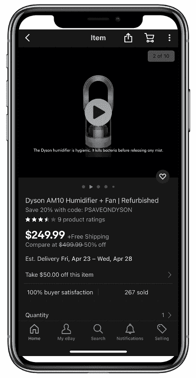

# 采用 API 优先的策略来增强开发者的能力

> 原文：<https://thenewstack.io/adopting-an-api-first-strategy-to-empower-developers/>

我们正处于一个数字时代，这个时代要求更高效、更频繁地与客户互动，这有助于解释为什么大多数组织现在认为 API(应用程序编程接口)是他们成功的基础。在易贝的经验中,“API 第一”的思想——关注开发者的需求，在实现之前设计 API，把 API 当作一个产品——产生了巨大的不同。

## API 作为一种产品

 [坦尼娅·弗拉霍维奇

Tanya 领导着易贝的开发者生态系统。她是改造易贝公共 API 项目的主要贡献者之一。](https://www.linkedin.com/in/tvlahovic/) 

API 是构建和连接应用程序所必需的。然而今天，API 不仅仅是软件与其他软件之间的对话。在易贝，我们的合作伙伴通过为他们的买家和卖家创造奇妙的体验来扩展我们的业务，他们最终是我们共同的客户。我们继续通过我们的 API 开发新的集成模式和收入机会。

在易贝，API 是由开发人员为开发人员开发的。我们将它们视为一流的产品，这意味着它们的设计、实现和维护方式是为了给我们的 API 客户——开发人员——一个良好的体验。

例如，为了向我们的买家提供更具吸引力的购物体验，我们正在推出新的视频功能。我们最近发布了新的[媒体 API](https://developer.ebay.com/api-docs/commerce/media/resources/methods) ，允许第三方开发者通过[上传相关视频](https://developer.ebay.com/api-docs/sell/static/inventory/managing-video-media.html)让卖家展示产品和品牌并推动销售。这是我们 API 优先策略的一个例子。我们已经从我们的开发者社区听到了尽早获得我们的产品和计划的重要性。我们关注开发人员的需求，与利益相关者合作，首先设计合同，与值得信赖的开发人员一起审查合同，最后发布我们的产品。新的 API 是目前向易贝上传视频的唯一渠道。

## API 优先

*“简单是最复杂的”——达芬奇*

API 第一的思想不仅是关于 API 本身，也是关于用例、能力和从新特性中受益的参与者。开发人员正在寻找功能，所以我们谈论的是推出产品，而不是发布 API。缩小视野，看到更大的画面是很重要的。

因此，在处理 API 时，有必要:

*   了解客户问题并围绕该问题进行设计。
*   不要在接口中公开内部实现细节。

许多组织从底层开始，围绕内部实现细节进行设计，而没有考虑消费者、抽象概念或隐藏底层复杂性。API 定义了消费者可以做什么，数据库不是 API 契约。API 所有者有时还会为他们的工程师进行优化，并通过使用内部词汇表忽略第三方开发人员，试图节省方法和端点的数量，将数据解释推给消费者等。

相反，参与 API 设计的每个人都需要专注于化繁为简。预先考虑功能是确保业务和技术策略一致的先决条件。

在易贝，我们从我们的界面设计方法(IDM)开始，以达成一个稳定的合同。它从通过指定参与者、动作和约束来描述用例开始。下一步是派生实体关系。然后从实体中识别名词，从动作中识别动词。最后一个阶段是确定资源表示和指定授权细节。一旦所有这些都完成了，最简单的部分就是将它映射到 RESTful 端点和方法。

为了取得最大成效，重点需要放在以消费者为中心的方法上。一个好的、可读的、可预测的、直观的和易于理解的 API 将使各种形状和大小的开发人员更有生产力和效率。

## 一致性

为了方便开发人员使用，每个 API 都需要适合一个整体的 API 组合。在易贝，我们有一个 API 分类法，这是几年前我们开始改造我们的开发者项目时定义的。我们将我们的 API 分为四个上下文:

*   允许卖家在易贝上管理他们的生意。
*   [购买](https://developer.ebay.com/products/buy)展示库存，并支持任何合作伙伴体验的交易。
*   [Commerce](https://developer.ebay.com/products/commerce) 拥有买卖用例通用的功能。
*   [Developer](https://developer.ebay.com/products/developer) 为开发者提供与易贝 API 集成的见解。

标准和模式定义了 API 中不变的内容，使开发人员更容易集成。我们依赖现有的行业标准和模式，也定义我们自己的标准和模式。这种方法为 API 开发过程带来了敏捷性和速度，以及 API 组合的一致性。

但是一致性不仅仅是关于规格和模式；词汇的一致性同样重要。例如，一个项目是 API 组合中的一个项目。使用一致的术语和可理解的名称，同时避免内部缩写，使得 API 易于发现和使用。

除了事物命名的方式，API 应该做它所说的事情。端点就像一个句子，其中资源是名词，HTTP 方法是动词。它传达了目的和意图。例如，此方法为卖家创建新的退货政策，而不修改卖家的现有列表:

`POST sell/account/v1/return_policy`

所有的 API 都必须是好公民，以避免混乱和开发人员效率低下，适当的治理过程可以帮助确保这一点。这都是关于为开发人员计划做出正确的选择，因此将治理作为使能器而不是门来利用是至关重要的。治理的重点应该放在“是什么”部分，而不是“如何”部分。这种方法给了工程师一些创作的自由。同时，开发人员可以集成标准化和一致的 API，这些 API 以相同的方式实现跨领域的关注点，如授权、API 速率限制和错误处理。这提高了开发人员的生产力，并创造了良好的开发人员体验。

## 开发者体验

交付一个 API 只是工作的一半。开发人员的整体体验也是这个版本的一部分。例如，文档必须准确有效。开发人员没有时间花几个小时阅读文档，因此保持文档简短、简洁和准确是很重要的。

OpenAPI 规范现在是描述 API 的行业标准，并对大型开发者社区开放源代码。许多工具，如 [Swagger](https://swagger.io/) ，从 OpenAPI 文档生成客户端。通过使用 OpenAPI 规范发布 API 合同，我们使我们的开发人员能够[立即与您的 API 集成](https://www.youtube.com/watch?v=E-Ucnf1LBlo)。

## 反馈回路

“当你知道得更多时，你会做得更好。”–玛娅·安杰洛

来自客户的直接反馈有助于形成 API 策略和路线图。归根结底，API 是为开发人员准备的，所以交付对他们有用的东西是至关重要的。直接与客户合作也有助于通过满足他们的需求来建立长期关系。

此外，尽早征求反馈允许 API 提供者优化他们的工程工作。设计优先的方法允许工程师在与客户迭代的同时快速改变界面，而不是立即投入到实现中。一个好的做法是在更大范围的发布之前进行公开测试或私人测试。关注你信任的开发人员来收集反馈，并且尽可能经常和尽早地这样做。

有时候迭代需要时间，但是从长远来看，遵循“度量两次，削减一次”的方法来改进 API 会更快。(在世界的某些地方，他们甚至说测量七次，切割一次！)交付一个我们知道会满足开发人员需求的 API 比六个月后重做更有效率。

间接反馈同样重要。API 有助于实现业务目标，因此分析 API 的使用和度量 API 的结果和性能同样重要。开发人员塑造你的产品，所以为了理解该走哪条路，研究数据并使用分析来改进整个 API 组合是很重要的。在易贝，这是增强 API 的主要驱动力之一。随着时间的推移，一些 API 已经被弃用和停止使用，而另一些 API 则随着大量次要和主要版本的发布而蓬勃发展。事情本该如此——蓬勃发展的 API 生态系统具有灵活性和适应性。

## 连续建筑

唯一不变的是变化–赫拉克利特

API 优先的策略可以实现敏捷的业务，增加实现的灵活性，并且是做好电子商务的先决条件。把你的 API 当做产品来对待并维护它们。定义标准并强调治理，但是在“如何”的部分要灵活，给团队一些创造性的自由。对于我们易贝的开发者生态系统组织来说，灵活性和快乐是工程师们放心关注客户、承担风险和创新的关键。

*有兴趣在易贝发展事业吗？我们在招人！要查看我们目前的职位空缺，请访问:*【http://ebay.to/Careers】

*<svg xmlns:xlink="http://www.w3.org/1999/xlink" viewBox="0 0 68 31" version="1.1"><title>Group</title> <desc>Created with Sketch.</desc></svg>*