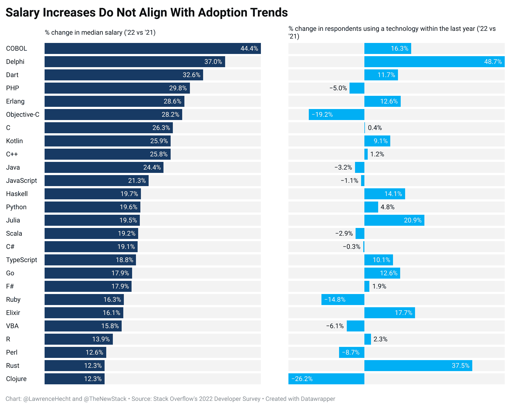
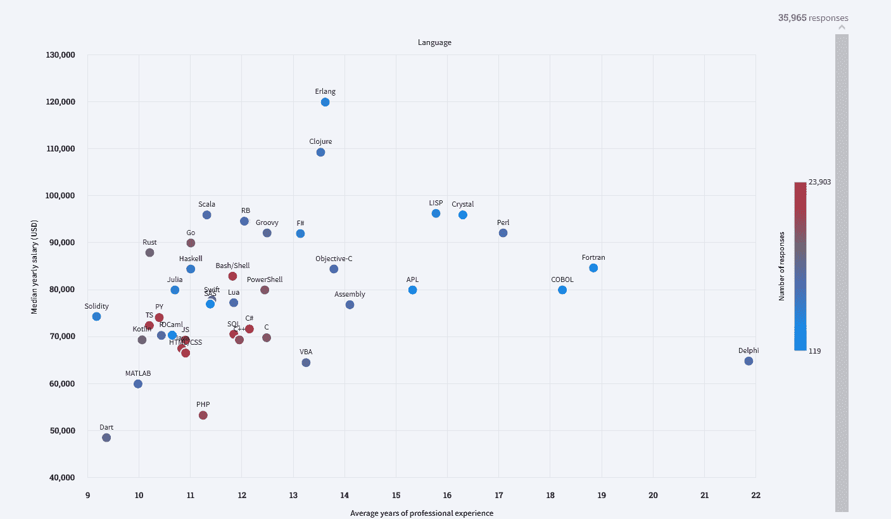

# 新数据显示，采用率和开发者薪酬不一致

> 原文：<https://thenewstack.io/adoption-and-developer-pay-do-not-align-new-data-suggests/>

这里有一个肮脏的小秘密:一次又一次，一些高薪的技术工作是为了几十年来都不酷的技能。

在 [Stack Overflow 的“2022 年开发者调查”](https://survey.stackoverflow.co/2022)中，薪资中位数涨幅最大的编程语言是 [COBOL](https://thenewstack.io/u-s-unemployment-surge-highlights-dire-need-for-cobol-skills/) 和 [Delphi](https://thenewstack.io/microsofts-programming-language-czar-anders-hejlsberg-the-interview/) ，分别上涨至 75592 美元和 63984 美元——上涨 44%和 37%。Dart 和 [Rust](https://thenewstack.io/rust-whats-next-for-the-fast-growing-programming-language/) 这两种最热门的语言，出现了一些最高和最低的工资变化，这是采用趋势和开发人员工资并不总是一致的又一个迹象。

自报薪酬调查数据是出了名的不稳定；这份报告内的[也是如此。仅仅通过减少样本量，只包括回答关于工作经验年数问题的人，工资中位数最高的语言就有大约 10，000 美元的波动，Erlang 超过 Clojure 成为第一名。与 2021 年相比，Clojure 的收养率实际下降了 26%。](https://thenewstack.io/stack-overflow-rust-remains-most-favored-but-clojure-pays-the-most/)

去年使用过 Delphi 的开发人员发现，在专业开发人员中，采用率从 2021 年的 2.36%上升到 2022 年的 3.51%。COBOL 的采用率也有所上升，但仍然只有区区 0.57%的使用率。尽管两者都是古老的语言，但三分之二的 Delphi 程序员计划继续使用它，这表明它还没有消亡。

COBOL 的情况有所不同，今年只有 20%的 COBOL 开发人员计划使用它。这实际上为企业家提供了一个赚钱的机会。如果你想快速学习 COBOL 并承担一些任务，有一些利润丰厚的角色在等着你。

Stack Overflow 的 2022 年开发者调查包括超过 73，000 名参与者，其中超过 53，000 名是专业开发者。所有参与者都在五月份接受了调查。

在通货膨胀和经济需求的推动下，开发人员的工资中位数在过去一年里全面上升。除此之外，堆栈溢出的发现表明，使用和学习模式与实际工资并不完全一致。
**来源:**栈溢出，“2022 年开发者调查”

根据多年的经验，去年使用 Erlang 的开发人员比使用 Clojure 的开发人员平均多赚了 10，000 美元。来源:堆栈溢出，“2022 年开发者调查”

<svg xmlns:xlink="http://www.w3.org/1999/xlink" viewBox="0 0 68 31" version="1.1"><title>Group</title> <desc>Created with Sketch.</desc></svg>