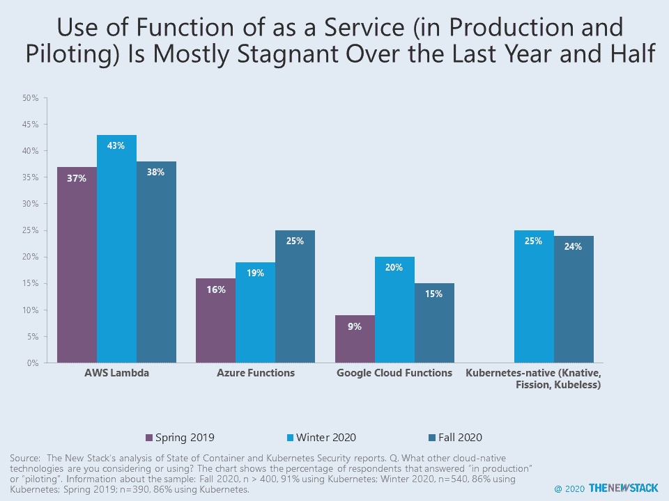

# 采用 AWS Lambda 无服务器摊位

> 原文：<https://thenewstack.io/adoption-of-aws-lambda-serverless-stalls/>

尽管 Amazon.com 首席技术官沃纳·威格尔宣称亚马逊网络服务的 Lambda 使用率已经大幅上升，但最近对 Kubernetes 社区的调查发现，无服务器服务的采用率相对下降。随着云原生组织的数量持续增长，他们不太可能将 AWS 无服务器计算技术纳入他们的计划。

云计算原生计算基金会(CNCF)[2020 年 6 月对其以 Kubernetes 为中心的社区的调查](https://github.com/cncf/surveys/tree/master/cloudnative)显示，三分之二的人正在使用或考虑使用无服务器技术。但是，除去评估和理论计划，只有 30%的人在生产中使用无服务器，这与 92%在生产中部署了容器的受访者相差甚远。

总体而言，46%的人使用至少一个托管平台(如 AWS Lambda、Google Cloud Functions)或可安装软件(如 Knative、OpenFaaS)。根据我们的[计算](https://thenewstack.io/knative-crowds-out-other-serverless-software-packages-and-other-cncf-survey-takeaways/)，这与 2019 年调查中的水平完全相同。AWS Lambda 的采用率从 2019 年的 67%下降到 2020 年的 55%，因为评估无服务器的组织不太可能在其路线图中包含它。与此同时，微软的 Azure 功能取得了显著进展，年增长率从 16%上升到 24%。

可安装软件选项意味着组织将托管其自己的 FaaS 解决方案，因此它可以通过内部基础架构和/或混合云交付功能。只有 17%的研究使用这种方法，但 [Knative](https://knative.dev/) 是最受欢迎的选择，其次是 [OpenFaaS](https://www.openfaas.com/) 。这两个选项都面向 Kubernetes，但是与 Kubernetes 无关的选项在多大程度上被采用呢？这个问题很难回答，尤其是因为这个调查是由管理 Kubernetes 社区的组织进行的。

StackRox，一家集装箱安全公司，对集装箱用户进行了一系列的调查来支持这些结论。在他们的报告中，AWS Lambda 的采用率停滞不前，从 2019 年春季的 37%降至 2020 年秋季的 38%。与此同时，Azure 功能从 16%上升到 25%，谷歌云功能从 9%上升到 15%。

## 模糊集装箱和兰姆达斯之间的界限

还记得 FaaS 吗？我们只是深入研究 Lambda 的采用，因为 AWS 更公开的分析是可用的，因为用户社区出现得更早。

Sumo Logic 对其 AWS 客户活动的[分析](https://www.sumologic.com/brief/continuous-intelligence-report/)发现，运行 Lambdas 的客户略有增加，从 2019 年的 36%增加到 2020 年的 39%。在 2020 年初， [Datadog 报告](https://www.datadoghq.com/state-of-serverless/)超过 40%的 AWS 客户已经采用了 Lambda，这个数字在也使用容器的 AWS 客户中几乎翻了一番。

从 2019 年到 2020 年，Lambda 和 Docker 的采用率差不多。这有助于解释为什么使用 has 无服务器的云原生组织的百分比保持不变。

虽然 AWS Fargate 运行在 Lambda 之上，但在计算有多少组织使用该服务时，这不应该计算在内，因为开发人员并没有积极编写调用函数的应用程序。据我们所知，来自上述监控提供商的分析排除了这种类型的用例，但值得注意的是，因为亚马逊在 2020 年开发的几乎一半的服务(不仅仅是 AWS)都利用了 Lambdas。Fargate 和其他 AWS 服务的增长可能是 AWS Lambdas 被调用的数量据报道飙升的一个重要原因。

AWS 继续模糊容器和 Lambdas 之间的界限，在今年的 [AWS re:invent](https://reinvent.awsevents.com/) 上发布声明。 [AWS Proton](https://aws.amazon.com/proton/) 将允许平台工程团队根据部署基于容器和无服务器应用程序所需的代码来管理基础设施。此外，Lambdas 现在可以作为[容器映像](https://aws.amazon.com/about-aws/whats-new/2020/12/aws-lambda-now-supports-container-images-as-a-packaging-format/)进行部署。

无服务器布道者 Ant Stanley 相信“容器+无服务器是常态，而不是例外。”容器使遗留应用程序更加高效，而新应用程序倾向于使用 FaaS 和事件驱动架构。从这个角度来看，推动[云原生](https://thenewstack.io/category/cloud-native/)应用程序开发的组织，通常被狭隘地定义为基于容器的，将不可避免地开始编写利用功能的应用程序。这种观点是有道理的，尤其是在一个大部分企业已经向集装箱飞跃的世界里。

## **巨大的无服务器增长**

虽然 AWS 正在吃自己的狗粮，但早期采用者也扩大了他们对 Lambda 的使用。2020 年早些时候，New Relic [报告](https://thenewstack.io/5-things-to-know-about-serverless-in-2020/)称，在生产中使用 AWS Lambda 的组织使用的函数数量和每周调用函数的频率几乎翻了一番。函数数量的增加意味着开发人员正在编写更多的应用程序。由于调用的函数数量是应用程序活动的表现，所报告的翻倍表明应用程序正在扩大。通过这些措施，无服务器的采用肯定增加了，我们没有理由怀疑它的增长已经放缓。

指数级增长令人印象深刻，但请记住，这是来自于应用程序和用例的小基数。尽管如此，我们对 2018 年和 2020 年调查的[分析](https://thenewstack.io/serverless-needs-more-observability-tools/)表明，早期采用者希望继续构建新的应用，尽管他们面临生产层面的挑战。为了测量这种类型的增长，我们需要询问利用基于事件的架构的应用程序的百分比，以及有多少应用程序需要调用函数。

衡量无服务器应用是一门不完美的科学。整篇文章都倾向于云计算，但是像 EDJX 这样的公司会从边缘计算的角度考虑 FaaS。从这个角度来看，专注于物联网、XR(替代和虚拟现实)和其他新兴用例的开发人员应该利用在设备附近运行的功能来部署分布式应用。在未来，有一个真正的替代执行场所。主要的云计算提供商和容器并没有垄断 IT 世界。

## 需要更多的研究

就调查而言，显然需要超越后端开发人员、平台工程师和关注容器的人的意见。额外的调查应该招募从事物联网、移动、游戏和不太以企业为中心的用例的开发人员。新的堆栈期待审查新的遗迹和数据狗的无服务器报告的更新版本。机器生成的数据也可以通过分析流行框架中使用的包下载数量来利用。还可以跟踪 StackOverflow 上的提问数量。你最喜欢的指标是什么？

## 奖励图案

理论上，信息安全专业人员是不插手的，可能不了解关于深入的技术路线图的技术细节。然而，他们对 FaaS 和容器的看法与更侧重于开发运维及 IT 基础设施受众的调查报告大致相同。

AWS、New Relic 和 Cloud Native Computing Foundation 是新堆栈的赞助商。

通过 Pixabay 的特征图像。

<svg xmlns:xlink="http://www.w3.org/1999/xlink" viewBox="0 0 68 31" version="1.1"><title>Group</title> <desc>Created with Sketch.</desc></svg>