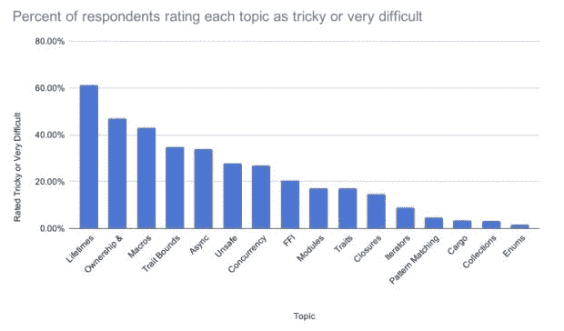

# Rust 的采用:谁在使用它，如何使用

> 原文：<https://thenewstack.io/adoption-of-rust-whos-using-it-and-how/>

这是两部分系列的第一部分。

[Rust](https://www.rust-lang.org/) 连续七年在 Stack Overflow 的年度调查中成为[最受欢迎的语言](https://survey.stackoverflow.co/2022/?utm_source=so-owned&utm_medium=announcement-banner&utm_campaign=dev-survey-2022&utm_content=results#section-most-loved-dreaded-and-wanted-programming-scripting-and-markup-languages)，Rust Conference 2022 突出了许多在 Rust seas 上起航的行业和开发者。虽然许多开发者在会议上已经制定了一个清晰的路线，但仍有一些人在努力解决如何使用这种语言的问题。

2006 年，软件开发人员 Graydon Hoare 在 Mozilla Research 工作时，将 Rust 作为个人项目开发出来，旨在作为 C++更可靠、更安全的替代方案。

微软是使用 C++的主要科技公司之一，它已经决定 c++不再被接受来编写关键任务软件，称 [Rust 是市场上一种高性能、内存安全语言的最佳选择](https://thenewstack.io/microsoft-rust-is-the-industrys-best-chance-at-safe-systems-programming/)。

让我们来看看谁在使用这项技术，为什么它很受欢迎，以及什么可能会阻碍其他人加入他们。

## 到底是谁在用？

Rust 基金会有大约 38 名成员和捐助者，并列出 138 个生产用户。最大的份额是软件公司，许多提供 API 和服务。随着许多垂直行业、小公司、大学和研究机构的加入，这种情况正在改变。当了解到计算基础设施(如亚马逊网络服务(AWS ))正在被氧化(在 Rust 中全部或部分重写)时，估计 200 似乎是一个低估。突然间，[许多现有的应用程序可以从 Rust](https://thenewstack.io/the-case-for-rust-as-the-future-of-javascript-infrastructure/) 中获益，而不需要额外的成本或者额外的成本有限。

我们能找出 200 家公司吗？严格来说，我只到了 174。“黑帽锈”的作者 Sylvain Kerkour 介绍了超过 42 家公司在他的研究中使用它。我们将这些与 Rust Foundation 的列表交叉，并添加了一些最近公开宣布的列表。因此，有合理的证据表明，在大型和小型公司的生产和开发中，开发人员在基层大量使用这种语言。

根据 [Modulecounts](http://www.modulecounts.com) 的数据，Rust 的 package repository Crates.io 正以每天 87 箱的速度增长。不是最快的，但也不贫血。与此同时，代码执行的性能改进和编译器的稳定性也越来越高。随着主流对这门语言的熟悉程度和信心的增长，投资可能会加快速度。

## 基础设施开发(API 和云服务)

可以很容易地说明，主要的技术供应商(许多面向用户)已经[拿起了铁锈斗篷](https://thenewstack.io/rust-in-the-linux-kernel-by-2023-linus-torvalds-predicts/)。仅考虑这一点的影响范围。是什么影响了这些主要的云提供商？可能是语言的速度和效率。或许，具体的例子像 [Dropbox 成功脱离 AWS](https://www.wired.com/2016/03/epic-story-dropboxs-exodus-amazon-cloud-empire/) 到自己的平台使用了大量的 Rust。你用 Dropbox 吗？惊讶你用的是铁锈！

Amazon Web Services 也很早就看到了优势，将虚拟化技术[鞭炮和测试工具](https://aws.amazon.com/blogs/opensource/why-aws-loves-rust-and-how-wed-like-to-help/)等技术基于 Rust 之上。AWS 提供了一个 [Rust SDK](https://aws.amazon.com/sdk-for-rust/) 。

基于安全和可靠性的考虑，Azure CTO Mark Russinovich 敦促开发者在新项目中避免使用 C 或 C++，提倡他们使用 Rust。他最近表示，业界应该将 C 和 C++语言视为“过时的”ZDNet 的那篇文章还提到了 Rust 在 Meta、谷歌(Android 和 Chrome)、Linux 内核甚至可能在 Windows 内部的使用。

在用户和创业公司方面，最近被 Adobe 收购的基于网络的[协作设计工具 Figma](https://thenewstack.io/adobe-buys-figma-what-does-this-mean-for-web-standards/) 在这篇 2018 年的文章中概述了其与 Rust development 的[体验，有好有坏。请记住，从那时起，Rust 社区就一直在持续改进。尽管如此，许多用户和开发者将会在云工具中使用 Rust，可能是有意或无意的。](https://madebyevan.com/figma/rust-in-production-at-figma/)

## 研究人员和科学家的吸收增加

比如说，与当前科学研究最喜欢的 Python 相比，代码执行速度提高了，这导致许多人预示着新的 Rust 环境。这就把数据科学和人工智能研究人员引向了生锈。在开发系统时，训练大型数据集的性能非常重要，而且变得至关重要。此外，Rust 社区正在使用或开发十几个用于计算的库。这个计数不包括可用的数据处理支持库。

## Rust 的语言进步

### 效率和能源

“绿色偏见”是这一进程中的一个因素。Rust 可以证明自己与 C 和 C++一样，与任何低级语言一样高效节能。来自葡萄牙的研究揭示了铁锈的功效。应该指出，对这一数据的批评是有根据的。例如，C++的基准大小非常小，以至于该测试主要测量 OpenMP 初始化。这些批评一般不会影响这里的要点，即铁锈非常节能。看看最[最近的表现数据](https://benchmarksgame-team.pages.debian.net/benchmarksgame/performance/spectralnorm.html)。工具链的改进甚至可能提供进一步的增强。请比较一下 Python，虽然是一种很棒的语言，在这个分析中的表现。

在他的论文“[Rust——每一个行业的编程语言](https://www.researchgate.net/publication/338248709_Rust_-_The_Programming_Language_for_Every_Industry#:~:text=Rust%20is%20a%20system%20programming,collector%20that%20could%20affect%20the)、*”*中，Cosmin Cartas 从另一个角度呈现了数据。他在 WebAssembly 的性能方面有一些有趣的数字，特别是与 JavaScript/Node.js 相比。该分析表明，Rust 可以在人机交换的这一重要领域很好地竞争。

### GitHub 数据

GitHub 提供了 Rust 采用率增加的最能说明问题的方面。截至 11 月 10 日，至少有 24 个以 Rust 为主要语言的热门回购。简单的直接搜索显示有 165，209 个指定了 Rust 语言。这是自同年 9 月以来超过 9000 个存储库的增长。

GitHub 上的 Awesome Rust(非官方)有大约 1300 个条目，至少在一定程度上涵盖了现代计算中表面上最主要的兴趣领域。由于 GitHub 的 API 在最近几年发生了很大的变化，以至于无法及时检索到对此次调查有意义的结果，关于行业部门利用率的更多细节将在未来的文章中公布。

## 批评和差距

运行时或库环境中的差距很小，因为很少有领域是未受影响的。成熟中有一些反复出现的主题。异步和高度并行化网络的改进，尖端机器学习/人工智能系统的产生，对一些 UI 实现清晰度或方向的需求，以及只是一般来说，重申一下，在某些领域创造成熟度。

Cargo 是一个包/构建管理器，尽管它很强大，但是它有各种不同的评论。这大部分似乎源于那些想要创建大型多语言版本的人，或者他们有强烈的“Make/CMake”偏见。Cargo 对这些挑战都有答案，但当然“细节决定成败”通常对一个工程师来说简单的事情对另一个工程师来说是一个挑战，这完全取决于接触、时间和心态。

以下评论部分摘自已知开发者和互联网的评论:

*   对许多人来说，生命是令人困惑的
*   语法和风格不同于更常见的语言
*   对额外复杂性的担忧隐约可见
*   错误可能很难调试
*   从搜索引擎的过时信息中寻找支持
*   一些人认为重要的库仍然不成熟或者有缺陷
*   Rust 中的异步 IO 可能很困难
*   大多数系统编程需要额外的“安全”编码级别
*   某些情况下对 LLVM 的依赖。

来自 [2020 Rust 调查](https://blog.rust-lang.org/2020/12/16/rust-survey-2020.html))的一张图表提供了人们对语言特色话题的更多感受。事实证明，这是一个很好的清单，列出了在你学完基础知识后如何专注于你的学习。

一些人认为 Rust 的“严格”是一个缺点，而另一些人认为从长远来看这是一个巨大的优势。你的感受可能在一定程度上决定你的成功。然而，如果一点额外的挫折有助于您将代码中的错误最小化，您可能会认为处理一些“严格性”是值得的。

Rust 的主流未来将依赖于 LLVM。这可能是一个明显的缺点，例如，禁止(或创建不适当的复杂性)用于某些嵌入式环境。尽管如此，许多 LLVM 后端被创建来在一些非常小的微控制器上生成代码。例如，ESP-32 微控制器在业余爱好者中很受欢迎，似乎得到了很好的支持。

GCC (GNU 编译器集合)领域的工作也必然会有所帮助。许多环境也有交叉编译和使用 C 中的硬件抽象层的方法，作为特定单板计算机(SBC)或芯片的有用方式。起重机后端也在这一领域进行了改造。

虽然 Rust 对于大多数开发人员来说并不是一个完全陌生的世界，但是对于 flow 和各种晦涩难懂的语法有一些概括，要想真正变得高效，必须首先掌握它们。这也包括我所说的记忆谱系(不是一个术语)。你需要用生命期、所有权、借用、克隆和可变性的概念来思考一下系统是如何传递和管理内存的。然而，掌握这种思想可以让你从翻滚垃圾的部署恐惧中解脱出来。是的，它会让你怀疑垃圾收集器的时代是否即将结束。

## 接下来—第二部分

很明显，Rust language 正处于上升趋势，尽管面临一些挑战，但它的成功背后有着重要的原因。铁锈已经在许多领域被采用，这是很容易辨别的。在下一篇文章中，我们将考虑几个具体的采用领域，并进一步讲述其引人注目的故事。

<svg xmlns:xlink="http://www.w3.org/1999/xlink" viewBox="0 0 68 31" version="1.1"><title>Group</title> <desc>Created with Sketch.</desc></svg>