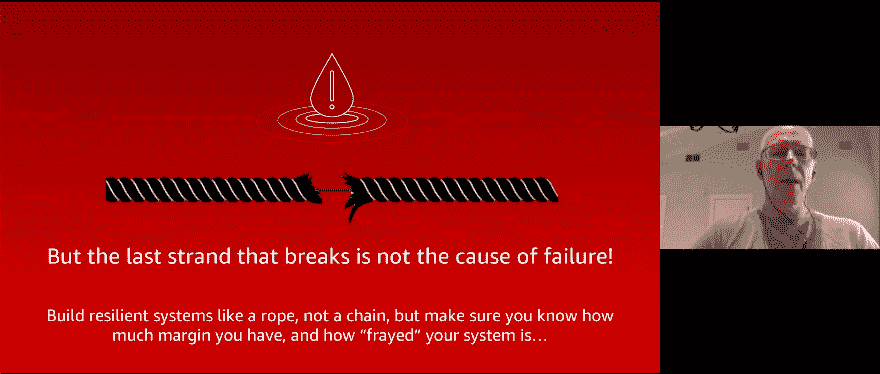
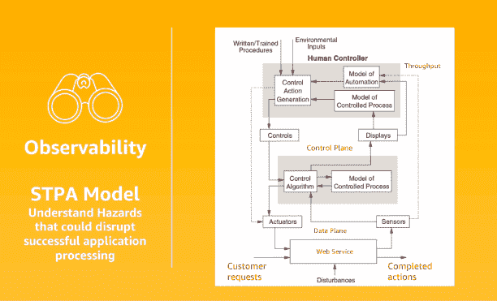

# 阿德里安·科克罗夫特谈“故障转移剧场”和实现真正的持续弹性

> 原文：<https://thenewstack.io/adrian-cockcroft-on-failover-theater-and-achieving-true-continuous-resilience/>

如何进行故障转移而不被绊倒？正常运行时间和可靠性是[混沌工程](https://thenewstack.io/breaking-serverless-on-purpose-with-chaos-engineering/)的核心，混沌工程是根除系统弱点的艺术和科学。这一切都是为了增加您的备份和您的备份的备份能够正常工作的确定性。

在今年的虚拟 [ChaosConf](https://www.chaosconf.io/) 、[上，亚马逊网络服务云架构战略副总裁阿德里安·科克罗夫特](https://twitter.com/adrianco) 谈到了“可用性剧场”的危险，以及如何在现实中更好地巩固系统的可靠性。他首先询问观众是否有备份数据中心，以及他们是否测试过其故障转移可靠性。

“如果你有一个备份数据中心，但你从来没有故障转移到它，也没有信心在一瞬间故障转移到它，你投资了很多钱的可用性，”他说。

有趣的是，近年来，已知的中断更有可能是由 IT 和网络问题引起的，而不是电力问题。科克罗夫特引用了 1984 年出版的《正常事故》*》一书，该书描述了具有多层故障的复杂系统，这些故障是“无法预料、无法理解、无法控制和无法避免的”*

 *虽然像自然灾害一样，这些中断可能是不可避免的，但您仍然可以尽一切努力为它们做准备。今天，我们将分享科克罗夫特关于持续测试弹性的建议。

## 了解你的利润。知道什么会出错

科克罗夫特谈到了我们如何建立冗余来替代故障转移，但故障转移的能力有时比我们要故障转移的东西更复杂。复杂性通常会增加失败的可能性。正如吉米·克里夫曾经唱过的，他们越大，摔得越重。

这最后一根稻草并没有真正压垮骆驼的背，你的系统并不像你最薄弱的环节那样强大。毕竟，许多团队都致力于寻找最薄弱的环节。科克罗夫特建议把它想象成一根电缆或绳子。随着它从磨损到完全撕裂，你不能把失败仅仅归咎于最后几股。

科克罗夫特解释说，“你没有真正了解全局，因为你建立了有很多很多冗余的弹性系统，你逐渐用尽这些冗余，直到绳子磨损，直到它真正断裂。”

> “每个人都有最好的意图，在过程的每一步进行局部优化，将逐渐消耗所有的利润，直到系统失败。”——艾德里安·科克罗夫特，AWS

他说，更重要的是捕捉未遂事件，并建立和衡量你的安全边际——在一切都毁于一旦之前。

除此之外，我们不能总是信任传感器，传感器可能会丢失更新或出现其他系统协调问题。你可以让两个用户同时以两种不同的方式来修复系统——但他们都没有密切关注。更新和补丁可能太不频繁。

科克罗夫特说，软件和航空业的复杂性试图通过人类、自动化系统和流程来保持控制。

随着波音 737 Max 8 的两次坠毁，飞机是控制过程，自动控制器是控制系统，但人类控制者——即飞行员——没有接受过如何处理新模型的培训。

“飞行员的[防失速自动化](https://www.bbc.co.uk/news/av/business-47816384)模型与实际自动化不符，这是飞机坠毁的原因之一，”科克罗夫特说。

软件业缺乏的是航空业拥有的全球记录和通知系统，当一架飞机或一次飞行出现哪怕是最轻微的问题时，该系统都会触发。软件需要更好地结合可观察性和控制。前者使您能够真正了解您的复杂系统，然后快速检测故障，后者使您能够管理对不可避免的故障的响应。

## **STPA:危险分析模型**

科克罗夫特提供了麻省理工学院教授南希·莱韦森的[【STPA】](https://www.amazon.com/Engineering-Safer-World-Systems-Thinking-ebook/dp/B00ELVWF70/ref=sr_1_1?crid=2QLBJH9KQEOND&keywords=engineering+a+safer+world&qid=1584492752&s=digital-text&sprefix=engineering+a+safe,digital-text,235&sr=1-1)系统理论过程分析，该分析使用了系统的功能控制图，反映了维持成功运行所需的约束。就像上面的例子一样，它让您可以可视化组件之间的连接，以及它们如何受到故障的影响。

STPA 模式将 [分为三层](https://medium.com/@adrianco/covid-19-hazard-analysis-using-stpa-3a8c6d2e40a9) :

*   商业功能
*   管理业务功能的控制功能
*   监视控制系统的人类操作员

在这种情况下，控制系统可以管理小干扰，比如阻止欺诈性请求，但控制计划自动化所能做的是有限的。如果有足够大的干扰破坏了网络服务会发生什么？

“想想控制平面，它能做的是有限的。如果你超越了那个极限，你就失去了控制，所以如果你的控制平面自动化失败了。科克罗夫特解释说:“超出范围的东西，比如控制器，客户就是不了解系统。”。

一旦你用 STPA 计划好了，你就开始了解可能会破坏你成功申请处理的危险。

传感器指标(上图中:右下)和模型(右上)的危险包括:

*   缺少更新
*   归零
*   溢出
*   毁坏的
*   有毛病
*   更新太快了
*   更新太不频繁
*   更新被延迟
*   协调问题
*   随着时间的推移而退化

这些问题的解决方案通常是通过重新定位来缓解，比如转移到另一台服务器。但是对于人类控制者来说，建模要复杂得多。

科克罗夫特说，相反，我们应该努力用对称模式简化人类模型。

“模式越简单越好。这意味着你可以了解正在发生的事情，因为你更容易理解，”他说。

然后使用工具来加强这种对称性。

## **避免错误的洪流变成风暴**

他认为，从数据中心转移到云可以实现更多这种一致的配置和自动化。尽你所能，不要在你的模型中引入破坏这种对称性的东西。另一方面，如果某个东西看起来像正方形，不要试图将其平滑为圆形。

> “如果事情有所不同，尽量不要掩饰，让它看起来一样，因为它会以不同的方式表现出来。然后测试这些假设。这是混沌工程弹性测试——测试事情相同和不同的假设。——艾德里安·科克罗夫特，AWS

对于 AWS 可用性，他提倡三法则。这种对称意味着确保相同的数据和相同的服务存在于三个区域中，每个区域都有自己独立的故障模式。假设有一场自然灾害切断了一个区域的电力。该系统必须检测发生了什么，并通知控制器。您应该能够在没有可见停机时间的情况下脱机使用区域。

人类控制者需要了解一切，但通常会出现“大量错误”，很难弄清楚发生了什么，是某个区域出现故障，还是某个特定传感器出现故障。

在三种控制器之间，甚至在相同控制器的不同类型之间，可能存在不一致。这就是你面临重试风暴风险的时候。

“那么作为人类控制的行动，他们真的不应该需要做任何事情。他们很困惑，分开工作，试图解决不同的问题，工具配置错误——各种各样的事情。我们还收到了大量工作，但控制器不同意，然后该区域出现故障，大量请求导致其他所有工作都出现故障。这就是故障转移和故障后恢复问题。所以你可以看到，整个系统很容易崩溃，破坏一切，”科克罗夫特说。

他说解决这个问题的一个方法是测试游戏日。它们有助于确保您的可观察性、监控和警报工具相互关联且始终同步。

类似地，您希望通过重试风暴来防止工作放大，除了在入口点和出口点之外，将重试次数减少到零。同样，他说要减少超时来丢弃孤立的请求。

最后，科克罗夫特说你必须先做混沌工程。他说，你应该把通过测试作为一种荣誉，所以尽可能把它游戏化。这是你实现持续弹性的方法。

亚马逊网络服务和 Gremlin 是新堆栈的赞助商。

通过混沌形态的特征图像[。](https://twitter.com/ChaosConf/status/1314253113977692160)

<svg xmlns:xlink="http://www.w3.org/1999/xlink" viewBox="0 0 68 31" version="1.1"><title>Group</title> <desc>Created with Sketch.</desc></svg>*