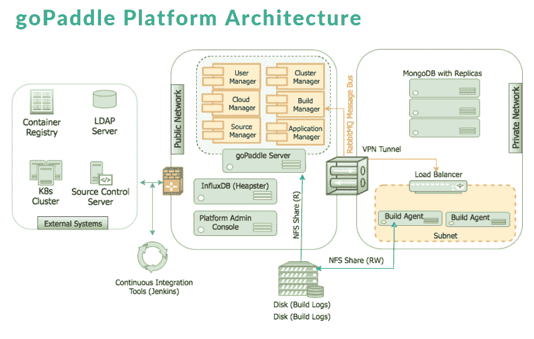

# 和库伯内特一起漂泊？看看 goPaddle

> 原文：<https://thenewstack.io/adrift-kubernetes-check-gopaddle/>

在 2017 年末[亚马逊网络服务](https://thenewstack.io/aws-takes-kubernetes-offers-serverless-database-service/)、 [Mesosphere](https://thenewstack.io/mesosphere-returns-kubernetes-beta-dcos/) 和 [Docker](https://techcrunch.com/2017/10/17/docker-gives-into-invevitable-and-offers-native-kubernetes-support/) 都宣布支持 Kubernetes 开源容器编排引擎之后， [Forrester](https://www.computerworlduk.com/cloud-computing/predicting-biggest-cloud-trends-in-2018-3669252/) 宣布 [Kubernetes](/category/kubernetes/) 在企业编排竞赛中胜出。它敦促投资于 Kubernetes 的技能和试点，但警告部署和集成的挑战。

总部位于西雅图的 goPaddle 的目标是减轻开发者和运营团队的痛苦。它由 DevOps 和云自动化公司 Bluemeric 发展而来，Bluemeric 是由前惠普高级软件工程师 Vinothini Raju 于 2011 年创建的。然而，Docker 和 Kubernetes 的崛起提供了一个巨大的机会，于是就有了这个分支公司。

Raju 说:“我们发现市场上这么多的工具只解决生命周期的一个特定方面。“我们认为这是一个拥有管理端到端生命周期的集成平台的机会。”

“服务可组合性是我们的使命，我们希望让开源开发者真正轻松地使用该平台。”

## 从设计开始

goPaddle 平台通过拖放组件提供了一个强大而简单的界面，开发人员可以使用它来动态创建微服务设计以及容器和集群规范。这个想法是设计一次 Linux 工作负载，然后将它们部署到任何地方。

她说，该公司希望让开发者在没有 Docker 和 Kubernetes 丰富知识的情况下，也能轻松定义服务。开发人员所要做的就是指定一个基础映像、构建和配置脚本，然后将 goPaddle 指向它们的位置，比如 GitHub 或 BitBucket，它会自动从源代码构建 Docker 映像，并将其存储在任何 Docker 注册表中。 

设计发布后，您可以通过选择集群来启动它，它可以跨各种环境运行，比如开发、测试和生产。使用轻量级目录访问协议(LDAP)，您可以为受控访问设置防火墙策略。

一个插件允许 Jenkins 用户为通过 goPaddle 创建的集群创建可重用的[管道](https://dzone.com/articles/creating-a-pipeline-gopaddle-way)。

[https://www.youtube.com/embed/9fQKLkIx2HI?feature=oembed](https://www.youtube.com/embed/9fQKLkIx2HI?feature=oembed)

视频

“我们有一个分布式构建环境，其中的构建是孤立的构建，我们对这些构建进行版本化。开发人员可以看到他们想要部署哪个构建，这就变得容易多了。我们还为他们提供日志记录和控制台访问，这将他们直接带入 Kubernetes 集群上的容器中，因此他们可以调试失败的部署，”Raju 说。

从服务控制台，用户可以查看每个服务的启动日志，以了解是否出现了问题以及需要注意的确切问题。开发人员可以直接访问 Kubernetes 服务控制台，而无需使用 Docker 或 Kubectl 命令。

[https://www.youtube.com/embed/hVXoiVP4zr0?start=1&feature=oembed](https://www.youtube.com/embed/hVXoiVP4zr0?start=1&feature=oembed)

视频

goPaddle 使用 [Fluentd](https://www.fluentd.org/) 来聚合日志以获得更好的可见性，这是一个基于[法兰绒](https://coreos.com/flannel/docs/latest/)和[印花布](https://www.projectcalico.org/)的覆盖网络及其内部的 Kubernetes 发行版。用户可以使用 Terraform 模板或他们的自定义模板启动集群；它支持 AWS、Google 和内部部署。

该平台还提供:

*   平台内每个操作的审计日志，
*   健康检查以验证每个服务部署，
*   MTTD/MTTR 指标，用于确定每项服务的停机时间和恢复时间，
*   一个最小的[堆](https://github.com/kubernetes/heapster)仪表板，包含 CPU、内存和网络等指标。

该平台可作为托管 SaaS 产品使用；DevOps-in-a-box，一种在单个服务器上为较小的团队设计的本地现成安装；和企业版。

Raju 称 Red Hat 的 [OpenShift](https://www.openshift.com/) 和 CoreOS 的[constructive](https://thenewstack.io/coreos-takes-cloud-portability-tectonic-release/)是 goPaddle 最接近的竞争对手，但一系列 Kubernetes 供应商正在涌现，包括 [Rancher](https://rancher.com/) 、 [Dome9](https://thenewstack.io/platform9-offers-developers-flexibility-todays-multi-cloud-world/) 、 [Loodse](https://thenewstack.io/loodse-automates-kubernetes-cluster-management/) 和 [Heptio](https://thenewstack.io/heptio-comes-stealth-mode-ksonnet/) ，它们都有自己的 Kubernetes 管理。

像 [Spinnaker](https://thenewstack.io/build-extensible-ci-cd-pipelines-spinnaker-kubernetes/) 和 [Harness](https://harness.io/harness-continuous-delivery/) 这样的公司正在接受持续交付和多云部署的挑战。

管理 Kubernetes 开发的[云本地计算基金会](https://www.cncf.io/)、CoreOS 、[红帽](https://www.openshift.com/)是新堆栈的赞助商。

通过 Pixabay 的特征图像。

<svg xmlns:xlink="http://www.w3.org/1999/xlink" viewBox="0 0 68 31" version="1.1"><title>Group</title> <desc>Created with Sketch.</desc></svg>