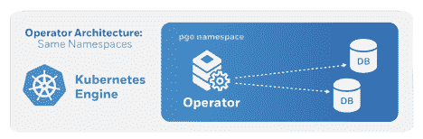
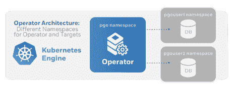
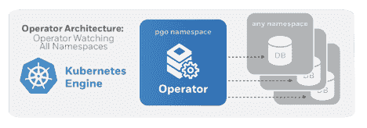
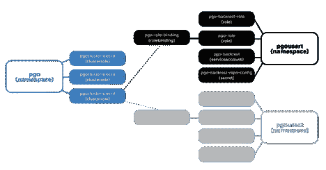

# 使用 PostgreSQL 操作符的高级 Kubernetes 名称空间管理

> 原文：<https://thenewstack.io/advanced-kubernetes-namespace-management-with-the-postgresql-operator/>

 [乔纳森·s·卡茨

乔纳森·s·卡茨是可信的开源 PostgreSQL 技术的领先提供商 Crunchy Data 的云工程& Growth 的主管，负责其云产品，包括 PostgreSQL 运营商。Jonathan 还负责 PostgreSQL 全球开发小组的宣传和其他治理工作，并且是非营利性的美国 PostgreSQL 协会的董事会成员。Jonathan 喜欢用 PostgreSQL 构建应用程序，并热衷于展示 PostgreSQL 的所有精彩特性。在 Crunchy Data 之前，乔纳森是 VenueBook 的首席技术官，在此之前，他是 Paperless Post 的技术副总裁。在这两家公司中，Jonathan 利用 PostgreSQL 开发了健壮的平台，利用了它的许多特性，从复杂的数据类型到流逻辑变化的能力。Jonathan 毕业于塔夫茨大学，拥有计算机科学学士学位和数学学士学位。](https://www.crunchydata.com/) 

Crunchy PostgreSQL for Kubernetes 为企业提供了一个开源、云无关的平台，通过利用 Crunchy PostgreSQL 操作符在其环境中构建数据库即服务。为了支持各种企业用例，Crunchy Data 继续开发增强功能，旨在确保 Crunchy PostgreSQL 操作员部署的可扩展性和安全性。

大型企业数据库即服务用户通常需要能够支持组织中各种团队和用户的 PostgreSQL 用户，他们可能有不同的需求。支持不同类型的 [Kubernetes 名称空间](https://kubernetes.io/docs/concepts/overview/working-with-objects/namespaces/)部署使企业能够更好地在 Kubernetes 上建立业务结构模型，并更好地将 PostgreSQL 资源分配给组织内的特定用户或用户组。

为了支持高级的组织用户架构，[发布的 PostgreSQL Operator 4.0 版本](https://info.crunchydata.com/blog/crunchy-postgres-kubernetes-operator-4.0)进行了增强，以进一步集成 PostgreSQL Operator 和 Kubernetes 名称空间。此外，最新的 [PostgreSQL Operator 4.1 版本](https://github.com/CrunchyData/postgres-operator/releases/tag/v4.1.0)提供了对名称空间管理的更多控制，允许用户动态创建和删除名称空间。当与 Crunchy PostgreSQL 操作员提供的基于角色的访问控制(RBAC)相结合时，Crunchy PostgreSQL 操作员使企业能够根据其企业需求定制最匹配的 PostgreSQL 即服务产品。

这篇文章介绍了复杂的 PostgreSQL 操作符如何与 Kubernetes 名称空间交互，并就 PostgreSQL 操作符用户可用的不同配置以及他们如何支持企业数据库即服务需求提供了指导。

## Kubernetes 名称空间和 PostgreSQL 操作符的背景

在 Kubernetes 中，名称空间为用户提供了在多个用户之间划分集群资源的能力(通过[资源配额](https://kubernetes.io/docs/concepts/policy/resource-quotas/))。名称空间旨在用于 Kubernetes 环境，其中许多用户分布在多个团队或项目中。特别是，随着特定环境中 Kubernetes 工作负载数量的增长，名称空间变得越来越重要。这是因为它们提供了一种方便的机制来组织工作负载，并为它们提供更细粒度的安全访问。但是，根据应用程序的安全需求，名称空间也为较小的工作负载提供了优势。

PostgreSQL 操作符利用 Kubernetes 名称空间支持来定义 PostgreSQL 操作符将 PostgreSQL 集群部署到的名称空间。这提供了更简单的系统管理，并使企业能够更容易地将 Kubernetes 资源分配到其业务中的特定区域(用户、项目、部门)。在 4.0 版中，PostgreSQL 操作符允许企业在其 Kubernetes 集群上部署一个 PostgreSQL 操作符，并监视任意数量的企业定义的名称空间。PostgreSQL Operator 4.1 版本为用户添加了额外的功能，以动态管理其 PostgreSQL 工作负载的名称空间。

## 应用于组织需求的名称空间

在 PostgreSQL Operator 4.0 之前的版本中，Operator 只能使用名称空间部署模式进行部署，其中 PostgreSQL Operator 及其部署的 PostgreSQL 集群都存在于单个 Kubernetes 名称空间中。这允许 PostgreSQL 操作符支持各种名称空间部署模式，包括:

*   **开发:**Operator 和 PostgreSQL 集群部署到同一个 Kubernetes 名称空间。
*   **单租户:**Operator 和 PostgreSQL 集群各自存在于自己的名称空间中。
*   **多租户:**操作员管理多个名称空间，这些名称空间可以包含多个 PostgreSQL 集群，被分配到一个名称空间的用户不能看到其他名称空间中的 PostgreSQL 集群。
*   **每个名称空间一个集群:**操作者为其管理的每个 PostgreSQL 集群创建一个名称空间，允许每个工作负载被隔离到一个特定的名称空间。

PostgreSQL 操作符的名称空间支持让您可以更好地将业务模型映射到 Kubernetes 基础设施上。例如，您可以定义单个用户(例如 Bob、Paul)、部门(例如工程、质量保证、研究)或者生命周期边界(例如开发、测试、QA)的名称空间。然后，运营商可以部署独特的配置，以便为每个组提供独特的服务。

## Kubernetes 名称空间和 PostgreSQL 操作符

PostgreSQL 操作符既知道它正在哪个 Kubernetes 名称空间中运行，又可以被配置为服务于不同的 Kubernetes 名称空间。这两种配置都是在启动时通过修改 PostgreSQL 操作符的部署定义中的环境变量来进行的。

PostgreSQL 操作员的环境变量是在启动时通过修改 PostgreSQL 操作员的配置文件中的 YAML 来配置的。下面特别提到与名称空间配置相关的环境变量。关于使用自动化 Ansible playbook 和 Bash 安装的完整安装说明，请参见 [PostgreSQL 操作符文档](https://access.crunchydata.com/documentation/postgres-operator/latest/installation/)。

操作员安装程序还允许您在初始安装后向操作员配置中添加一个新的监视名称空间。在操作符的未来版本中，添加新的被监视的名称空间将是自动的，并且更加动态。

## PostgreSQL 运算符部署到的命名空间的配置

为了配置将在其中运行 PostgreSQL 操作符的 Kubernetes 名称空间，有必要配置 PGO_OPERATOR_NAMESPACE 环境变量。Ansible 和 Bash 安装方法都允许您修改这个与操作符安装相关的 PGO_OPERATOR_NAMESPACE 环境变量。

操作符命名空间可以是你喜欢的任何名称，在这篇博客中，我们使用 pgo 作为操作符命名空间。

## PostgreSQL 操作员将 PostgreSQL 集群部署到的命名空间的配置

操作符在启动时根据它在启动时传递给操作符的名称空间环境变量中找到的内容来确定它将服务哪些名称空间。NAMESPACE 变量可以保存不同的值，这些值决定 PostgreSQL 操作符将监视的名称空间。该变量是在操作员安装过程中指定和设置的。PostgreSQL 操作符中的名称空间值的格式是模仿[操作符生命周期管理器](https://github.com/operator-framework/operator-lifecycle-manager/blob/master/doc/design/operatorgroups.md)项目的。

受监视的名称空间可以被命名为您想要的任何名称，在这篇博客中，我们使用名称 pgouser1 和 pgouser2 作为示例名称空间名称。命名空间如何命名以及使用多少命名空间由用户决定，这些被监视的命名空间可以代表企业内的用户、组或部门。

### 开发示例

开发部署模式为 PostgreSQL 操作符和 PostgreSQL 操作符部署的 PostgreSQL 集群提供了在单个 Kubernetes 名称空间中的部署。

这种部署模式的优点是简单。这种部署模式可能最适用于:

*   单一开发人员 PostgreSQL 操作员安装。
*   您对 Kubernetes 环境只有一个目的的用例。
*   当您需要部署和管理的 PostgreSQL 数据库非常有限时。

这种部署模式的缺点是，它要求需要多个 Kubernetes 名称空间中的 PostgreSQL 集群的用户执行多个 PostgreSQL 操作符安装，并在单个 Kubernetes 集群中管理多个 PostgreSQL 操作符。

### 单租户示例

单租户部署模式将 PostgreSQL 操作符部署在指定的 Kubernetes 名称空间(例如:pgo)内，但是将托管 PostgreSQL 集群部署到一个不同的 Kubernetes 名称空间(例如:pgouser1)。

这种部署模式的优点是它提供了额外的灵活性，因为它允许用户在每个 Kubernetes 名称空间内更具体地指定 PostgreSQL 操作符 RBAC 控件，其中受监视的名称空间(在本例中为 pgouser1)比拥有操作符本身的名称空间(在本例中为 pgo)具有更少的 RBAC 权限。除了部署 PostgreSQL 集群的 Kubernetes 名称空间之外，这种部署模式提供的额外粒度的 RBAC 权限控制为用户提供了额外的安全隔离。

使用这种类型的操作符部署，您还可以支持多租户 Kubernetes 场景，因为您可以在单个 Kubernetes 集群上运行许多不同的 PostgreSQL 操作符，每个操作符都有一个独特的配置。

为了使用单租户部署模式部署 PostgreSQL 操作符，有必要按如下方式配置 PostgreSQL 操作符环境变量(pgo 和 pgouser1 是示例标识符)。

`export PGO_OPERATOR_NAMESPACE=pgo`

`export NAMESPACE=pgouser1`

### 多租户示例

多租户部署模式规定将 PostgreSQL 操作符部署到它自己的 Kubernetes 名称空间(例如:pgo)，但是将托管 PostgreSQL 集群部署到多个不同的 Kubernetes 名称空间(例如:pgouser1pgouser2)。

这种部署模式的优点是它提供了比单租户模式更大的灵活性。这使得企业在根据业务模型构建 Kubernetes 环境时更加灵活。例如，可以将监视的名称空间创建为公司内的用户、组或部门。然后，单个操作者可以用单个配置以一致的方式处理所有名称空间。

要将操作符部署到其自己的名称空间中，但将 Postgres 集群创建到多个名称空间中，变量如下:

`export PGO_OPERATOR_NAMESPACE=pgo`

`export NAMESPACE=pgouser1,pgouser2`

从 4.1 版开始，您可以在 PostgreSQL 操作符的管理下动态添加更多的名称空间:

`pgo create namespace pgouser3`

### 每个命名空间一个集群的示例

“每个名称空间一个集群”部署模式将 PostgreSQL 操作符部署到它自己的 Kubernetes 名称空间(例如:pgo)，并将托管的 PostgreSQL 集群部署到任何 Kubernetes 名称空间(例如:cluster 1；cluster2… clusterN)。

要将操作符部署到其自己的名称空间中，但将 Postgres 集群创建到任何目标名称空间中，变量如下:

`export PGO_OPERATOR_NAMESPACE=pgo`

`export NAMESPACE=`

这里，空字符串值表示所有名称空间。运营商仍然要求您为每个要部署 PostgreSQL 集群的命名空间准备好正确的 RBAC 控制。在操作符项目中，提供了一个脚本，用于将特定于操作符的 RBAC 控件安装到任何一个目标名称空间中。

要成功部署此模式，可以使用以下命令:

`pgo create namespace cluster1`

`pgo create cluster –n cluster1 cluster1`

### PostgreSQL 运算符 RBAC

为了对 PostgreSQL 操作符部署提供更细粒度的访问控制，PostgreSQL 操作符提供了本机 RBAC。此 PostgreSQL 操作员本机 RBAC 使 PostgreSQL 操作员管理员能够配置创建作业、访问名称空间、创建部署和其他 Kubernetes 资源所需的操作员权限。

关于对新名称空间模式的支持，PostgreSQL 操作符还添加了对针对每个要监视的名称空间的不同 RBAC 权限的应用和配置的支持，并且需要特定的 PostgreSQL 操作符。当您执行操作符安装时，安装过程会导致 PostgreSQL 操作符遍历要监视的名称空间列表，为每个名称空间创建所需的 RBAC 资源。

在运行安装脚本之后，示例部署在您的 Kubernetes 系统上创建了以下 RBAC 结构:

### pgo 客户端和命名空间

从 PostgreSQL Operator 4.0 开始，现在需要 PostgreSQL Operator 公共行接口(pgo CLI)来标识向 PostgreSQL Operator 发出命令时要使用的名称空间。

pgo CLI 的用户可以创建一个 pgo_NAMESPACE 环境变量来以持久方式设置命名空间，也可以在 PGO 命令行上使用–NAMESPACE 标志来指定它。如果 pgo CLI 请求不包含有效的命名空间，该请求将被拒绝。

pgo CLI 用户现在被配置为可以访问某些命名空间，以阻止或提供对某些命名空间内的 PostgreSQL 集群的访问。pgo CLI 用户可以使用新的 pgo 命令查看他们有权访问的命名空间:

`$ pgo show namespace`

`namespace: pgouser1 (accessible)`

`namespace: pgouser2 (accessible)`

## 结论

支持不同类型的 Kubernetes 名称空间部署可以让企业更好地在 Kubernetes 上建立业务结构模型，并更好地将 Postgres 资源分配给组织内的特定人员或组。

从 PostgreSQL Operator 4.0 开始，企业能够在其 Kubernetes 集群上部署一个 PostgreSQL 操作符，并监视任意数量的企业定义的名称空间。这提供了更简单的系统管理，并使企业能够更容易地将 Kubernetes 资源分配到其业务中的特定区域(用户、项目、部门)。

请尝试一下 PostgreSQL 操作符，并告诉我们您的想法。这里有简单的入门指导[。Crunchy Data 欢迎针对](https://info.crunchydata.com/blog/install-postgres-operator-kubernetes-on-gke-ansible) [PostgreSQL 操作符项目](https://github.com/CrunchyData/postgres-operator)的 GitHub 问题、协作和拉请求。

通过 Pixabay 的特征图像。

<svg xmlns:xlink="http://www.w3.org/1999/xlink" viewBox="0 0 68 31" version="1.1"><title>Group</title> <desc>Created with Sketch.</desc></svg>