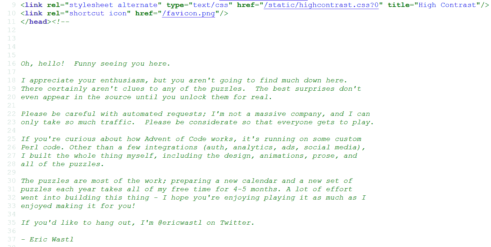
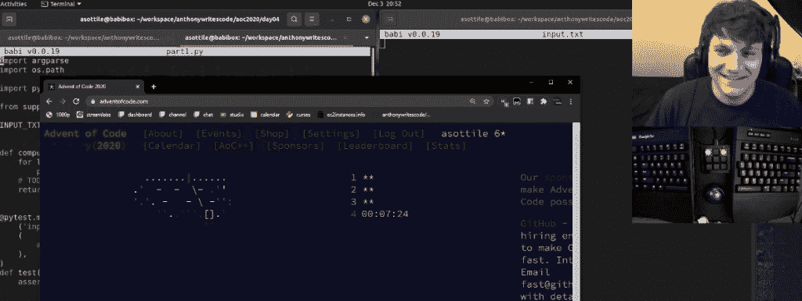

# 《代码的来临》围绕谜题建立了一个编程社区

> 原文：<https://thenewstack.io/advent-of-code-builds-a-programming-community-around-puzzles/>

12 月为计算机爱好者带来了另一个一年一度的现象:一组新的编程难题出现在一个名为[降临代码](https://adventofcode.com/)的网站上。

[Squarespace 的首席工程师 Tanya Reilly 在最近的一篇描述这一现象的博客文章](https://noidea.dog/blog/i-love-advent-of-code)中解释道:“每年，Eric Wastl 都会创造 25 个由两部分组成的编程难题，所有这些难题都由一个关于拯救圣诞节的可爱故事联系在一起。”。“但真正有趣的是，当它们在 12 月出现时，你正在做它们，每天一个，与成千上万的其他人一起同时解决它们。”

但是，这个庞大的社区也带来了一系列不同寻常的技术挑战，Wastl 每年都以决心和奉献精神应对这些挑战——并从云获得了一点帮助。

## 传播欢呼

成群的开发者急切地等待着每一个新谜题在午夜到来，倒数着圣诞节的到来，在过去的六年里，它已经拥有了一大批热情的粉丝。“让它脱颖而出的因素是社区，”一位[粉丝在黑客新闻](https://news.ycombinator.com/item?id=25251835)上发帖说。“r/adventofcode subreddit 每年都非常活跃，你不仅可以从其他人那里学习编程技巧和诀窍，还可以看到人们做一些疯狂的事情，比如用 Excel、Git 等工具解决问题。以及他们的解决方案的酷的可视化。”

今年有 18，700 名粉丝订阅了 Reddit 上的[专用论坛，论坛上到处都是展示聪明创意的解决方案的帖子。](https://www.reddit.com/r/adventofcode/)

因为有一个很大的社区在解决同样的难题，所以有现成的观众来欣赏这些及时的编码创造力的壮举。该网站的粉丝用令人眼花缭乱的各种编程语言来解决它的难题，从 [Smalltalk](https://www.reddit.com/r/adventofcode/comments/k62gf7/2020_day_1_and_beyond_smalltalk/) 到[哈斯克尔](https://www.reddit.com/r/adventofcode/comments/k615vn/repo_my_ongoing_haskell_advent_of_code/)、 [Clojure](https://www.reddit.com/r/adventofcode/comments/k5ujjz/2020_day_2_clojure/) 和[樱庭落](https://www.reddit.com/r/adventofcode/comments/k61rta/2020_day_3_raku/)。解决方案已经发布在 [Java](https://www.reddit.com/r/adventofcode/comments/k610e3/2020_day_3_puzzle_1_java/) 、 [C#](https://www.reddit.com/r/adventofcode/comments/k650wc/my_solutions_in_c/) 、 [Go](https://www.reddit.com/r/adventofcode/comments/k5i121/2020_day_1_2_go_advent_of_code_2020_in_go_day_1/) 、 [Rust](https://www.reddit.com/r/adventofcode/comments/k58819/advent_of_code_20_in_rust/) 、 [Kotlin](https://www.reddit.com/r/adventofcode/comments/k5fdgr/day_02_in_kotlin/) 、 [Lisp](https://www.reddit.com/r/adventofcode/comments/k5fee7/2020_day_2_part_12_julia_lisp_im_quite_new_to/) 、 [Swift](https://www.reddit.com/r/adventofcode/comments/k5g6wd/day_2_in_swift/) ，甚至 [Powershell](https://www.reddit.com/r/adventofcode/comments/k5yoc5/2020_day_3_part_1_powershell_almost_there_i_think/) 。

一名机器学习研究人员正试图使用 Tensorflow 计算他们的解决方案[。有人贴出了他们在大会上写的解决方案](https://www.reddit.com/r/adventofcode/comments/k5jh6s/2020_day_1_tensorflow_this_year_ill_be_attempting/)。有人通过为苹果的 Siri 语音助手创建一个自定义命令[解决了一个难题。至少有四个不同的 Reddit 用户](https://www.reddit.com/r/adventofcode/comments/k4vtj6/2020_day_1_did_someone_say_siri/)[创建了](https://www.reddit.com/r/adventofcode/comments/k5rspd/unreal_engine_4_video_day_2/) [动画](https://www.reddit.com/r/adventofcode/comments/k5w3dl/2020_day_3_visualization/) [图像](https://www.reddit.com/r/adventofcode/comments/k6588d/2020_day_3_raytraced_visualisation_in_blender_3d/)来描绘他们的解决方案(其中一个使用 [Ascii 艺术](https://www.reddit.com/r/adventofcode/comments/k5vmg1/day_3_making_the_ascii_trip/))。有人在 Excel 电子表格中解决了同样的难题[。有人发布了一个用 Game Boy 汇编语言](https://www.reddit.com/r/adventofcode/comments/k5rb61/2020_day_3_excel_is_back/)和教育可视化编程语言 [Scratch](https://www.reddit.com/r/adventofcode/comments/k5ok8o/here_are_my_solutions_in_scratch_lowering_the_ante/) 完成的解决方案[。](https://www.reddit.com/r/adventofcode/comments/k5j2f7/2020_day_2_game_boy_assembly_turns_out_you_write/)

有些人甚至已经解决了游戏世界中的谜题，如编程视频游戏 Exapunks 中的 [Factorio](https://www.reddit.com/r/adventofcode/comments/k5fmi7/day_01_solution_in_factorio/) 和[。](https://www.reddit.com/r/adventofcode/comments/k60ycf/day_1_part_1_solution_in_exapunks/)

Wastl 有没有被他的粉丝解决他的一个谜题的速度震惊过？“他们所有人，每天晚上，”他在 Twitch 上告诉观众。

## 魔术背后

在 Twitch 上，Wastl 说他受到了他从小喜欢的基督降临节日历的启发。基督降临节日历计算圣诞节前的天数。瓦斯特也受到“帮助人们学习的热爱”的激励。对程序员教育的热爱。”一些人告诉他，他们已经从解决他的难题转向了编程生涯。“对我来说，这是最酷的故事。我想要的只是给一些人去追逐梦想的能力。”

在 Twitch 上，Wastl 笑着说，这两个部分的谜题模仿了人们太熟悉的现实世界中需求变化的现象——但这是一个在低压环境中体验它们的机会。

正如 Squarespace 的 Reilly 解释的那样，“与圣诞老人相关的谜题不会激发出最漂亮的、可投入生产的代码。”但最终，这是这项活动独特魅力的一部分。“技术是一个充满地位焦虑和自我的职业，所以人们聚在一起展示他们最可怕的代码，这既温暖又脆弱。我喜欢这样。”

2020 年并没有改变他的过程——除了“因为 Covid，每个人都在家”的意义上，Wastl 周四在 Twitch 上解释道。"所以他们改做《代码降临》——所以他们拥抱服务器直到死亡."

2019 年第一天的流量比前一年增加了 20%，所以他试图计划在 2020 年再次增加流量。但是当重要的一天到来时，有 150%的巨大增长，这很快导致[服务器超载](https://twitter.com/davidcoles/status/1333637673609674753)。

[https://www.youtube.com/embed/gibVyxpi-qA?feature=oembed](https://www.youtube.com/embed/gibVyxpi-qA?feature=oembed)

视频

第一个谜题于 12 月 1 日推出，在 48 小时内，超过 86，000 人完成了它。瓦斯特后来在 Twitch 上承认，这么多用户真的很难想象。"这不是你的猴脑能解决的数字."这个数字比 2015 年全年的求解者总数还要多[。](https://twitter.com/ericwastl/status/1333874003119910914)

“猜猜看，如果您的服务器内存有限，工作进程的数量没有限制，同时传入的请求比您预测的多得多，会发生什么？”Wastl [事后解释](https://www.reddit.com/r/adventofcode/comments/k4ejjz/2020_day_1_unlock_crash_postmortem/)。“没错，池中的所有服务器同时耗尽内存。然后，他们都完全停止反应。然后，因为现在是 2020 年，AWS 的‘强制停止’命令需要 3-4 分钟才能强制停止。根本原因:2020 年。”

当 Twitch 上的一条评论说大型服务是建立在失败和事后反思的基础上时，Wastl 很快同意了这一点——他在给任何想尝试推出自己的大规模活动的人的一些建议中重申了这一点。“失败了很多，犯了很多错误。每当你犯了一个错误……理解它，消化它，修正它，增加对它的监控——然后你就可以出发了。

“然后等下一个东西坏了，再来一次。”

## 爱的劳动

Wastl 花了一年的大部分时间构思谜题。“每年准备一个新的日历和一套新的谜题要花掉我 4-5 个月的空闲时间，”Wastl 解释道，这是一条隐藏在网站 HTML 代码中的秘密信息。“制作这个东西花了很多心血——我希望你能像我喜欢为你制作它一样喜欢玩它！”

在 Twitch 上，Wastl 说他几乎一直在做拼图，并且总是用“成百上千的拼图想法”更新他的“庞大”列表。2016 年的一个谜题受到了 defcon 演讲的启发，该演讲讲述了将指令注入一个神秘的芯片以解码其工作原理。

Wastl 仍然试图早点完成，这样他的 beta 测试人员就有时间来测试这些难题。他们总是识别出哪些输入具有边缘情况，但也让他惊讶地发现哪些输入是最困难的。当被问及是否需要更多 beta 测试人员时，他有一个熟悉的答案。“不，我需要更少的测试者。我收到了太多的反馈……我花了很长时间才看完测试版测试人员说的话。”

Twitch 上的观众观看时，离午夜还有几分钟，Wastl 建议他们“在我去看服务器和对着纸袋呼吸之前”再做一件事他要求观看他的流媒体的每个人都切换到另一个 Twitch 直播——在这种情况下，Lyft 软件工程师安东尼·索特瓦(Anthony Sottile)当时正在一个名为[安东尼编写代码](https://www.twitch.tv/anthonywritescode?referrer=raid)的频道上播放。

就像世界上成百上千的开发人员一样，Anthony 徘徊在代码页的出现上，等待下一个难题的出现。

他试图解决 SQLite 中的所有难题。

* * *

## WebReduce

<svg xmlns:xlink="http://www.w3.org/1999/xlink" viewBox="0 0 68 31" version="1.1"><title>Group</title> <desc>Created with Sketch.</desc></svg>