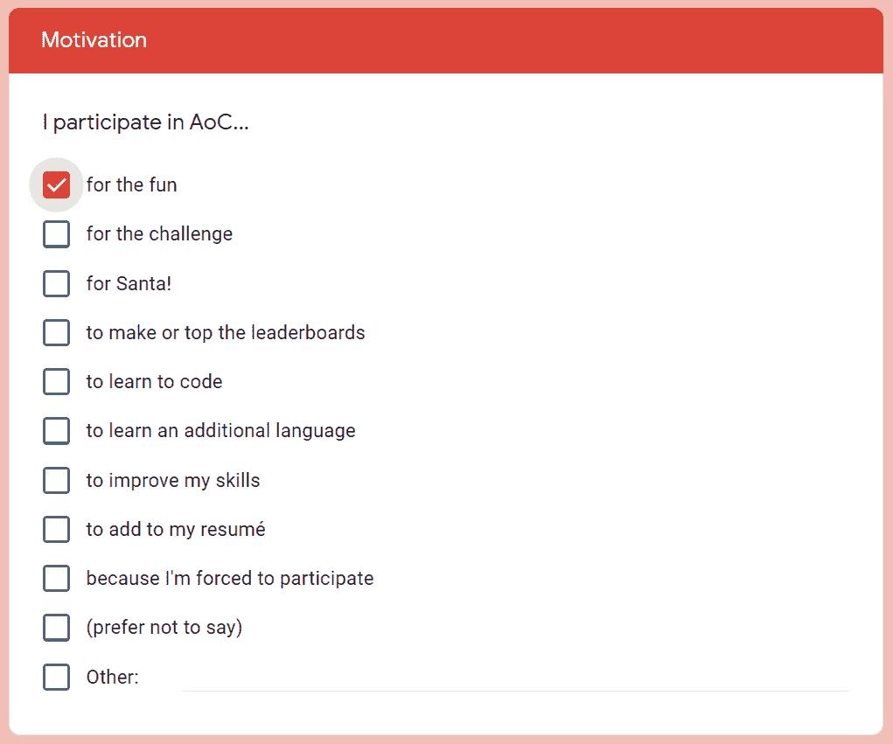

# Code 编程难题的出现创造了新的全球记录

> 原文：<https://thenewstack.io/advent-of-codes-programming-puzzles-set-new-global-record/>

自 2015 年以来，每年 12 月都会发生这种情况。“我喜欢帮助人们成为更好的程序员，我喜欢制作谜题，”埃里克·瓦斯特 [上个月告诉教育网站 Real Python](https://realpython.com/interview-eric-wastl/)。“所以我想出一些东西，可以送给我的几个朋友。”

一时兴起，Wastl 制作了[【代码降临】](https://adventofcode.com/)——一个每天 25 个编程谜题的系列，在圣诞节倒计时时讲述一个精灵主题的故事。从那时起，它们已经成为技术社区的一个珍贵的年度传统，并释放了大量的创造力。

今年第一天的难题被 183，620 个独立用户解决了。

虽然每天的谜题有两个部分，但第一天有 164，920 名参与者解决了第一部分和第二部分。33，000 名粉丝甚至在 Reddit 上订阅了这个大事件的[专用论坛(一年前](https://www.reddit.com/r/adventofcode/)[只有 18，700 人](https://thenewstack.io/advent-of-code-builds-a-programming-community-around-puzzles/))，黑客新闻上有数百条[评论](https://news.ycombinator.com/item?id=29403522)和[投票](https://news.ycombinator.com/item?id=29292818)。

这一切都提供了一个有趣的机会来体验编程社区的真正广度，就像在虚拟城镇广场上的自发聚会一样。有笑声、新的自豪感和对开发人员的一瞥。

在世界各地，人们加入到欢乐中来——并在节日期间分享一点善意。

## 2021 年的故事:圣诞老人的潜水艇

你注意到的第一件事是代码的出现已经成为一个非常大的事件。现在甚至有了官方的“代码降临”商店，出售咖啡杯、贴纸、t 恤和帽衫——短语“代码降临”现在是美国的注册商标。

该活动吸引了强大的赞助商，包括 Capital One、美国运通、Spotify，甚至教育出版商麦格劳·希尔。JetBrains(也是赞助商)甚至制作了一个特别的视频，展示了他们的开发者倡导者 Sebastian Aigner。

[https://www.youtube.com/embed/6-XSehwRgSY?feature=oembed](https://www.youtube.com/embed/6-XSehwRgSY?feature=oembed)

视频

但是，尽管如此,《代码的来临》仍然保持了它的趣味性。

例如，在[的一篇博客文章](https://blog.jetbrains.com/kotlin/2021/11/advent-of-code-2021-in-kotlin/) [中，JetBrains 的开发者支持者 Sebastian Aigner](https://www.linkedin.com/in/sebastian-aigner) 承诺，他的公司也将向随机选择的注册 JetBrains 抽奖活动的参与者发送“Kotlin 关怀包”，方法是在他们的 GitHub 知识库的主题中添加一个特殊代码，“为我们的社区增添节日的甜蜜”(尽管 JetBrains 也为允许使用 JUnit 进行自动化测试的解决方案创建了一个[存储库模板](https://github.com/kotlin-hands-on/advent-of-code-kotlin-template))。

今年的故事问题包括一个 25 部分的冒险，涉及圣诞老人的潜艇。“它被圣诞灯覆盖着(因为它当然是)…”

“很显然，其中一个精灵绊倒了，不小心把雪橇钥匙飞进了海洋！”解释了第一天的谜题。有抱负的编码员被告知，他们每解决一个问题，就会获得一颗星星，这颗星星将增强潜艇实验性按键跟踪天线的强度。到目前为止，已经有熔岩管，一只巨大的乌贼，并且一度有一大群螃蟹。

## 开发人员创造力的起点

多年来，这些疯狂的故事已经成为活动参与者更多创造力的起点。

自称为“电脑呆子”的加里·j·格雷迪(Gary j . Grady)一直在创作关于每个谜题的漫画，然后在推特上分享。在世界各地，许多其他人也给了数据他们自己的创造性的可视化。

例如，芬兰自学成才的工程师 Jari Komppa 和阿尔伯塔省的互动媒体设计师 Jordan Ranson。

有些视觉效果很可爱——几乎是艺术品

当然，无数人在 Twitch 上直播他们的解谜过程。

## 国产硬件

参与者可以登录(使用来自 GitHub 的现有凭证，您的 Google 帐户登录，甚至来自 Twitter 或 Reddit)，这允许网站跟踪他们的分数。该网站还对每天解决谜题的前 100 人进行奖励，最先提交答案的人将获得 100 分。(今年的第一个谜题显然只用了 67 秒就解决了[。)](https://adventofcode.com/2021/leaderboard/day/1)

“如果你不能在午夜参与，那不是问题；许多人使用私人排行榜与他们所在地区的人竞争，”Wastl 在 Code site 的出现上解释道。([耶鲁安·海曼斯，](https://www.jeroenheijmans.nl/)一位荷兰的软件开发人员，创建了一个参与者调查，结果将在“圣诞节前后”从他的 [GitHub 库](https://github.com/jeroenheijmans/advent-of-code-surveys)发布在 Reddit 上。)

但是其他程序员找到了其他自豪的来源，构建了他们奢侈而不太可能的自制解决方案:

一名数学系学生甚至将他们的答案提交给了一篇学术性的分析代数数学论文。还有一些人用这些谜题来测试他们在特定语言方面的技能。一位博客作者在博客上写下了他们解决统计编程语言 R 中的谜题[的努力。几个甚至](https://securityboulevard.com/2021/12/2021-advent-of-code-day-02-dont-try-this-at-home-edition/)[用](https://www.reddit.com/r/adventofcode/comments/rd1ukw/2021_day_9_in_scratch_with_plot_of_basins/)麻省理工的[视觉语言](https://www.reddit.com/r/adventofcode/comments/rcywqu/2021_day_7scratch_me_lets_make_this_code_run_as/)给年轻学习者，Scratch。

## 为代码参与者的到来欢呼

Eric Wastl 正在关注他创建的这个意外的社区，他在 Twitter 上分享了他的积极态度。

仔细看看这个网站，你会瞥见他的日常生活。“构建和运行《降临代码》占用了我大量的时间和精力，”Wastl 在一页上写道，他说他[接受](https://adventofcode.com/2021/support)的支持，以支付他的基础设施和时间，以及未来的项目和“我的寿司瘾”

在一个由五名 beta 测试人员组成的团队(以及两名社区经理)的帮助下，他每年都会组装一套新的谜题。但在现实生活中，Wastl 还担任 TCGPlayer 的高级架构师，这是一个致力于收集交易卡牌游戏的电子商务网站，他上个月告诉 Real Python 网站。

“我的工作范围从复杂的算法、Kubernetes、供应商选择和基础设施扩展到培训、架构规划、技术候选人评估和运行大型内部黑客马拉松。”

令人感兴趣的是，这是否是他磨练技能的地方，他最终将把这些技能带到《代码的来临》。“我的日子是各种事情的混合体，”Wastl 告诉真正的 Python 网站，“像与团队和个人交谈，帮助他们解决最困难的技术挑战，算法设计，高级技术规划，以及为工具、自动化和可见性构建东西”

即使是《代码降临》的官方说明也支持性地提醒新用户“你不需要计算机科学背景就能参与——只需要一点编程知识和一些解决问题的技巧就能让你走得很远。你也不需要一台昂贵的电脑；每个问题都有一个解决方案，在 10 年前的硬件上最多 15 秒就能完成。”

今年，Wastl 鼓励他不断发展的社区，因为这项活动实现了更多的里程碑。

事实上，本周 Wastl 宣布了另一个新的里程碑。他一直在计算有多少用户参与了这个活动(至少解决了一个难题)。

周四，Wastl [宣布](https://twitter.com/ericwastl/status/1469040666118438919)比赛终于迎来了第 50 万名解谜者。

Wastl 告诉 the Real Python site，现在支持竞争的最佳方式是传播消息——并愿意帮助其他正在努力解决问题的人，尤其是新的和早期职业程序员。他补充道，只要有一点善意，其他一切都会迎刃而解。

“只要社区继续保持其令人印象深刻的相互支持的历史，我就不需要去任何地方。”

更正:这篇文章是对之前版本的更正，之前版本称《代码降临》的创造者埃里克·瓦斯特接受捐赠；《代码降临》并未注册为非营利慈善机构，因此支持是不可扣税的。这篇文章的前一个版本还提到，软件开发人员耶鲁安·海曼斯创建了一个“官方”的代码参与者降临调查；这项调查不是官方的。

<svg xmlns:xlink="http://www.w3.org/1999/xlink" viewBox="0 0 68 31" version="1.1"><title>Group</title> <desc>Created with Sketch.</desc></svg>