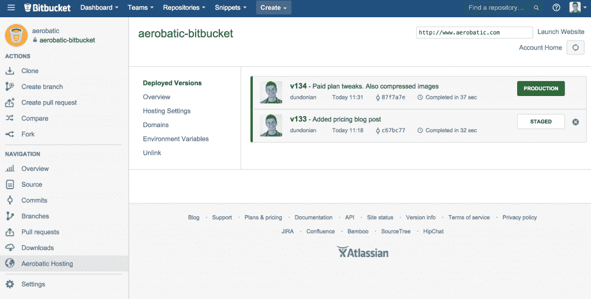
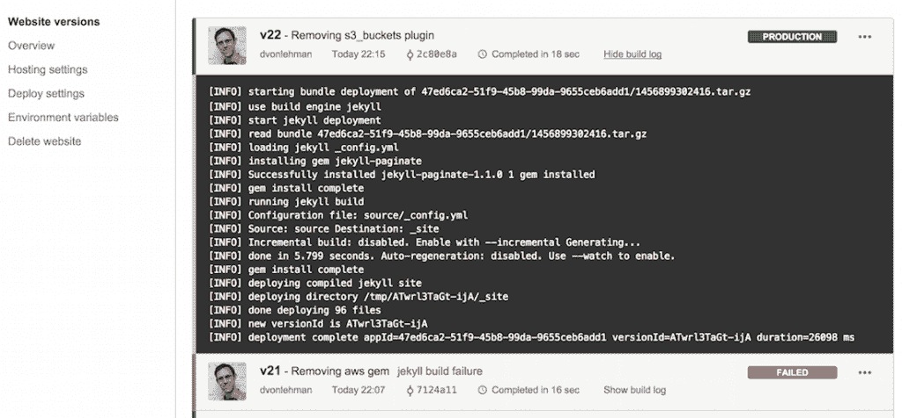
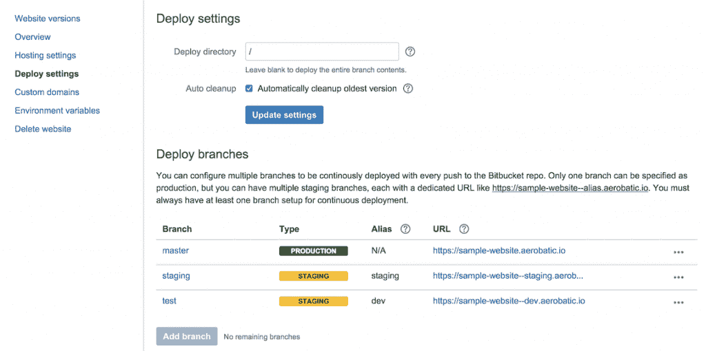
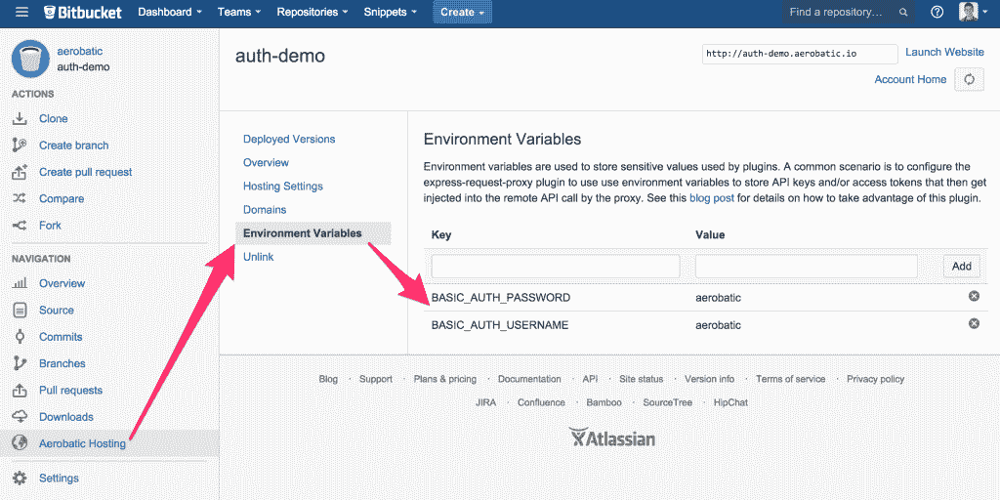

# 特技飞行直接从 BitBucket 部署网站

> 原文：<https://thenewstack.io/aerobatic-deploys-websites-directly-bitbucket/>

[Aerobatic](https://www.aerobatic.com/) 是一个静态托管平台，希望缓解开发人员在大规模网站工作时面临的一些更常见的痛点。Aerobatic 将开发人员的代码直接推送到 Bitbucket，持续部署网站，同时处理 CDN、分支部署、SSL 和缓存失效。虽然今天有很多静态托管解决方案，但 Aerobatic 通过提供与 [Atlassian 的 Bitbucket](https://bitbucket.org/) 的深度集成而脱颖而出。

## **启动你的引擎**

当电子商务应用公司 [MyMarket](https://www.mymarket.io/) 旨在简化其静态托管解决方案时，它转向 Aerobatic 来帮助解决他们的需求。

“我们可以使用很多服务，但每项新服务都会增加复杂性。另一方面，Aerobatic 通过直接集成在 Bitbucket 中并通过标准的 package.json 文件进行配置来降低这种复杂性，”MyMarket 首席技术官迈克尔·施拉姆说。在实施特技飞行后，MyMarket 团队将其部署过程的速度比之前的基准提高了 8 倍以上。

比特斗和特技飞行项目仪表板

Aerobatic 与 Atlassian Bitbucket 的紧密集成消除了开发人员的大量上下文切换，而其内置的连续部署结构消除了对额外 CI 工具的需求。对于需要更安全设置的大型企业，用户可以运行特技飞行的私人实例。

除此之外，Aerobatic 还提供了可扩展性和定制功能，可以帮助开发人员定制它来满足他们的需求。

“我们使用 AWS 的‘全方位’方法使我们能够利用他们最新的完全托管和无服务器产品快速构建可大规模扩展的服务。Aerobatic 平台也是开源的，其架构使得核心平台可以通过定制插件进行扩展，”Aerobatic 的创始人之一 Jason Gowans 说。

## **静态托管的好处**

在其核心，Aerobatic 是面向管理网站的，无论这些是使用静态生成器如 Jekyll 或 [Hugo](https://www.aerobatic.com/docs/static-site-generators/#hugo) 构建的机构，还是使用 React.js 等框架工作的企业。

静态并不意味着缺乏功能或灵活性，因为 Aerobatic 为用户提供了全球 CDN，具有自动更新通配符 SSL 证书、API 代理、回滚、分支部署、身份验证等功能。对于那些完全使用 Jekyll 的人，Aerobatic 会自动构建 Jekyll 站点，允许用户使用自定义的 Ruby 插件。

杰基尔建造日志输出屏幕特技

特技飞行的一个关键特性是通过 Bitbucket 进行版本控制。拥有版本控制意味着整个团队可以使用 git 的分布式代码管理功能来构建和编辑网站。

Gowans 还指出，当开发人员利用 JIRA 的力量以及 Aerobatic 提供的许多审计和分析功能时，开发工作流程会进一步简化。Gowans 说:“与 web analytics 相比，能够查看内容编辑的提交历史提供了一些有趣的优化机会，例如，如果你仍然使用 WordPress 这样的传统 CMS，这是不容易实现的。”

## **引擎盖下**

Powering Aerobatic 是一个 Node.js 多租户 web 服务器，运行在 AWS Elastic Beanstalk 上，充当亚马逊简单存储服务器(S3)的智能流代理。该平台还依赖 DynamoDB 和 Redis 来存储每个网站的元数据。

Gowans 指出，由于网页是通过特技提供的，它们经历了一个轻量级的预处理阶段，优化 HTML 资源 URL(图像、脚本、样式表等)。)通过定向到 Aerobatic 自己的带有激进缓存头的 CDN。所有网站流量都由一个全球 CDN 管理，该 CDN 处理边缘缓存、自定义域 SSL 终止、恶意流量过滤和请求泛洪预防。

特技飞行部署设置

除了资产托管，Aerobatic 还通过插件为 DevOps 团队提供更多功能。这些插件是作为标准的 [Express.js](http://expressjs.com/) 产品实现的，Gowans 提到了开发人员在 Aerobatic 中使用的两个最受欢迎的插件是 [HTTP 基本认证](https://www.aerobatic.com/docs/http-basic-authentication)和 [HTTP 代理](https://www.aerobatic.com/docs/plugins/http-proxy/)，它们代表网站代理对远程 URL 的请求。

在 CI 和 CD 方面，Aerobatic 利用了 AWS Lambda 的力量来推动其工作流程。当将更改从存储库推送到 Bitbucket 时，webhook 触发 Aerobatic，它获取最新的项目源代码，并将其写入 staging bucket。

这反过来又会触发 Lambda 函数，从暂存桶中取出代码，执行任何需要的构建任务，然后将编译后的网站推到最终部署桶中。

“对我们来说，有一个类似的本地版本通过浏览器同步运行也很棒，开发者可以在本地测试，而不用推进到一个过渡系统，”施拉姆说。

特技飞行认证环境变量

特技飞行易于设置，为希望立即开始的团队提供一键解决方案。开发人员只需一键安装 Aerobatic Bitbucket 插件，将他们的存储库链接到它，就这样。Gowans 指出，对于那些想要使用其插件的人来说，只需在 package.json 文件中创建一个 JSON 格式的网站清单即可。

与 Atlassian 非常相似，Aerobatic 力求透明和开放，提供公共功能储备，用户可以就特技飞行队接下来的工作提供反馈和建议。

Aerobatic 为大规模工作的 DevOps 团队提供了许多产品，它不仅希望脱颖而出，还希望提高开发人员的生活质量。

通过 Pixabay 生成特征图像，通过特技飞行生成嵌入图像

<svg xmlns:xlink="http://www.w3.org/1999/xlink" viewBox="0 0 68 31" version="1.1"><title>Group</title> <desc>Created with Sketch.</desc></svg>