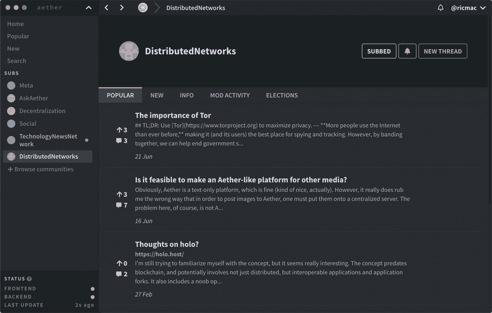
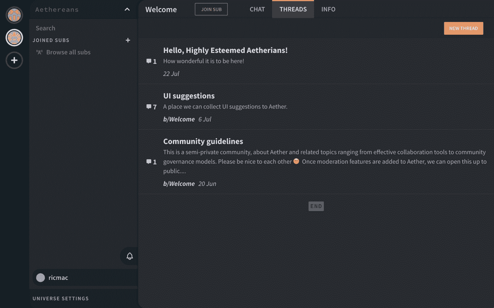

# Aether:一个具有自我节制和隐私的去中心化 Reddit

> 原文：<https://thenewstack.io/aether-a-decentralized-reddit-with-self-moderation-and-privacy/>

Aether 是去中心化社交媒体生态系统中的众多新应用之一。它就像一个点对点版本的 Reddit，具有类似的新闻聚合和社区讨论功能。有趣的是，Aether 不仅分散了其产品的技术方面，还分散了用户治理。换句话说，Aether 的用户可以管理自己，而不是受制于 Reddit 这样的企业霸主的突发奇想。

 [理查德·麦克马努斯

Richard 是 New Stack 的高级编辑，每周撰写一篇关于 web 和应用程序开发趋势的专栏文章。此前，他在 2003 年创立了读写网，并将其打造为全球最具影响力的科技新闻和分析网站之一。](https://twitter.com/ricmac) 

为了了解 Aether 的目标是什么，以及它到底是如何使用分散技术的，我采访了 Aether 的联合创始人 [Benedict Lau](https://twitter.com/LauBenedict) 。

首先，在与 Lau 交谈后，我了解到 Aether 实际上是两个独立的应用程序，其中只有一个是分散的！这一点从 Aether 的主页上并不明显，主页上只宣传其新发布的托管(即集中式)web 应用。在本文的后面会有更多的介绍，但是让我们先来看一下分散式产品，它是[，一个可以在 Linux、Windows 或 Mac 上使用的点对点桌面应用](https://getaether.net/download/)。

P2P 应用程序于 2018 年首次发布，被宣传为“独立、自我调节的社区网络”(如首次启动该应用程序时的注释所述)。据 Lau 称，它每月有大约 2000 名活跃用户。这款应用是由刘的商业伙伴[伯拉克·内比特](https://twitter.com/nehbit)开发的，他在 2013 年左右开始着手开发这款应用。P2P 应用发布后，Nehbit 在 2019 年聘请 Lau 作为承包商，帮助开发该 web 应用。刘今年成为该公司的联合创始人。

## 自我节制和审查

Aether 的 P2P 应用与其他去中心化的社交媒体服务(例如基于流言蜚语的 Manyverse，我在上周的文章中提到过)的不同之处在于“自我调节”方面。刘向我描述这是“主观适度”，他说这意味着“用户是优先考虑的。”在实践中，这意味着用户能够设置过滤器，自己决定他们想要允许的内容，包括允许谁对其进行调节。

“我可以看我想看的内容，”他解释道，“我可以订阅其他人或一些机构应用的过滤器。这样我可以保护我的注意力。”

Nehbit 在去年的一篇博客文章中解释了这是如何工作的。他写道，Aether“从 P2P 网络中提取原始的社交网络数据”，然后“根据你的选择，在本地编译这些数据”——包括“你同意对你看到的内容进行调节的人。”如果你不喜欢社区中某个版主的所作所为，你可以“禁用那个版主”，这样你就再也看不到他们的行为了。

Aether 的去中心化 P2P 应用

这种方法也意味着审查在 Aether 的 P2P 应用中不是一个问题。这是可能的，因为点对点网络的性质，内容托管在数百台不同的计算机上，而不是一个中央服务器。或者如刘所说，“你可能没有在 Reddit 这样的服务上发布任何你想发布的内容的自由”。

我问到了非法内容，以及这些内容在这两款应用中是否被“审查”。刘说，对于网络应用程序，“我们在法律上必须像 Reddit 一样处理它，因为它是我们运营的基础设施。”通过 P2P 应用，他们部署了不同的方法来管理非法内容。

“有一些东西可以防止垃圾邮件和非法内容，”刘说。“有一种东西叫做黑名单。因此，如果有人发布了一些法律要求我们屏蔽的内容，所有客户都会与该屏蔽列表联系，以清除这些内容，并禁止播放。所以它远离了网络。”

实际上，P2P 应用上的内容也可以被审查。刘承认，一些用户反对黑名单功能，因为他们认为这侵犯了他们的言论自由权。但他指出，由于 P2P 应用程序是开源的，如果这些人不喜欢当前的设置，他们可以自由选择这个项目。

## 隐私

正如 2021 年的许多替代社交网络服务一样——去中心化或其他方式——Aether 热衷于保护其用户的隐私。这款 P2P 应用“努力尽可能少地了解你的身份信息，”根据首次推出时的说明。Aether 还从 Snapchat 借用了短暂内容的概念——内容“最终”会从 P2P 网络中消失不过，刘指出，通过在自己的设备上备份内容，“网络会忘记，但个人可以保存”。

与流言蜚语一样，Aether P2P 使用加密技术来验证身份和内容。当你第一次注册这个应用程序时，你必须通过“制造”一个工作证明问题来创建一个用户密钥。每当您添加或编辑内容时，都会发生类似的过程。

“如果我在这里做一个动作，如果我上传一些东西，这是一个全新的过程，”Lau 说。“这不是区块链，因为不是每个人都在铸造同样的东西。但我必须解决一个难题，才能让我的行动焕然一新——否则，人们会向网络发送垃圾邮件。”

这个铸造过程影响网络上的一切。所有节点将只接受正确生成的动作——包括像投票和审核这样的事情。

## Web 应用程序与 P2P 应用程序有何不同

与 P2P 应用不同，web 应用是传统的服务器-客户端设置，类似于 Reddit 的基础设施。除了类似 Reddit 的讨论功能，这款网络应用还有一个类似 Slack 的聊天功能。它的目标是那些想要创造自己私人空间的组织或个人——在以太的行话中称为“宇宙”。因此，你不用加入 P2P 应用上的公共社区，而是创建自己的私人社区，并控制谁可以访问它。

另一个关键区别是 P2P 应用是开源软件，而 web 应用是托管的商业服务(同样，像 Reddit 一样)。“如果你真的托管基础设施，”刘说，“你可以运行一种更传统的 SaaS 模式——这也有望为 P2P 方面的 R&D 提供大量资金。”

Aether 的托管 web 应用程序(注意聊天按钮 P2P 应用程序中没有)。

刘告诉我，最终，这两个应用的路线图会走到一起。然而，他们首先需要解决的关键问题是如何将聊天实现到 P2P app 中。Lau 提到了一个名为 [Cabal](https://cabal.chat/) 的开源项目，该项目将自己描述为一个“实验性的 p2p 社区聊天平台”。根据 Cabal 网站的说法，“所有东西都在本地存储和运行。”因此，这类似于流言蜚语协议的工作原理——内容首先是本地的，然后在建立连接时与网络同步。

在不久的将来，Aether 希望将 universes(私人社区，目前仅在 web 应用中可用)合并到桌面应用中。通过这种方式，有人可以用托管或 P2P 后端创建一个世界。

“这真的取决于你在看什么样的观众，你有什么样的用例，”Lau 说。“如果你是一个工作团队，如果你是一个品牌，[……]这种(网络应用中的)层级控制系统是可以的。但如果你在做一些开源项目，[或]一些激进分子，政治组织——你有被审查的风险——最好用点对点后端支持它。”

## 结论

与任何社交网络一样，Aether 的挑战将是达到一定规模，让[网络效应](https://en.wikipedia.org/wiki/Network_effect)发挥作用。在这一点上，2018 年首次亮相的 P2P 应用程序只有 2000 名用户，Aether 还有很长很长的路要走。我上周测试的小道消息应用程序也有同样的问题。

然而，Aether 的自我调节方面很有趣——特别是考虑到控制脸书、Twitter 和其他主要社交网络用户反馈的黑盒算法。我也很有兴趣看看 Aether 是否能成功地将其 SaaS 业务与 P2P 后端合并，这可能会成为一个有吸引力的产品，因为一些组织希望运营一个也能抵抗审查的私人社交网络(如果不是完全免疫的话)。

正如我上周提到的，我不认为任何去中心化的社交媒体项目会取代像 Reddit 或脸书这样的大型主流产品。但我们中的许多人都在呼吁在社交媒体上获得更多的用户控制和隐私，而 Aether 正试图满足这些需求。出于这个原因，这是值得关注的——如果你愿意的话，你可以亲自尝试一下。

<svg xmlns:xlink="http://www.w3.org/1999/xlink" viewBox="0 0 68 31" version="1.1"><title>Group</title> <desc>Created with Sketch.</desc></svg>