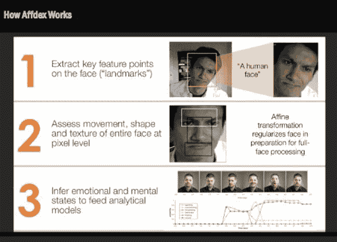

# 知道你感受的情感智能机器的崛起

> 原文：<https://thenewstack.io/affective-computing-emotionally-intelligent-machines/>

现在，我们的很多信息都可以数字化:我们读什么，买什么，甚至我们的生命体征都可以在手机上追踪，让我们更好地了解我们的长期健康状况。但是，如果有一台机器跟踪、分析甚至回应你的情绪，你会有多舒服呢？

## 情感量化的自我

这就是所谓的情感计算[的支持者](https://en.wikipedia.org/wiki/Affective_computing)想要做的:弥合计算机和人类之间的认知-情感鸿沟，开发能够解释、适应和响应人类用户情感状态的系统。但是这是我们想要的机器吗？

对于许多人来说，围绕语音和手写识别发展的机器学习范式是有意义的。毕竟，能够和你的电脑说话，让它理解你，并在那个层面上和你互动是很有用的。但是，来自最新神经科学的证据表明，情感确实在推理和认知控制中发挥着重要作用，这导致情感计算专家断言，情感推理对于真正的机器智能至关重要。

这一观点正在被计算机科学、人工智能、心理学和神经科学中不断发展的研究所证实，导致了情感计算领域的蓬勃发展。像 [Affectiva](http://www.affectiva.com/) 、 [Emotient](http://www.emotient.com/) 、 [Realeyes](http://www.realeyesit.com/) 和 Sension 这样的初创公司正在开发能够分析和区分面部表情背后的情商的应用程序:眉毛上的皱纹，卷曲的嘴唇是代表微笑还是鬼脸。

[T15](https://thenewstack.io/wp-content/uploads/2015/07/affdex-1.png)T17

像 Affectiva 的 Affdex 这样的技术使用一系列分配给面部特定部位的点来跟踪情绪“分类器”,这些点由一种算法进行实时分析，然后与世界上最大的先前分析过的面部和情绪数据库进行比较，以确定你此刻可能的感觉。Affectiva 的面部编码软件速度快如闪电，只需几分之一秒就可以评估面部的微表情，而且惊人地准确。观看 Affectiva 的首席科学官[拉纳·埃尔·卡利奥比](https://www.linkedin.com/in/kaliouby)在这次 TED 演讲中演示该公司的软件:

[https://www.youtube.com/embed/o3VwYIazybI?feature=oembed](https://www.youtube.com/embed/o3VwYIazybI?feature=oembed)

视频

## 在大数据的推动下，神经营销正在兴起

情感计算的复兴无疑受到大数据的出现及其在推动更深层次的机器学习中的作用的推动，正如我们在[谷歌用于人工神经网络的 Deep Dream 软件](https://thenewstack.io/deep-learning-neural-networks-google-deep-dream/)等例子中看到的那样。情感计算研究人员正在使用他们现在可以获得的巨大的、众包的声音、手势、面部和生理反应(心率、皮肤电反应)数据集，来推动这项技术进一步实现人类和机器之间更自然的交互。想象一下，如果我们的计算机能够表达同理心——这将改变我们与机器的关系。这种对情感智能机器的推动也受到了改进的传感器的帮助，这些传感器现在在手持设备上变得很常见，以及成熟的分布式平台，这使得该技术能够以前所未有的方式扩大规模。

然而，这也得益于对情感分析重要性的观点转变，因为情感、定性“软”数据越来越被视为与定量“硬”数据同等重要。在新领域[神经营销](https://en.wikipedia.org/wiki/Neuromarketing)中，广告客户特别感兴趣的是使用测试对象的情感和其他生理变化等软数据来微调市场研究，并通过跟踪和分析 详细的情感和身体反应来衡量他们在不同文化和年龄人口中的商业活动的有效性，这些反应可以以某种方式货币化，而没有传统广告测试技术的人为偏见。

情感计算也可能有医疗或教育应用:自闭症患者可能会受益于一种可穿戴的 T2，它可以测量和监控他们的焦虑和压力水平，并在崩溃发生之前提醒父母或看护者。

但是也许最大的未知是情感计算如何在无处不在的物联网中发挥不可或缺的作用，在物联网中，各种技术的新堆栈如此嵌入我们的日常生活，以至于它们变得不引人注目，使用起来很直观。作为我们日常经历的一部分，情感智能设备会衡量我们的感受，并做出相应的反应。例如，如果我们的能量水平和注意力下降，咖啡机可以自动启动，或者[厨房桌子可能会显示激发食物的食谱](https://thenewstack.io/ikeas-concept-kitchen-of-2025-it-cooks-interacts-and-composts/)。

## 新的“情感经济”

观察家们预测一个新出现的“[情感经济](http://www.newyorker.com/magazine/2015/01/19/know-feel)”，在这种经济中，情感将只是另一个为了各种目的而被收集、评估和利用的数据集。配备这些算法的手机、手表或其他可穿戴设备可以提供针对情绪的广告或其他个性化的虚拟体验，或者创造更沉浸式的游戏环境，正如微软的 Xbox One 试图利用其飞行时间技术来追踪玩家的眼球运动和生理状况。

然而，尽管在许多领域有潜在的积极应用，一些人会认为这些工具可能会被用来进一步[私有化我们的意识](http://monthlyreview.org/2012/10/01/privatization-of-consciousness/)，因为公司和他们的神经营销者获得了对我们最隐私的情绪和想法的更令人不安的洞察力，并使用这些数据来操纵我们进一步购买我们不需要的东西，或让我们观看另一个不必要的商业广告。出于对隐私的担忧，一些[立法者希望要求](http://variety.com/2013/digital/news/house-bill-would-restrict-camera-enabled-spy-set-tops-1200497102/)公司给消费者一个选择退出的机会，并在他们的游戏控制台摄像头正在监视他们以及个人数据正在被收集时警告他们。最终，这将取决于如何使用这些数据，但问题依然存在:我们真的希望手机、沙发或电视知道我们的真实感受吗？

[https://www.youtube.com/embed/WSj26ncU_po?feature=oembed](https://www.youtube.com/embed/WSj26ncU_po?feature=oembed)

视频

图片: [Realeyes](http://www.realeyesit.com/) 、 [Affectiva](http://www.affectiva.com/) 、SensoMotoric 仪器。

<svg xmlns:xlink="http://www.w3.org/1999/xlink" viewBox="0 0 68 31" version="1.1"><title>Group</title> <desc>Created with Sketch.</desc></svg>