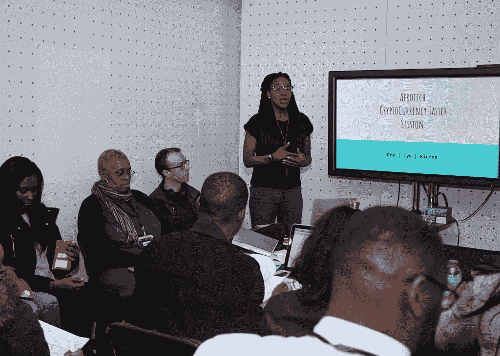
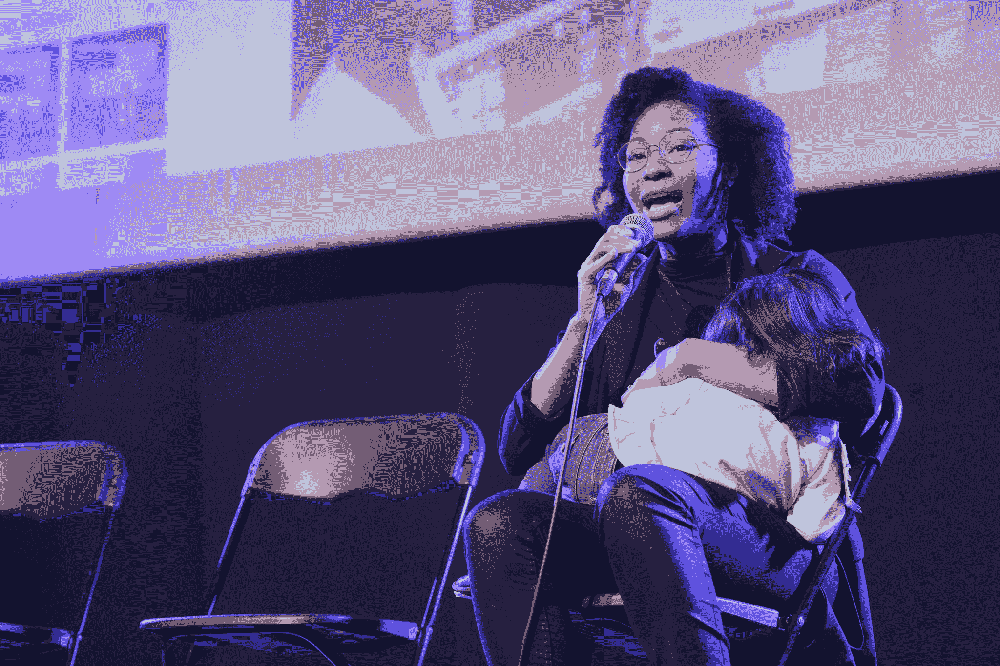
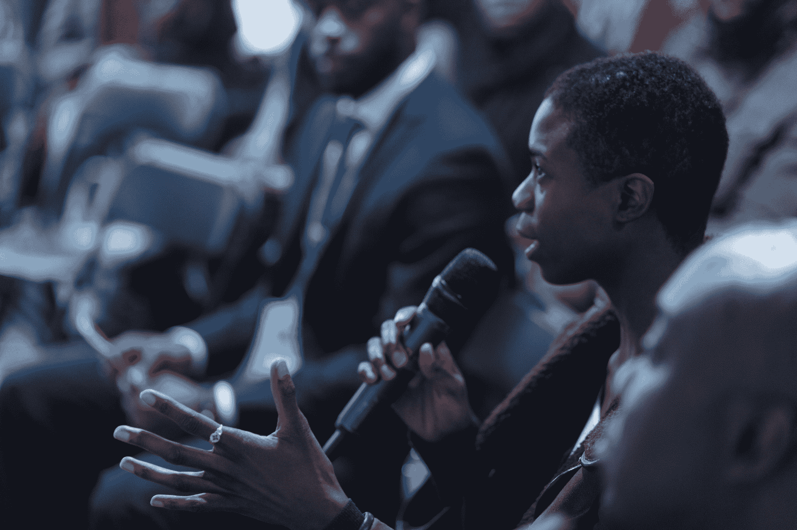

# Afrotech Fest 展示了如何让科技活动更具包容性

> 原文：<https://thenewstack.io/afrotech-fest-shows-how-to-make-tech-conferences-more-inclusive/>

伦敦没有多样性问题，但它有包容性问题。这里的科技产业两者兼而有之。我们已经讨论了一些设计包容性技术活动的方法，但是我们发现这个建议有一些漏洞。这就是为什么我们抓住机会报道我们听说过的第一个以黑人为重点的科技活动——[Afrotech Fest](https://www.afrotechfest.co.uk/)，这是一个由非洲和加勒比海血统的黑人举办的科技节日。

在第二年，Afrotech Fest 将有 50 名黑人演讲者和研讨会负责人在科技初创公司麦加肖尔迪奇的充满活力的艺术中心 Rich Mix 进行为期两天半的活动。

创始人和[的联合组织者](https://www.afrotechfest.co.uk/team/) [Debs Durojaiye](https://twitter.com/firstname_debs) 告诉《新堆栈》，“你可以作为一个科技领域的黑人站在舞台上，而不是谈论自己是一个黑人，你会成为一个谈论这个话题的人，你实际上是一个称职的工程师和设计师。”

Afrotech Fest 的目标之一是消除这种符号化，提高有色人种在技术社区的信心和归属感。它专注于 Durojaiye 所说的黑科技领域的人们会发现有用的任何东西，这意味着它涉及广泛的主题，从图像识别到 WordPress 联合创始人的故事。

> “让我们把关于黑人在这个白色空间意味着什么的对话拿出来，这样我们就可以谈论我们感兴趣的东西了。”Debs Durojaiye，Afrotech Fest

Afrotech Fest 将于 4 月 12 日至 14 日在伦敦举行，新的堆栈将在那里，但我们今天在这里预览它。

## Afrotech Fest 的不同之处

Durojaiye 描述了这个节日背后的想法是“尽可能开放、开放和包容尽可能多的人。”

门票价格是进入科技活动的第一个障碍。大多数科技活动都非常昂贵，所以大多数需要他们的公司支付门票，但只有更大或更成熟的公司才会为此分配预算。当然，在这种恶性循环中，参加这些活动并建立关系网是获得声望高、收入高的工作的成功途径。

这让许多人“被拒之门外”。人们感觉自己是社区的一部分，并通过这些活动找到工作。”Durojaiye 继续说，这“导致人们没有在正确的时间和正确的地点与正确的人联系。”

Afrotech Fest 两天半的门票是 40 英镑(52 美元)，这是在伦敦吃晚餐的费用。它几乎是由志愿者在各个层面组织起来的。

许多人经常负担不起请假去参加活动。这就是为什么 Afrotech Fest 在周五下午 6 点开始，贯穿整个周末。

虽然伦敦在科技舞台上的表现似乎比许多城市都要好，但毫无疑问，这些未被充分代表的人所面临的挑战也适用于演讲。Afrotech Fest 总是付钱给它的演讲者——这是我们最近在科技行业看到的增长趋势。作为 GDS 的交互设计师和科技活动组织者，杜罗杰耶被邀请在其他科技活动上发言。她习惯于问自己是否会得到报酬，尽管答案通常仍然是否定的。

“我是一个黑人酷儿女性，我需要在场，需要被关注，”但她说她需要知道这是否值得她浪费时间。“参加大型会议的人——他们有高薪工作。”

> "只有能负担得起免费演讲的人才会免费演讲."Debs Durojaiye，Afrotech Fest

缺少儿童保育通常是最大的原因，至少女性表示她们不能参加科技活动。Afrotech Fest 还负担不起提供托儿服务，但他们是一个适合儿童的活动，有一个家庭包容的环境。欢迎有孩子的父母参加任何讲座——完全接受孩子不是沉默的——还有一个柔软的游戏区，孩子们可以自由奔跑，父母可以观看直播讲座。母乳喂养和哺乳在任何地方都是受欢迎的。

对于年龄较大的孩子，甚至有青少年研讨会，包括编码，制作和可穿戴设备。

Afrotech Fest 旨在回答这两个问题:

*   大家怎么参与？
*   大家怎么搞？

他们甚至有一个小时的展示时间，供任何有想法的人在五分钟内展示。

“如果这个活动是为所有人举办的，那就考虑那些有最大需求的人，确保它能为没有这些需求的人服务，”杜罗杰耶说。

这包括一个安静的空间，有一系列的目的，包括为神经多样化的与会者和用作祈祷的地方。

“我们只需要一个人来要求它——只要是在我们的能力范围内，并且我们认为这是对其他人的一种好处——我们就努力让它成为我们活动的一部分，”她说。

她继续说，“这是一个有意的空间。我们所做和提供的一切都是有目的的。这个空间是给每个人的。每个人都签署参与者保证书。每个人都有机会接触和参与。”

## 包容性的活动不需要重新发明轮子

Durojaiye 将 Afrotech Fest 的目标受众描述为任何从事技术或对技术感兴趣的人。这就是为什么主题和技术水平从可访问性和行动主义到 GraphQL、图像识别和网络安全都有广泛的范围。

Durojaiye 说她受到了 T2 MozFest 的启发，mozz fest 在历史上是非常开放的，热情的，参与者和主题都是多样化的，只要他们关注互联网上的开放访问。

> “我们如何向通常不参与这种对话的人开放技术空间？”Debs Durojaiye，Afrotech Fest

不管你是否在技术部门工作，我们都和技术部门一起工作。Durojaiye 继续说，让科技活动更具包容性非常重要，这样普通公民就可以参与到这些围绕在线安全、隐私和安保的对话中来。

这个节日是人们提升科技职业水平的一种方式，但也欢迎那些第一次接触科技行业的人。它旨在将那些通常在科技行业没有影响力或支持结构的代表性不足的人与熟悉该行业的类似经验丰富的人联系起来。

杜罗杰耶说，这与其说是一场招聘会，不如说是“如果你需要帮助，可以联系我，这是你的职业选择。”

当然，对于精心挑选的赞助商来说，这里有足够的空间来联系与会者和实际的工作论坛。

她表示:“这不是一次招聘活动，但(这可能)是一个积极的结果。如果人们觉得自己的成长得到了支持，他们就会进入一个周围有更好网络的行业。”

> “Afrotech Fest 对任何可以参加的人开放。其实大家来了都有用。这只是作为一种拓宽大家理解的方式。”Debs Durojaiye，Afrotech Fest

虽然 Afrotech Fest 绝对是一个独特的技术活动，但这并不意味着该团队没有借鉴其他包容性的技术活动。

Durojaiye 说，这个活动的大部分灵感来自 AlterConf 背后的[原则，AlterConf【】是一个非常受欢迎但现已退休的国际会议系列，专注于技术和游戏领域的边缘化人群。](https://www.alterconf.com/code-of-conduct#etiquette)

在任何科技活动中，行为准则都是必不可少的，因为任何人都可能在相反的环境中展示会让人感到不舒服的微攻击。为此，杜罗杰耶借用了 XOXO 节(Portland ' s conference for free digital creatives)的代码和包容政策。她说，知道其他人已经做了这项工作，对于一个活动来说，从其他人那里借用，给予信任，然后测试什么工作或不工作是聪明的。

任何能创造安全空间的东西。

图片由 [Afrotech Fest 2018](https://www.flickr.com/photos/155979550@N02/with/40772696251/) 提供。

<svg xmlns:xlink="http://www.w3.org/1999/xlink" viewBox="0 0 68 31" version="1.1"><title>Group</title> <desc>Created with Sketch.</desc></svg>