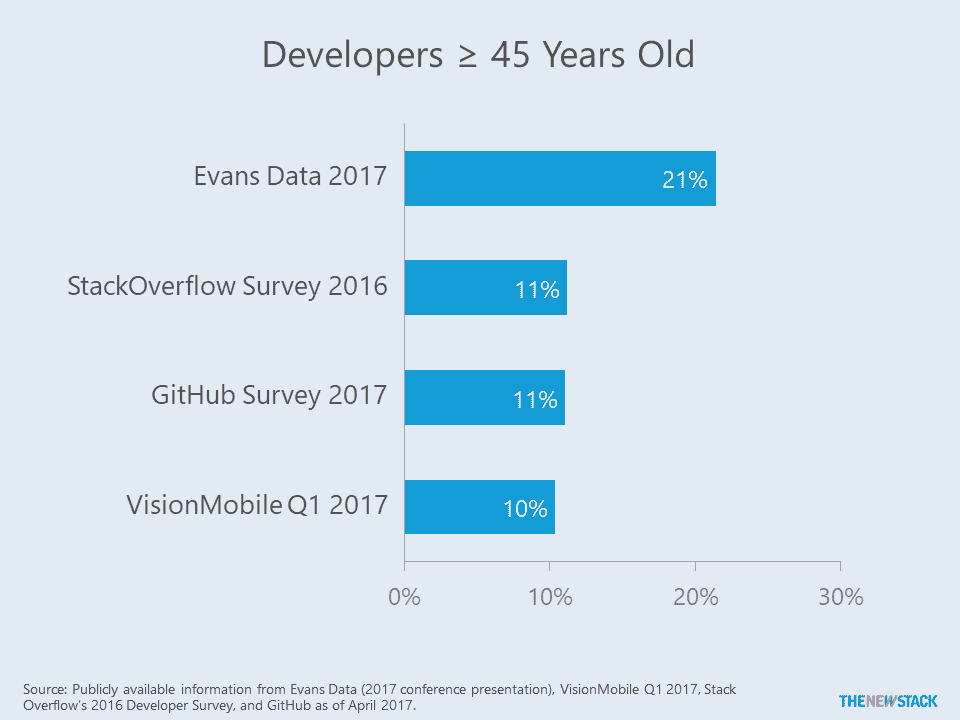

# 技术年龄歧视和“数字原住民”的神话

> 原文：<https://thenewstack.io/ageism-tech-good-news-really-ugly-news/>

根据员工数据分析公司 [Visier](https://www.visier.com/company/) 最近的一份报告，大多数 30 岁以上的员工担心会因为科技领域的年龄歧视而失业。它从 100 多家企业公司提取人力资源数据，并挖掘这些数据以获得劳动力问题的答案和本次调查的结果。

据 Visier 首席战略官[戴夫·维斯贝克](https://www.linkedin.com/in/daveweisbeck/)称，科技领域存在年龄歧视对任何人来说都不足为奇。但是，他在一次采访中说，事情的发展方式比我们想象的更加微妙。

## 研究结果:好的方面

当我们在 IT 领域想到年龄歧视这个术语时，我们通常会想到雇主和项目经理如何仅仅因为年龄而系统性地或随意地歧视个人。

在我们的领域里，我们听到了很多关于年龄歧视的轶事，但是这是真的吗？首先，从数据开始。“证据在哪里？”魏斯贝克问道。每个人都从偏见的假设开始，但根据数据，这是真的吗？

事实证明，年纪大的员工一旦被录用就不会受到歧视。当然，也有例外，但数据显示，40 岁以后，非管理型科技工作者进入了“科技圣人时代”(Visier 创造的一个术语)。Visier 发现，科技时代的员工越来越有可能获得最高的绩效评级。魏斯贝克说，在非技术行业，情况并非如此，在这些行业，年长的员工发现他们的绩效评级在下降。

他说，根据数据，以工作时间长短来衡量，年纪越大的员工越忠诚。一旦他们找到工作，他们就呆在原地。相比之下，25 岁左右的员工离职率高达 40%。到 20 多岁时，这一比例下降到 20 %, 30 岁出头的员工又下降到 10%。

Weisbeck 说，替换一名技术工人的成本，以生产率损失和新员工增加来衡量，通常大约为基本工资的 150%。因此，这不应该是招聘时一个不重要的考虑因素，因为公司经常引用较低的员工成本来招聘年轻员工。

根据绩效评级，年长员工的表现也优于年轻员工。他说，他们的知识和经验提供了可衡量的结果。Visier 还发现，在他们的客户中，类似职位的工资没有下降。年长的员工也同样有可能被提升到管理层。“如果你给某人一个经理的职位，你显然会更加重视他们，”魏斯贝克说。"在这方面没有偏见。"

## 丑陋的

韦斯巴克说，尽管所有这些数据都显示年长员工很棒，但招聘中的偏见“非常明显”Inc.com 发表了一篇令人沮丧的文章，标题为[“硅谷不可饶恕的罪恶:成为 X 世代”](https://www.inc.com/geoffrey-james/the-unforgivable-sin-in-silicon-valley-being-gen-x.html)，该杂志在文章中断言，“如果你是听着珍珠果酱长大的，你可以和你梦想中的高科技工作吻别了。”

根据 Visier 的数据，招聘经理对年轻员工有很大的偏见。简单地说，对于婴儿潮一代来说，被雇用的机会比他们的劳动力代表少 60%。他说:对所有行业来说，这都是一个艰难的时期，但数据显示，科技行业的情况更糟。

年龄在 34-48 岁的工人也好不到哪里去，被雇用的人数比他们的劳动力代表少 33%。维斯巴克说，相比之下，20-33 岁的求职者的就业率高出 50%。

调查数据显示，开发人员比其他技术人员更年轻。除了图表中显示的数据，GitHub 和 VisionMobile 的数据显示，三分之二的受访者年龄在 35 岁或以下。

陷入这种偏见的挫败感导致一个人开始了[@ Digital Ageist](https://twitter.com/digitalageist)Twitter feed(也有一个数字年龄歧视者脸书页面)。在公司被收购后，这个人从一个成功的社交内容营销管理职位上被解雇，他花了几个月的时间寻找一个类似的职位，却在每个职位上都面临年龄歧视。他们在匿名的情况下接受了我们的采访，因为他们仍在找工作，将被称为 DA。

46 岁的达经常被误认为是 30 多岁的人，但即使到了面试阶段，也是碰壁又碰壁。由于是市场营销背景，他们评估了招聘职位中使用的语言，以找出使用什么语言来暗示公司正在寻找 30 岁以下的人。他们说，“精力充沛”、“充满激情”和“数字原生代”是“表明他们想要时髦、酷和年轻的人”的术语。这些术语在招聘信息中无处不在。

## “数字原生”

一个[数字土著](https://en.wikipedia.org/wiki/Digital_native)是一个出生于 1990 年后，伴随着互联网无处不在而成长的人。

“他们认为年轻人会带来什么老年人不会带来的东西？”达问道。“当然，给年轻员工的工资会少一些，但招聘经理们似乎也有这样的想法，千禧一代会更有激情，他们会更好地理解技术，他们会更了解其他千禧一代想要什么，”达说。"就像在 iPad 上长大会神奇地转化为营销能力."

图片由 D. Casey Flaherty 提供

哦，事实证明这不是真的。“因为他们熟悉基本技术而期望他们自动知道如何使用复杂的技术，就像因为他们知道如何在微波炉中烹饪热口袋而期望他们自动知道如何准备美食一样，” [D .凯西·弗莱厄蒂写道。](http://www.geeklawblog.com/2015/10/the-myths-of-digital-native-part-1.html)

## 哎呀，这是非法的

寻求“数字原住民”的公司忽略了一个事实，那就是[年龄歧视自 1967 年](https://en.wikipedia.org/wiki/Age_Discrimination_in_Employment_Act_of_1967)以来就是非法的。

这并不能阻止公司在招聘信息中使用这个词。DA 在一年多前开始使用这个术语，记录了 508 条推文，其中大部分显示了这个术语的用法，标记了公司，[建议使用术语“数字智能”而不是](https://twitter.com/digitalageist/status/877289883575791616)。到目前为止，只有几家公司对这些有益的建议做出了回应。

像 Intuit、Cisco 和 McAfee 这样的公司已经在 feed 上出现。《时代》杂志是最严重的违规者之一，达说，他们显然不在乎，因为他们一遍又一遍地这样做。他们说，媒体公司是最糟糕的。

达说，偶尔，招聘启事会悄无声息地消失。有几次，招聘人员会道歉并承诺会做得更好。这让 DA 很高兴，因为，他们说，提要的目的是提高意识。

然而，可能需要提高更多的认识。在写这篇文章的时候，达还在找工作。

TNS 分析师劳伦斯·赫克特对本文有贡献。

通过 Pixabay 的特征图像。

<svg xmlns:xlink="http://www.w3.org/1999/xlink" viewBox="0 0 68 31" version="1.1"><title>Group</title> <desc>Created with Sketch.</desc></svg>