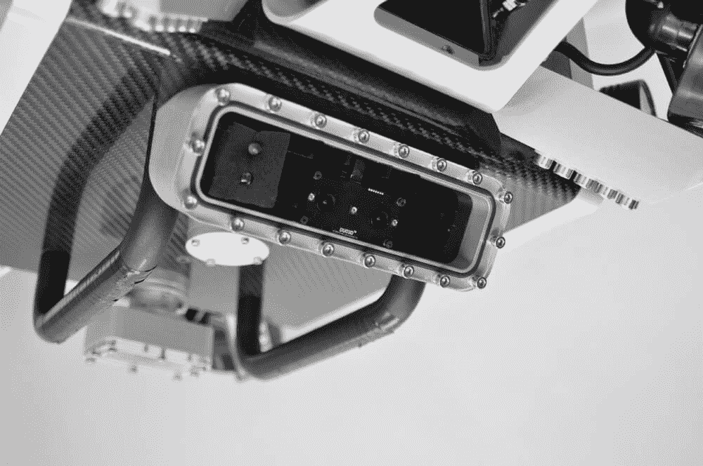
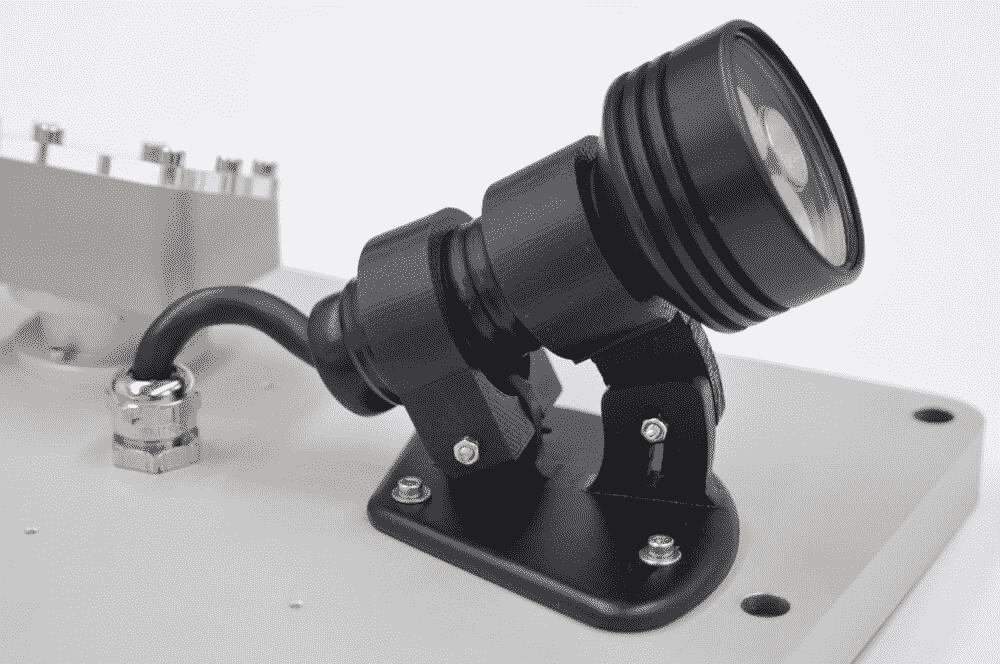
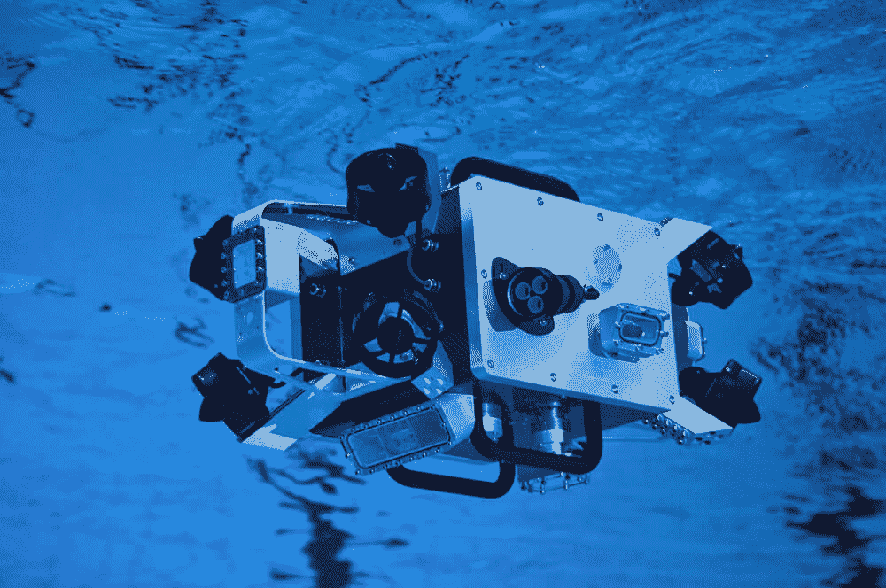
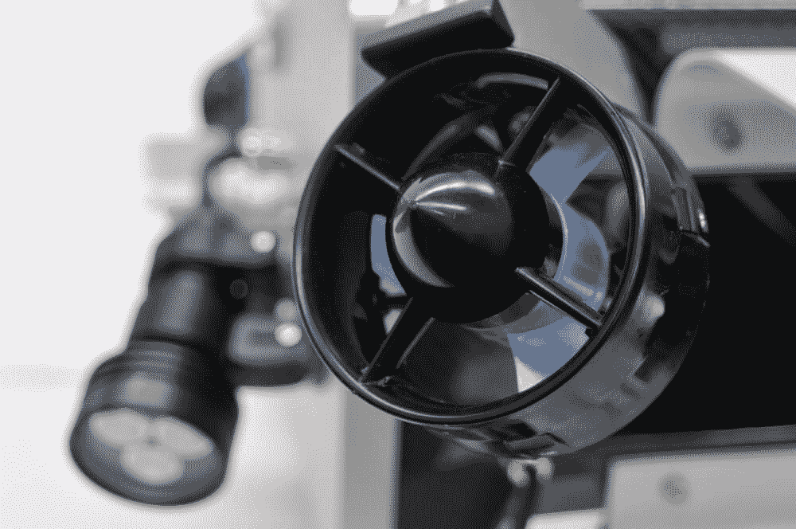
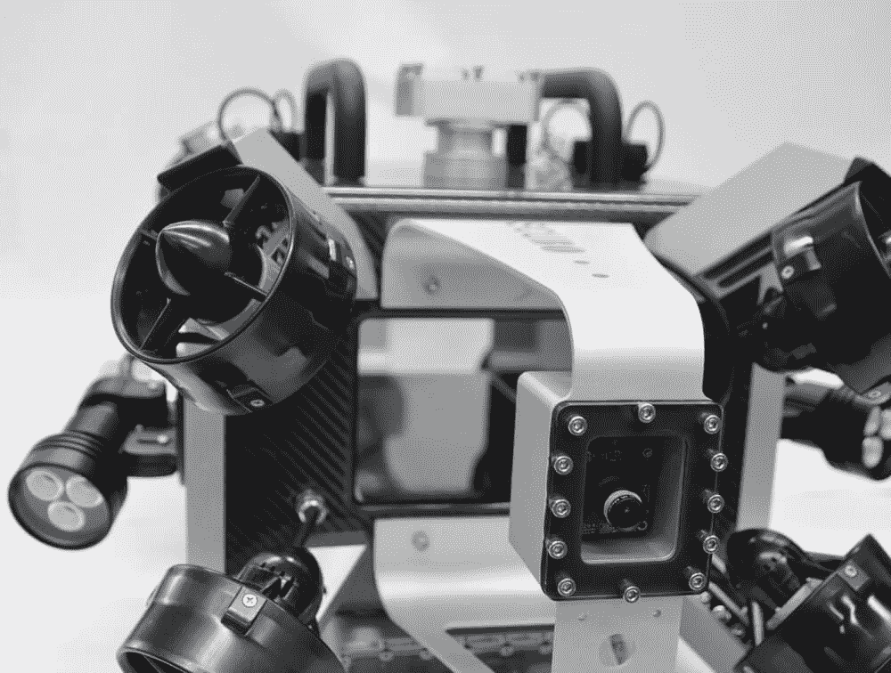

# 基于 Arduino 的潜水机器人绘制受威胁珊瑚礁的地图

> 原文：<https://thenewstack.io/agile-arduino-based-submersible-robot-maps-threatened-coral-reefs/>

正如我们许多人所知，世界上的珊瑚正处于大麻烦之中，正在经历大规模的全球性灭绝，很大程度上是由于污染、过度捕捞和全球气温上升。甚至[使用的防晒霜](http://time.com/4080985/sunscreen-coral-reefs/)也受到牵连。虽然珊瑚只占海洋的一小部分，但超过四分之一的物种生活在珊瑚礁中，这使得许多科学家警告说，随着珊瑚礁栖息地的退化，依赖珊瑚的其他海洋生物也将越来越受到威胁。

但是研究珊瑚礁可能是一个劳动密集型、耗时甚至危险的过程，需要研究人员潜入水下深处记录数据，例如识别不同的珊瑚物种和测量珊瑚组织的健康状况，而所有这些都不会损坏它们或被鲨鱼咬到。

为了让这项艰巨的任务变得更容易，来自瑞士[苏黎世联邦理工学院](https://www.ethz.ch/en.html)的科学家开发了一种潜水机器人，它能够通过六个机载摄像头从任何角度近距离探索水下栖息地。Scubo 是一个全向设备，这意味着它可以向任何方向移动，没有任何延迟，使它能够通过对称安装在它身上的八个推进器轻松避开障碍物。观看这款灵活、多功能的水下机器人在瑞士韦尔萨斯卡河的活动:

[https://www.youtube.com/embed/-g2O8e1j3fw?feature=oembed](https://www.youtube.com/embed/-g2O8e1j3fw?feature=oembed)

视频

## 模块化多任务机

25 公斤(55 磅。Scubo 还被设计成模块化的，这意味着它可以处理不同的任务和应用，这要归功于它的五个通用模块端口，用户可以插入不同类型的传感器、相机或光源。它的众多相机意味着 Scubo 可以扫描珊瑚礁，拍摄图像和其他数据，这些数据可用于 3D 建模海洋栖息地的虚拟地图。一条输水管道穿过机器人的中部，改善了设备的整体流体动力学，也是冷却内部电子设备的一种方式。

 

Scubo 能够下降到 20 米(65 英尺)，可以连接到计算机和水外的电源，提供稳定的电力，并允许实时查看图像。或者，它也可以被释放，自由漫游长达两个小时，无需充电。

在其碳基箱形罩下，Scubo 使用 [Arduino Due](https://www.arduino.cc/en/Main/ArduinoBoardDue) 微控制器进行实时任务，使用英特尔 NUC(下一计算单元)进行高速计算，使用[惯性测量单元](https://en.wikipedia.org/wiki/Inertial_measurement_unit) (IMU)和压力传感器帮助定向。但这也是开放社区的优势，正如 ETH 研究员 Johann Diep 在 Arduino 博客中所说:“我们选择使用 Arduino，因为它提供了所需的接口(I2C、SPI 等)。)，它很容易编程(一开始我们都没有使用过 Arduino)，而且网络上有一个很大的社区非常支持我们的问题。”

Scubo 运行在 [ROS](http://www.ros.org/) ( [机器人操作系统](https://en.wikipedia.org/wiki/Robot_Operating_System))上，这是一个面向机器人软件开发的开源软件框架集合，它允许世界各地的工程师为他们的机器人创建各种操作系统。结合 Arduino 软件，用户可以监控传感器数据，并通过笔记本电脑向 Scubo 发送命令，并使用来自 [3DConnexion](http://www.3dconnexion.de/) 的特殊“3D 空间鼠标”操控机器。

## 用网真探索海洋

虽然它可以被编程为自动运行并自行扫描珊瑚礁栖息地，但 Scubo 也可以通过沉浸式[远程呈现](https://thenewstack.io/telepresence-robot-uses-virtual-reality-offer-immersive-experience/)技术进行增强，让操作员感觉他们也在探索海洋，而不必亲自到场。该团队设想，Scubo 不仅可以让科学研究受益，还可以让娱乐和旅游行业受益(该项目的赞助商之一是迪士尼研究)。例如，使用虚拟现实耳机，水族馆的游客可能能够在珊瑚中潜水，具有令人信服的真实感，而不必造成这种旅游的现实生活版本通常会带来的环境影响。

像 Scubo 这样的项目将有望扭转关于不可持续的工业规模的做法如何影响我们脆弱的珊瑚的知识潮流——除了让普通人亲自“看到”(并关心)这里真正的利害关系。

通过 Pixabay 的特征图像。来自 Scubo 的其他图片。

<svg xmlns:xlink="http://www.w3.org/1999/xlink" viewBox="0 0 68 31" version="1.1"><title>Group</title> <desc>Created with Sketch.</desc></svg>