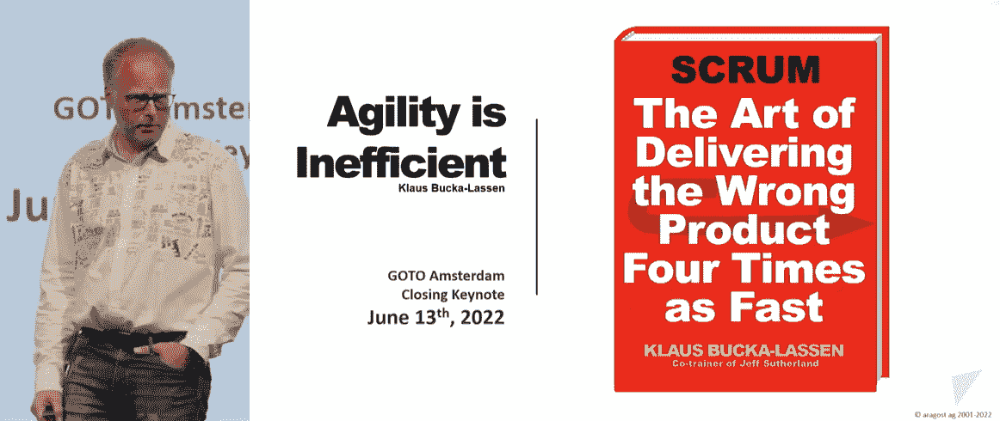
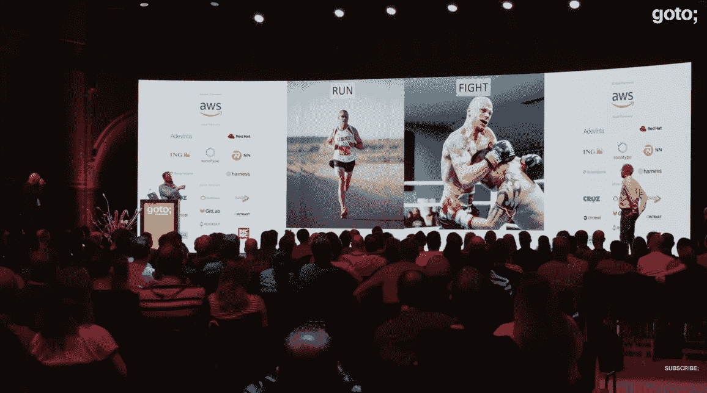

# 敏捷蔻驰嘲笑效率优先于效果

> 原文：<https://thenewstack.io/agile-coach-mocks-putting-efficiency-over-effectiveness/>

一位敏捷倡导者在 2022 年的 [GOTO Amsterdam](https://gotoams.nl/) 会议上发表了一篇[无法预测且发人深省的演讲](https://www.youtube.com/watch?v=BvydomrrdyQ)。他一次又一次地强调，对一个组织来说，有效的*比仅仅是高效更重要。一路走来，他通过分享自己的经历和例子，以及改善工作场所的见解和现实策略，提出了一些实用的原则，让经理们专注于正确的事情。*

 *但结果证明这是一个非常生动的演示，有几个惊喜——在最后有一个大的情节转折。

## 敏捷是否效率低下？

说话的人是克劳斯·巴卡-拉森(Klaus Bucka-Lassen )( T7)——生于丹麦，长于丹麦，但现居苏黎世。作为一名开发人员，12 年前，他成为了大公司(包括 Scrum Inc .)的敏捷培训师/教练和顾问。

在他的演讲中，Bucka-Lassen 提出了一个问题:“敏捷是低效的吗？”但是他首先警告他的听众“对于今天加入的每个人来说，听到一些敏捷的抨击是因为你讨厌它？抱歉，那是不会发生的，因为我真的不认为这是低效的。我只是引诱你进来，作为诱饵。”

他首先介绍了他在一本关于 Scrum 开发方法论的流行书籍《Scrum:用一半时间做两倍工作的艺术》上的即兴创作。

Bucka-Lassen 展示了他自己的模仿作品:

“谁读过这本书？”他问。“通常我会看到一些人举手——他们其实并没有太在意。”

但他是在表明一个观点。Bucka-Lassen 说，他一直讨厌真正的书的原书名，“因为它只讲效率。它只是说，“让我们改进事情，这样我们就能交付更多的东西”。但是你不能确保你交付的是正确的东西。”

毕竟，效率可能意味着只是快——但方向错了——而有效性意味着真正交付客户需要的东西。Bucka-Lassen 的一张幻灯片指出，“效率”这个词不是一个面向客户的词，而是“向内看，定义和优化流程”

“当我们谈论效率时，客户在哪里？哪儿也不去。”

Bucka-Lassen 认为 Scrum 和敏捷主要是关于效率的——“如果你的组织主要关注效率，这是很危险的。”

Bucka-Lassen 说，有效性是相反的——向外看，看市场(和我们的客户)真正想要的和需要的，以及愿意支付的。一张幻灯片上写道，这是“做正确的事情”和“做正确的事情”之间的区别。或者，正如 Bucka-Lassen 后来在他的演讲中所说，“效率是关于我们如何做事情的*，*，而有效性是关于什么的*【T3。”*

后来，他展示了一幅漏水的船的漫画，认为效率先生向提着水桶的人大喊，让他们加快工作速度，而效率先生则告诉他们找到船上的漏洞，并堵住它。

## 正确的梯子，错误的建筑

Bucka-Lassen 分享了管理专家 [Peter Drucker](https://en.wikipedia.org/wiki/Peter_Drucker) 的一段恰当的话。"没有什么比高效率地做一些根本不应该做的事情更没用的了。"另一位管理大师[斯蒂芬·R·科维](https://en.wikipedia.org/wiki/Stephen_Covey)也强调了这一点:“如果梯子没有靠在正确的墙上，我们每走一步都会更快地到达错误的地方。”

但是 Bucka-Lassen 随后展示了他自己现实世界中的警示例子——从 2014 年福布斯对 Blockbuster 视频的分析开始——以及[它为什么会破产](https://www.forbes.com/sites/forbescoachescouncil/2020/08/20/the-fourth-commandment-of-strategic-planning-set-audacious-goals/)。

“具有讽刺意味的是，百视达失败了，因为它的领导层已经建立了一个运转良好的运作机器，”福布斯写道。Blockbuster”是一个非常紧密的网络，可以以极高的效率执行，但不适合放入新信息。

例如，Bucka-Lassen 指出，Blockbuster 曾经放弃了购买网飞的机会。

他还愉快地回忆起苹果 iPhone 问世后未能成功转型的电话公司高管——从微软首席执行官史蒂夫·巴尔默(Steve Balmer)嘲笑其 500 美元的价格和缺乏内置键盘的视频片段开始。

在他演讲的最后，Bucka-Lassen 分享了一些警告信号，即你的公司过于关注效率。一个是[过度关注预算和成本削减](https://thenewstack.io/is-a-recession-coming-heres-how-to-cut-it-costs-wisely/)——而不是持续的资金:“他们试图强迫你生产同样的东西，但投入更少。”

他说，这是另一个向内看而不是向外看顾客的例子。“不会有任何创新或类似的东西。这表明人们关注的是成本，而不是价值——你创造的价值。”

第二个警告信号？由流程人员(而不是产品人员)管理的公司。Bucka-Lassen 说，关注过程和自动化是好的。“但如果你忘了回顾过去，市场到底想要什么？—那么你可能会错过市场的窗口。你的生产效率有多高并不重要。”

他还认为，对专业化的过度关注“可能是一个迹象，表明你的组织关注的是效率而不是有效性。或者至少按照这个顺序——首先是效率，*然后是*效率。”(举个例子:如果一家公司的文化禁止交叉培训，将每个人都困在严格定义的角色中。)

Bucka-Lassen 告诫他的观众要避免公司展示这些警告标志——“或者我们在软件开发中经常喜欢称之为‘气味’。”

## 糟糕公司的命运

观众提出了一个问题。"当我们看到那些气味时，我们应该让 T2 跑吗？"Bucka-Lassen 引用了 Scrum 的创始人之一 [Jeff Sutherland 的话:“如果每个人都离开了糟糕的公司，我们就不会再有糟糕的公司了！”](https://www.linkedin.com/in/jeffsutherland/)

提问者回应道:“得了吧，太可笑了！所以你就想让我们跑？”

“是的！”巴卡-拉森说。“越快越好！”

但是这位观众——也是一位敏捷教练——并没有被安抚。很快，他们从观众席上站起来，走上舞台，要求使用遥控器——并插入他们自己的笔记本电脑演示。

“我也是有效性的支持者，”这个新数字说。“可是我要打！”

然后他们发起了一场反陈述——争辩说有一个替代方案。

“我想*改变*这个只关注效率的世界。”他说。“或者，如果我们不能获胜……至少我想*包含*这种效率思维，这样就不会影响或扰乱我们正在努力营造的环境。”

原来这都是表演的一部分。说话的人是巴卡-拉森的哥哥——德克·巴卡-拉森。他以一系列帮助只关注效率的公司转型的“技巧”结束了演讲。

对于遵循传统企业预算和成本削减方法的公司，德克说，他试图引导他们从“大爆炸”报告转向更敏捷的报告，专注于所产生的影响，也就是说，转向“以有效性为导向的衡量”

例如，一家考虑切断在线接线员的公司被展示了当他们的接线员被切断时没有接通的电话数量。“这让我们能够将对话从关注效率转变为更‘有效’的关注。”

德克也有在专注于专业化的公司工作的经历。(他实际上在一家更大的公司工作，那里只有一个人知道如何打印 pdf。)的解决办法？跟着那个专家做几次演练——直到有第二个训练有素的工人来减少你的依赖性。这不仅减少了那种单一的依赖，还创造了一种关系。

德克将这种方法描述为在一个以效率为导向的世界和更大的效率之地之间找到一个“适配器”。

最后，德克承认他基本上同意他哥哥克劳斯的观点，有效性比效率更重要。但是对于被困在注重效率的公司的员工，德克最终倡导了一种不同的解决方案——或者至少是一种双管齐下的回应。“如果你的公司在这方面有困难，”他说，“我会说坚持一段时间。

“因为你随时可以决定以后逃跑。”

[https://www.youtube.com/embed/BvydomrrdyQ?feature=oembed](https://www.youtube.com/embed/BvydomrrdyQ?feature=oembed)

视频

* * *

# WebReduce

<svg xmlns:xlink="http://www.w3.org/1999/xlink" viewBox="0 0 68 31" version="1.1"><title>Group</title> <desc>Created with Sketch.</desc></svg>*