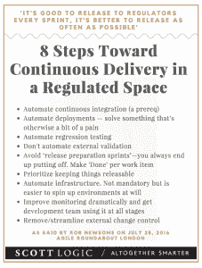

# 银行家的敏捷:如何在监管的世界中快速失败和快速迭代

> 原文：<https://thenewstack.io/agile-for-bankers-how-to-fail-fast-and-iterate-rapidly-in-a-regulated-world/>

敏捷软件开发的世界是关于实验和创新的。但是，你如何更快地学会失败，但这次是在一个受监管的环境中？你如何在银行、医疗或政府领域快速迭代？

Nigel Wilson，Scott Logic 总经理

在伦敦 LendInvest 办公室的敏捷环岛会议上，这正是来自 T4 Scott Logic 的奈杰尔·威尔逊和罗布·纽森想要回答的问题。

Scott Logic 是一家总部位于英国的软件咨询公司，拥有 200 名团队成员，主要从事资本市场和金融服务。可以肯定的是，该公司在监管环境中保持敏捷方面学到了很多经验。

## 管控环境中的独特挑战

威尔逊把受管制的环境描述为任何一种工业或任何一种产品或服务的提供，其中特殊的要求来自于企业之外。这些为交付强加了外部限制以及功能性和非功能性需求。

“基本上，任何行业的产品或服务都要服从来自组织外部的利益相关者的要求，”威尔逊解释说。最常见的是在金融、贸易、安全、能源和医疗保健领域。

> 对于外部监管的软件，产品所有者成为中间人，与软件团队、任何内部监管角色和外部监管利益相关者一起工作。

在典型的快节奏敏捷软件环境中，您首先基于业务价值来设置优先级。当你不仅要确保软件的稳定性和安全性，还要确保软件的合规性时，这将是一个挑战。

那么到底什么是敏捷呢？对于 Wilson 来说，敏捷是有价值的——创建没有文档的软件，这有助于克服瀑布项目管理模型的局限性。在敏捷中，你“以可持续的方式工作”，他说，“团队速度决定了我们交付的速度。”

但他解释说，在监管环境中，监管机构通常会为项目设定达标日期。例如，他说，“银行业通常更擅长设定一个要求日期，而不是解释它。”虽然这些日期带有大量证据和文件的预期，但它们通常没有关于如何到达那里的说明。

“从我的经验来看，敏捷实际上可以帮助你满足这些需求——替代方案是瀑布来满足它，并希望它起作用，”他说，指的是反对敏捷的瀑布项目管理可以从一开始就如此结构化，以至于计划中的任何改变都在时间和金钱上代价惊人。

Scott Works 之所以采用敏捷方法，是因为它允许他们与监管者一起增量工作，并在工作过程中发现问题。

## 实现合规性的敏捷方法

威尔逊和纽森提供了他们自己的经验指导方针，让你在努力做到合规的过程中不失去灵活性。

### 注重结果

检查这些要点，并找出如何将它们构建到敏捷流程中，同时始终关注最终结果:

*   明确目标
*   确定如何证明合规性
*   定义验收标准以及如何测试 is
*   纳入“完成”的定义

### 格外合作

罗布·纽森，Scott Logic 开发部主管

“连监管者和债权人都是人！”Wilson 说，开发者和产品所有者经常把监管者放在高高在上的位置，看不起你的组织来实施监管，但他提醒我们，“监管者更愿意参与对话。”

他认为，当你将这些监管者视为你的业务和敏捷过程中的关键利益相关者时，成功就来了。他在公共场所的安全认证方面做得特别好。这一切都归结到一个问题:我们如何才能达到没有惊喜的地步？

Scott Logic 的开发主管纽森一直致力于从一开始就了解安全团队。从一开始就与他们合作，“不，你不能这样做。不，你不能发布那个。”通常会变成容易的默许。他说，其他团队忽略了安全单元，最终不得不简单地重新开始整个项目。

纽森发现，英国金融行为监管局(Financial Conduct Authority)的“他们有点担心，内部合规人员可能会经常说‘不’。”他指出，监管当局实际上非常愿意讨论，尽管没有多少开发团队主动接触他们。

但成功不仅仅是讨好这些外部监管者。威尔逊指出，让团队参与进来是产品负责人的工作，确保他们理解任何法规背后的意图。这将带来另一个重要的问题:是否有其他实现方法可以达到这个目的？

然后，确保双方都参与决定你将如何展示增量目标。

### **遵循模式，比如短跑**

这就是威尔逊最能说明敏捷确实更适合监管环境的地方。虽然传统的瀑布开发模型冒着他所谓的“最后的大爆炸”的风险，但是敏捷非常适合于遵从，因为它自然地伴随着增量交付。敏捷有明确的时间块或“冲刺”,可以持续两周到几个月。

你可以在你的 sprint 活动中加入一个法规验证过程。这样，你就不会冒险等到瀑布的尽头才发现你不能发布你的软件，因为它根本就不兼容。

> 敏捷让你更频繁地发布，让你的涉众冷静下来。

### 弯曲边界；发挥创造力。

界限是 Scott Logic 的团队发挥创造力的地方。

“需要合规的是你的整个产品或服务，”威尔逊解释道。“我们必须在全面服务方面做到合规，但我们不一定要通过技术做到这一点。”

他说，有时最好是将你能做的事情自动化，然后进行手动变通，作为在产品准备好之前达到合规的一种方式。

### 摧毁那些发射井！

企业越大，物理和组织上的孤岛似乎就越大。如果你是一个有内部监管部门的组织，你需要尽早引入他们。

监管要求需要从第一天起就纳入项目范围。你必须了解这些内部利益相关者需要什么，然后从一开始就把它作为需求构建进去。这也确保了产品负责人拥有大量的法规遵从性知识，然后她可以将这些知识传递给团队，而团队成员必须至少熟悉法规。

威尔逊还对行业内的人际网络提出了很好的建议。他指出，通过分享挑战，你也可以分享解决方案:“体外监管不只是影响你，而是影响整个行业。”

### **持续合规工作**

为了保持合规性，Nelson 提供了三个提醒:

1.  **将持续检测融入到您的持续交付中。**您应该将合规性测试构建到您的持续交付中，并尽可能地将其自动化。当它成为您的过程的一个自然部分时，保持合规性会容易得多。
2.  **学习和优化。**与更广泛的社区保持同步非常重要——学习他人在您的监管环境中的做法。这是一个很好的方法，可以让您知道不遵从性的情况，让您知道您可能还没有测试的边缘情况，让您对意图保持警惕，以及重构和改进的方法。
3.  **展望未来。无论你在开发什么样的产品或服务，你都会有一个路线图和产品清单。**

专题图片:华盛顿特区，[国会图书馆](http://www.loc.gov/pictures/item/dc0641.photos.030358p/)。

<svg xmlns:xlink="http://www.w3.org/1999/xlink" viewBox="0 0 68 31" version="1.1"><title>Group</title> <desc>Created with Sketch.</desc></svg>