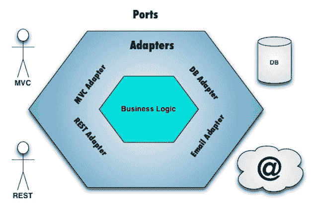

# 敏捷管理:如何与您的团队一起管理微服务

> 原文：<https://thenewstack.io/agile-management-how-to-manage-microservices-with-your-team/>

微服务这个术语已经出现[大约五年了](http://www.interedition.eu/wiki/index.php/About_microservices)，指的是可独立部署的服务，这些服务组合在一起形成一套服务，您可以选择连接或不连接。只是在最近一两年，公司才开始积极地使用它作为整体架构的更灵活、可伸缩的替代方案。我们可以讨论微服务的优点和缺点，但今天我们希望少谈软件架构，多谈它对你的组织结构的影响。

这篇文章将带你走过你的团队在微服务上的陷阱和成功，我们甚至会探讨，如果做得正确，微服务架构如何与推动高质量软件设计的规则相适应，这可以追溯到 20 世纪 60 年代。

## 这是你的微服务团队

微服务的商业利益是巨大的——你变得更有竞争力，因为你能够更快地响应客户需求。而且，根据[敏捷联盟负责人](https://www.agilealliance.org/programs/)和 Printchomp 首席技术官 Declan Whelan 的说法，当正确实施时，微服务架构是一种从整体上提高设计、交付和协作质量的方法。

当然，有好的一面，也有不好的一面。领域驱动设计思想领袖扬·斯滕贝里在他的文章“[从微服务](http://www.infoq.com/news/2014/08/failing-microservices)的失败中获得的经验”中简洁地总结了共同的挣扎

微服务架构通常具有以下特点:

*   开发人员之间的分歧:不是每个人都会马上加入团队微服务，也不是所有的团队成员都具备这样做的技术能力。
*   **服务边界造成障碍**:当你分配工作时，你创造了一种主人翁感，这可能导致责备。“这导致开发人员抱怨他们的服务被其他服务上的任务阻塞，并拒绝帮助解决这些阻塞任务，”Stenberg 说。他还发现，通常一心一意的微服务会偏离总体目标。
*   **独立服务**:允许程序员独立工作可能会产生更多的语言障碍，当试图连接各个部分时就会出现这种障碍。“未能为每个服务指定 API，特别是每个服务之间传递的模型，导致了经常性的问题，特别是对于前端开发人员来说，”Stenberg 还说。
*   **服务粒度**:做得太多太快。同样，微服务可能会忘记关注这些部分如何组合在一起的更大图景，每个微团队都在竞相提供自己的服务。

## 决定微服务是否符合您的需求

每个团队都会决定什么最适合他们。这里有一个故事:

Printchomp 是一个 11 人的团队，包括四名现场和两名场外编码人员，他们还执行所有的质量保证和测试。Whelan 说，他们选择走微服务路线不是因为他们在寻找它，而是他们只是在寻找一种改变，微服务作为解决他们需求的一部分而出现。他们的目标是简化私有 API 及其领域的核心功能共享，让客户能够轻松打印商品，让他们能够无重复地共享这些功能。

这是该团队的第一个 web API，他们希望它是一个 RESTful 超媒体 API。

Whelan 说，他们想要一个架构解决方案，允许他们向前迁移，同时仍然向后兼容，能够在不破坏现有接口的情况下推出新的更改。他们希望它易于使用，并且易于被客户消费，“所以一个 restful JSON API 肯定是有意义的，”他说。

> “我们已经构建了一个相对完整的 Rails 应用程序，我们看到了对 Printchomp 所做事情的 API 访问的需求，微服务是显而易见的答案。”

实际上，Whelan 发现微服务、域驱动设计和[端口和适配器或六边形架构](http://spin.atomicobject.com/2013/02/23/ports-adapters-software-architecture/)的三方组合是他们的解决方案。

【T2

事实上，他认为这可以改变整个软件行业的游戏规则。“资源和域对象之间有很强的相关性，这让我想到了这种端口和自适应架构风格。我们可以从 API 中获得不同的适配器，”他说。“在领域驱动的设计、端口和适配器以及微服务之间存在三足鼎立和三角关系，它们看起来确实是重叠和自我支持的。每一个都是非常强大的想法，这三者的结合非常强大。”

## 如何帮助你的团队应对微服务

一旦你决定微服务架构是否是指导你的团队的正确方向，这里有一些方法可以帮助他们适应:

### 如何围绕微服务重组你的团队

1968 年，程序员梅尔文·康威说:

> “设计系统的组织……不得不生产这些组织的通信结构的复制品。”

基本上，如果你有三个团队构建一个编译器，他们可能会构建一个三遍编译器，而如果你只有两个团队，你会得到一个两遍编译器。您的架构反映了您的组织结构，如果您想要某种技术架构，您需要重新调整您的组织结构。

自从被称为康威定律以来，它对今天的微服务架构尤其适用，这通常会加剧通信问题。

当然，如果你接受惠兰的建议，虽然团队的结构可能会发生变化，“如果一个公司想在微服务方面取得成功，由于微服务很小，所以需要由单个团队来处理，就像他们在[网飞](http://techblog.netflix.com/2015/02/a-microscope-on-microservices.html)和[亚马逊](http://www.slideshare.net/nathariel/scaling-microservices-architecture-on-aws)一样。然后，这个团队需要负责从概念到现金。”如果整个团队从头到尾都是负责任的，这肯定会减少所有权的问题。

“微服务将以不同的方式推动团队界限，因为很难有三个团队在微服务上工作。如果你着眼于连续交付，你需要一个团队，然后康威定律开始生效，你的团队必须反映你的产品/微观结构。”当然，惠兰承认这不可能在大规模的组织中进行协调。

有一个敏捷管理游戏可以帮你做到这一点，这个游戏叫做《管理 3.0 的[干预者》。引入微服务作为你的团队自组织的一种方式，迫使他们在一个平坦的表面上增长他们的组织，关注组织的分形值网络，而不是层级。玩家根据每个项目的功能和跨功能依赖关系，将卡片放在设计组织上。](https://management30.com/product/meddlers/)

### 带回极限编程

[极限编程](http://www.extremeprogramming.org/)就是在你需要的时候提供特定的产品和服务，本质上是对 a T. It .的微服务。它专注于创建一个扁平化的协作团队，在这个团队中，所有的团队成员都在不断地相互沟通，并与他们的客户沟通。追溯到 1996 年，这个想法与今天的精益、敏捷和 scrum 趋势一致。

[极限编程的价值](http://www.extremeprogramming.org/values.html)可以轻松应用于微服务:

1.  简单:做你该做的事。
2.  **沟通**:和日常单口相声一样，需要每天面对面签到。
3.  **反馈**:scrum 短迭代的前身，之后是演示和回顾。
4.  **尊重**:随着微服务所有权的改变，这可能会半途而废。"每个人都贡献价值，即使只是单纯的热情."
5.  **真相**:管理期望，承担团队责任。

### 重温敏捷工程实践

让我们简单回顾一下敏捷宣言:

1.  个人和交互胜过过程和工具。
2.  综合文档之上的工作软件。
3.  合同谈判中的客户协作。
4.  响应变化而不是遵循计划。

这是关于适应和响应变化——当然是微服务背后的一个原则。但是，正如 Whelan 所说，这也是关于找到“人与过程和产品之间的正确平衡”，当公司经常交叉双臂，眨眨眼睛，神奇地宣布自己“敏捷”时，这一部分很少被考虑

那么你的团队应该尝试什么样的敏捷工程实践呢？

*   **结对编程**:打破隔间墙，找个人一起工作几个小时。(或者试试[对勺](https://www.youtube.com/watch?v=dYBjVTMUQY0)。)
*   **重构**:也就是沿途清理，以监控领域如何转移。
*   **测试驱动设计**:在经历整个设计过程之前，先测试你的假设，检查引入是否安全。

惠兰指出，“如果你要构建微服务，那么你需要持续交付，然后你需要做所有的技术实践，”包括测试驱动的开发和重构。

### 警惕 Scrum 忽视分析和设计

Whelan 警告不要单独使用 scrum，因为他觉得这会对你的技术资产造成损害。“对敏捷转型的技术关注一直在稳步下降。作为一名真正的技术敏捷教练，这让我感到不安，因为我认为组织需要一种多方面的方法来实现敏捷。Scrum 没有通过设计提供任何技术实践的指导，”他说。"许多采用 scrum 的组织非常擅长快速建立技术债务."

Whelan 警告说，流行的 scrum 框架带有故意的漏洞，如果没有很好地计划，会在你的微服务架构中留下漏洞。

“如果你有一个传统的瀑布，如果你过去做分析和设计，并注意技术细节，你需要以另一种方式做，但 scrum 不允许”这样做。“如果你没有用其他东西来取代它，你真的只能拥有一个又一个功能，”惠兰说，“过一段时间，你的技术核心将是一个巨大的浪费，你只能重写，重写，重写。”

他的团队使用微服务的产品负责人，但在其他方面遵循每周仪式的看板。

请务必记住，虽然微服务完全是独立扩展，但您不能忘记更广泛的目标以及一切是如何连接的。

## 未来九个月的微服务

在总结之前，先给 Printchomp 微服务体验照点消毒阳光。

> “我们开始分别构建微服务，但它们是共存的。我们开始构建新的服务，但随着服务的稳定，我们慢慢地重构了我们的 web 应用程序。”

他说，九个月后，这不是一个完成的工作，而是他们仍然在经历转变。

“我相信并了解到的一件事是，对您的领域有一个清晰的了解是一件非常有价值的事情，因为您的代码领域不会像围绕它变化的自适应服务那样变化，如果您可以将变化很大的东西与变化很小的东西分开，那真的会有所帮助，因为这样您就可以真正构建一个稳定的核心，而这正是我们真正追求的。”

现在，这一切并不意味着惠兰和 Printchomp 过去九个月的微服务很容易。他特别提到“跨微服务边界的重构比在独立的微服务中更具挑战性。”

他也承认这并不容易。“我认为开始时存在怀疑，因为领域驱动的设计和这种六边形架构和微服务对团队来说确实是新的，”但一旦他们理解了价值，他们就可以继续进行变革。

## 微服务管理已审核

微服务架构在整体架构上拥有强大、灵活的业务主张，因为它允许您快速扩展业务以响应客户需求。然而，就像 scrum 和其他经常强加给编程团队的方法和框架一样，如果没有正确实现，反而会破坏沟通和团队协作。

让我们回顾一下避免这种情况发生的一些技巧:

*   遵循康威定律，你的软件会反映你的组织结构，但是你的组织结构也会受到你的软件目标的影响。
*   只要有可能，微服务最好与一个团队合作。太大了吗？尝试一个像爱管闲事的人这样的游戏来帮助你重组。
*   专注于极限编程的简单性、交流、反馈、尊重和信任。
*   尝试像结对编程、重构和测试驱动设计这样的敏捷工程。
*   不要太沉迷于 scrum 而忘记了全局。

正如惠兰所说，“我认为微服务正在迫使我们做出更好的技术决策。”但是你需要努力去实现它。

最后，请记住，微服务架构是一些问题的答案，但一如既往，做对您和您的团队最有利的事情，并考虑将其与其他补充架构混合，如六边形或域驱动设计。

<svg xmlns:xlink="http://www.w3.org/1999/xlink" viewBox="0 0 68 31" version="1.1"><title>Group</title> <desc>Created with Sketch.</desc></svg>