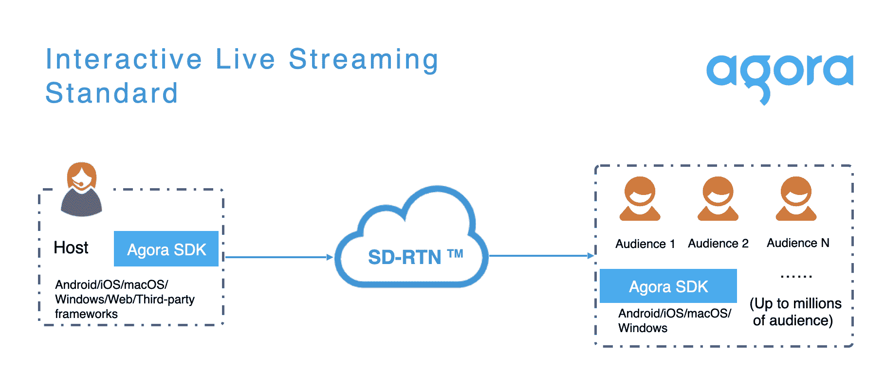

# Agora 借助 3D 视频和音频 SDK 驾驭元宇宙浪潮

> 原文：<https://thenewstack.io/agora-rides-metaverse-wave-with-3d-video-and-audio-sdks/>

尽管“元宇宙”没有标准定义，但已经出现了许多为 3D 互联网提供专业服务的初创公司。Agora 就是这样一家公司，它为互动应用程序提供“实时交流和直播功能”。它的功能涵盖各种平台，但目前主要用于 3D 网络和 Unity 应用程序。

为了发现 Agora 如何适应元宇宙的趋势，以及它从发展的角度提供了什么，我采访了 Agora 的首席软件工程师[本·韦克斯](https://www.linkedin.com/in/benjamin-weekes/)。

在我们的 Zoom 电话会议上，Weekes 向我展示了一个演示，他和其他四个人坐在一张虚拟的桌子旁。一个照片般真实的化身代表每个参与者(仅上半部分)，用户能够在虚拟房间中进行 360 度环绕。开发者可以使用 Agora 的 SDK 和 API 在他们的应用程序中构建这样的功能，例如，在会议应用程序或游戏中。

然而，这并不一定是 Agora 的 SDK 将它与类似的开发者平台区分开来——或者实际上，与使用原生 web 或 Unity 编码构建相同功能的开发者区分开来。Weekes 最兴奋的是 Agora 的全球网络，[SD-RTN](https://docs.agora.io/en/live-streaming/product_live_standard)——代表“软件定义的实时网络”它类似于 Fastly 或 Cloudflare 等公司的 CDN(内容交付网络)。

“低延迟视频是我们的宗旨，”他说。“我们在全球每个二级 ISP 中都有服务器。”目前，Agora 每月提供“大约 600 亿分钟”的在线视频。

## 元宇宙用例

Agora 并没有过分宣传自己是一家元宇宙公司——这个词只在它的主页上出现过一次。然而，该公司的公关代表确实向我推销了这次采访，作为对元宇宙互操作性的讨论，所以我问 Weekes Agora 如何定义“元宇宙”以及该公司在该领域为开发者提供了什么？

他回答说，元宇宙是“一个 3D 环境，可以用 Unity、Unreal 之类的东西来渲染，也可以在网上渲染。”他补充说，Agora 拥有“所有这三个平台的 SDK，允许你将实时语音和视频放入 3D 世界和游戏中。”

在 Agora 的客户中，元宇宙最受欢迎的用例之一是将实时视频流式传输到 3D 世界(见上图)。该公司还在探索 Agora 网络上的 360 度视频流——例如，对拳击比赛进行 360 度覆盖，这样你就可以在观看时改变视角。Weekes 承认，后者“目前有点超前，因为你通常需要每秒 10 兆比特，”但他认为 5G 的到来将很快成为现实。

通过 Agora 图解。

另一个流行的用例是空间音频，Weekes 将其描述为“当你在一个群体中时，你可以相互交谈，当你靠近时，它会变得更大声[……]如果你的耳机支持它，如果人们在你身后、你面前等，你可以获得 3D 感。”

Agora 也有构建增强现实(AR)体验的 SDK，比如使用苹果公司用于 iOS 的 [RealityKit](https://developer.apple.com/documentation/realitykit) 框架的[一个例子](https://www.agora.io/en/blog/multi-user-collaborative-ios-ar-experiences-with-agora-part-1/)。这是一款[协作式增强现实应用](https://github.com/AgoraIO-Community/Collaborative-AR-RTM)“在这里，你可以与世界各地的任何人一起创建一个场景，查看来自其他人的实时更新。”

图片来自 Agora。

## Unity vs. Web

至于 Agora 的客户正在构建哪些 3D 平台，据 Weekes 称，目前主要是 Unity 或 web。他们的客户中有很多关于是基于 Unity 还是基于 web 的讨论，但他更倾向于后者。

“老实说，我是网络的忠实拥护者，但我意识到，目前在某些业务上，Unity 比 WebGL 更好，”他说。“我总是认为谷歌和 Meta 等公司正在推动浏览器的发展，因此没有理由让它落后。我已经和很多先做网络的客户谈过了，因为分享一个原型的链接比把一个 Unity 应用放在 app store 里并管理围绕它的所有迭代要容易得多。”

他补充说，网络也让用户更加方便。

“你不必安装一个应用程序，然后自己去同步。因此，我可以分享一个会话的链接，而你在 Oculus[耳机]中只需在你的消息中点击它，你就可以直接进入它。”

## 那么，互操作性呢？

由于这次采访应该是关于新兴的 3D 互联网的互操作性(至今仍未解决)问题，我询问了 Weekes 对此的看法。他认为元宇宙会是基于网络的，还是会发展成一个独立的互联网平台？

“我认为，就像我们今天的 iPhones 一样，你已经得到了网络和应用程序的混合——这将是一样的。如果你使用 Oculus 耳机，你会看到上面有一个浏览器，可以很容易地点击一个链接，加入不同的 WebVR 世界。”

Weekes 指的是 Oculus 浏览器， [Meta 将](https://developer.oculus.com/documentation/oculus-browser/)描述为“Oculus Quest 设备的内置浏览器。”他还指出，这是基于谷歌的开源铬渲染引擎。

“我认为他们(Meta)会从谷歌围绕视频编码和解码所做的所有硬件加速工作中受益，”Weekes 说。“它与我构建的演示应用程序配合得非常好，我主要是在上面进行测试。”

然而从开发者的角度来看，Weekes 说 Agora 是完全多平台的。“这只是让 SDK 进入你的应用程序的一个例子，这不是一个大的工作，”他说。

虽然[代码](https://github.com/AgoraIO/API-Examples/blob/master/README.md)在不同的平台上是不同的，但据 Weekes 称，“它们都遵循相同的惯例，即监听用户加入频道，然后一旦你收到通知，你就可以订阅并发布到频道中。”

## 大元宇宙平台问题

我们正处于元宇宙炒作周期中的一个点，我们正在等待大公司定义他们未来的架构。去年[启动了元宇宙趋势](https://thenewstack.io/meta-metaverse-developers/)的 Meta 公司已经表示，它将建立一个可互操作的平台——但是它还没有公布任何技术细节。虚幻引擎背后的公司 Epic Games 的蒂姆·斯维尼在[最近的一次采访中说](https://www.ft.com/content/e13ce526-0e33-4ca2-9699-184d0138eada)“我们(这个行业)需要将我们的专有技术转移到开放标准、文件格式和网络协议上，这样我们所有的系统都可以互操作，我们都可以成为元宇宙的参与者。”但同样，没有确切的细节说明这将如何进行。

与此同时，我们有像 Croquet 和 T9 这样的公司在构建基于网络的元宇宙平台。在 AR 方面，Niantic(pokémon Go 背后的公司)[最近宣布](https://www.theverge.com/2022/5/24/23138313/niantic-lightship-augmented-reality-ar-platform-social-network-gaming)增加对网络的支持。因此，在“开放的元宇宙”空间里有很多实验在进行。

至于 Agora，它现在覆盖了所有平台——特别关注 Unity 和 web 应用程序。您几乎可以称之为“可互操作的服务”。虽然支持所有当前的元宇宙平台是明智之举，但似乎在很大程度上依赖于 Agora 的类似 CDN 的网络——这是一个竞争非常激烈的领域。

<svg xmlns:xlink="http://www.w3.org/1999/xlink" viewBox="0 0 68 31" version="1.1"><title>Group</title> <desc>Created with Sketch.</desc></svg>