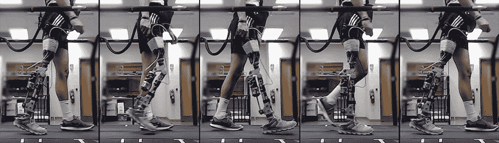

# 人工智能算法在几分钟内自动“调整”假肢

> 原文：<https://thenewstack.io/ai-algorithm-automatically-tunes-prosthetics-within-minutes/>

假肢已经有几千年的历史了，最早的铁腿和木脚的记录出现在古印度和 T2。今天，假肢在设计上更加精致，但大问题是，对于截肢者来说，习惯用新的假肢移动仍然是一个耗时的过程。通常，使用假肢的患者需要亲自来到诊所，让人类保健从业者专门为该患者手动“调节”该装置——这一过程可能需要几个小时。

但是根据来自北卡罗来纳州立大学、北卡罗来纳大学和亚利桑那州立大学的一组研究人员的说法，在[强化学习算法](https://thenewstack.io/reinforcement-learning-ready-real-world/)的帮助下，这种情况可能会改变。类似的算法——最好解释为通过试错法学习的机器版本——已经出现在人工智能研究项目中，这些项目生产的机器可以通过从网络中自动提取数据进行学习，这些机器可以在几个小时内达到对国际象棋和其他游戏的超人掌握。

在这项特殊的工作中，研究人员能够证明，可以显著地自动化调整过程，因此患者可以在 10 分钟内带着他们的假肢在平坦的表面上舒适地行走。该团队题为“机器人膝关节假体个性化的在线强化学习控制”的论文最近发表在[IEEE Transactions on Cybernetics](https://ieeexplore.ieee.org/document/8613842)上，并描述了新的调谐系统，该系统能够修改 12 个不同的控制参数，这些参数控制着可能在所谓的双足步态周期中突然出现的假体动力学——当一只脚接触地面时开始，当同一只脚再次接触地面时结束的运动序列。

论文合著者黄青说:“我们首先给病人一个带有随机选择参数的电动假肢膝。”“然后，我们让病人在受控的情况下开始行走。

“设备上的数据和患者的步态是通过设备中的一套传感器收集的，”黄补充说。“计算机模型调整设备上的参数，并实时将患者的步态与正常行走步态的轮廓进行比较。该模型可以判断哪些参数设置提高了性能，哪些设置损害了性能。使用强化学习，计算模型可以快速识别允许患者正常行走的参数集。依靠训练有素的临床医生的现有方法可能需要半天时间。”

## 动态协同适应

假肢和它的人类使用者之间的“共同适应”过程可能是一个复杂的过程，在一天中动态地变化。特别是，新的调整过程涵盖了 12 个参数，如关节刚度和允许的运动范围，重点是指示稳定行走模式的数据模式。此外，当患者行走时，可以训练调整算法来识别可能指示可能跌倒的某些模式，这将帮助用户避免这种情况。

然而，该项目确实面临一些挑战，其中之一是从人类患者那里收集的相对较小的数据集，这些患者只能行走这么长时间来生成数据以训练计算机模型。

到目前为止，该团队仅在平坦表面上行走的患者身上测试了其调整算法。下一步将是进一步开发用于假肢佩戴者上下楼梯的算法，以及创建该系统的无线变体，以便患者可以在自己舒适的家中随时进行额外的调整。为了最大限度地减少跌倒，测试算法的安全性也很重要。

此外，该团队希望找到一种方法，让用户能够更好地将他们的身体偏好纳入系统:也许用户可能会发现一种步态比另一种步态更舒适，不管算法确定什么是稳定的行走模式。无论如何，这样的研究表明，很有可能将人类和机器人元素快速无缝地集成在一起，从而为假肢佩戴者节省一些时间和金钱。

图片:海蒂·阿戈斯蒂尼；北卡罗来纳州立大学，北卡罗来纳大学和亚利桑那州立大学。

<svg xmlns:xlink="http://www.w3.org/1999/xlink" viewBox="0 0 68 31" version="1.1"><title>Group</title> <desc>Created with Sketch.</desc></svg>