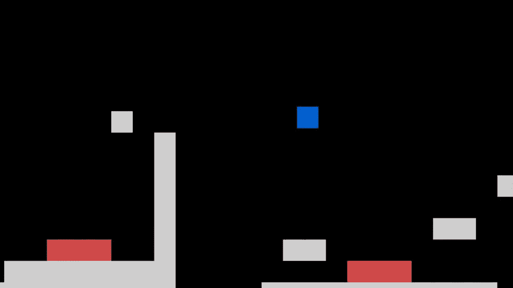
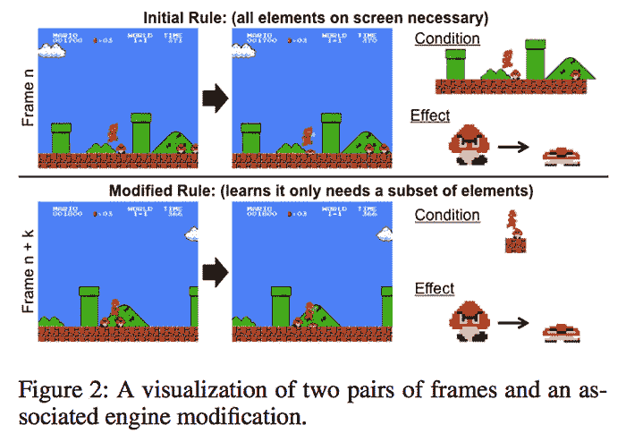
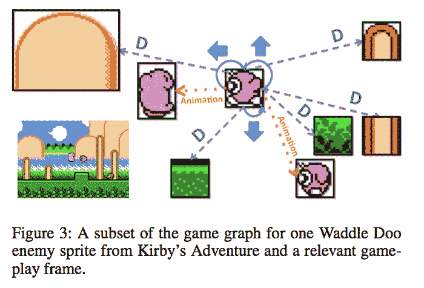

# 人工智能通过“概念扩展”自动化视频游戏设计

> 原文：<https://thenewstack.io/ai-automates-video-game-design-with-conceptual-expansion/>

我们这些见证了游戏产业发展的人可能还记得早期在雅达利(Atari)或任天堂(Nintendo)等系统上的简单但却迷人的视频游戏。从最初的时代开始，游戏设计已经突飞猛进，出现了各种各样的类型，从复杂的角色扮演游戏到动作和策略游戏。但是，虽然很多人购买和玩游戏，但没有多少人有必要的技能来设计和制造一个游戏。

如果人工智能加入其中，这种情况可能会改变。毕竟，人工智能已经在游戏本身中使用，给游戏中的非玩家角色灌输适应性行为，使他们看起来更真实，更有反应，而不仅仅是屏幕上的像素。但是根据来自乔治亚理工学院的两位计算机科学家的说法，使用人工智能来创造游戏很可能会为更多的潜在游戏设计师打开领域，有效地使这一过程民主化。

在他们的预印本研究中，佐治亚理工学院交互计算学院的“[通过概念扩展进行自动化游戏设计](https://arxiv.org/pdf/1809.02232.pdf)”、博士生[马修·古兹迪尔](http://guzdial.com/)和副教授[马克·里德尔](https://www.cc.gatech.edu/people/mark-riedl)介绍了一种使用人工智能重组现有游戏以创建新游戏的新方法。这个过程被称为“概念扩展”，它是一种“组合创意技术”，利用机器学习来帮助创建自动化游戏设计系统。

正如研究人员指出的那样，以前自动化游戏设计的尝试仍然依赖于来自专业设计师或众包的专业知识。他们的概念扩展算法是第一个真正能够“学习”游戏的底层设计和机制、规则和组件的系统。它通过分析现有游戏中的视频游戏等级来做到这一点，并将这些数据转换为创建一个新的游戏环境，该环境具有自己的对象和规则。

人工智能生成的原创游戏《黑仔弹跳》

“过程如下:我们输入游戏视频和一个精灵表，”研究人员写道。精灵表是游戏中所有图像或精灵的集合，包括所有背景艺术、动画帧和等级结构的组件。他们写道:“我们用精灵表对视频进行图像处理，以确定每一帧中精灵出现的位置和内容。”然后，我们学习关卡设计的模型和游戏的规则集。然后，我们将关卡设计和游戏规则集的表示合并成我们所说的游戏图。”

在团队的实验中，人工智能分析了三款游戏的游戏性:“超级马里奥兄弟”、“科比”和“超级男人”。这些游戏的“游戏图”提供了一种描述这些游戏之间相互关系的方式，为概念扩展算法创建了一个示意图，然后用于推断一个全新的游戏。从这个意义上说，该团队的组合算法不同于以前基于规则的机器学习模型，因为它旨在处理“更嘈杂”、更复杂的表示，如这些游戏图中的表示，并能够为特定的游戏设计目标优化过程。

在分析了这些游戏之后，该算法得出了非常有趣的游戏:第一个是“黑仔墙”(见下面的视频)，其中主要玩家——如蓝色方块所示——必须移动和跳跃，以逃离大型红色墙壁，这些墙壁会在接触时杀死人。对于第二个游戏，名为“死亡弹跳”(见上文)，玩家必须通过跳跃穿过关卡——这并不容易，因为每次玩家降落在地面上，都会导致部分地面消失。很明显，该算法能够结合所分析游戏的一些基本元素——例如屏幕上的水平移动以及对象的交互方式——来创建自己的新游戏。

[https://www.youtube.com/embed/urKsby4-AbQ?feature=oembed](https://www.youtube.com/embed/urKsby4-AbQ?feature=oembed)

视频

很明显，人工智能在创造更精致的游戏之前还有一段路要走，但很明显，人工智能有一天可能会在帮助人类游戏开发者自动化目前相当复杂的设计过程的一部分方面具有巨大的潜力，有时需要数百人的团队，可能会简化游戏开发并制作更好的游戏。

图片:佐治亚理工学院。

<svg xmlns:xlink="http://www.w3.org/1999/xlink" viewBox="0 0 68 31" version="1.1"><title>Group</title> <desc>Created with Sketch.</desc></svg>