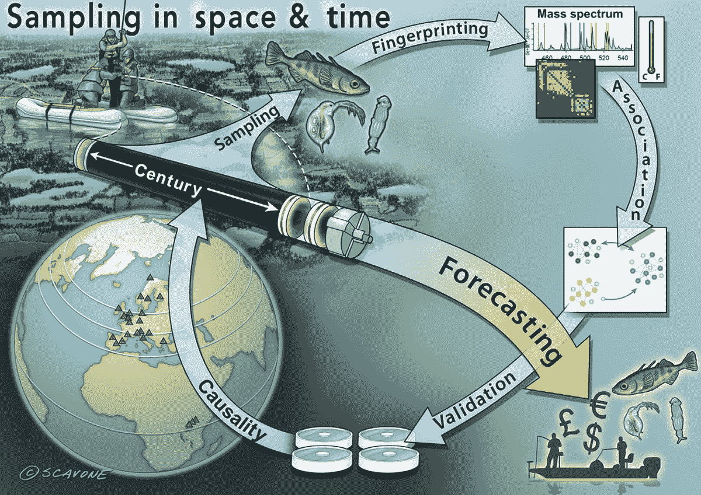

# 人工智能生物多样性“时间机器”可以决定不确定的未来

> 原文：<https://thenewstack.io/ai-biodiversity-time-machine-could-decide-for-uncertain-future/>

[人工智能](https://thenewstack.io/category/machine-learning/)的力量已经在我们生活的许多方面变得越来越明显，无论是驱动[推荐引擎](https://thenewstack.io/40-something-dude-asks-for-music-recommendation-redditors-point-to-the-algorithms/)和[个人助理](https://thenewstack.io/rebuilding-ai-toward-a-feminist-alexa/)的算法，还是推动[救命药物](https://thenewstack.io/machine-learning-for-drug-discovery-using-the-google-kubernetes-engine/)新发现的复杂计算。

伯明翰大学的一组研究人员现在提出，人工智能也可以用来潜在地解决人类现在面临的一些最大的环境问题，例如由于采矿和伐木等人类采掘活动造成的污染和栖息地丧失，对生物多样性的严重威胁。

研究小组提出了他们所谓的“时间机器框架”，该框架将使用人工智能来帮助不同学科的决策者和专家“回到过去”(可以这么说)，以便汇编预先存在的环境数据，使他们能够量化地观察环境变化如何在长时间内影响生物多样性和各种生态系统。随着时间的推移，更好地了解这些历史数据将有助于更好地预测哪种缓解策略最有效。

该团队的提议最近发表在“[生态和进化趋势](https://www.sciencedirect.com/science/article/pii/S0169534721002597?dgcid=author "The Time Machine framework: monitoring and prediction of biodiversity loss")”上，概述了人工智能如何用于帮助专家确定最佳行动方案，以管理生物多样性丧失的影响。

“生物多样性的丧失会持续很多年，通常是由多种环境威胁的累积效应造成的，”论文的首席研究员、在伯明翰大学教授生物系统和环境变化的副教授 Luisa Orsini 博士解释道。“只有通过量化污染事件之前、期间和之后的系统级生物多样性变化，才能确定生物多样性和生态系统服务损失的原因。”

Orsini 指出，现在广泛使用的工具不能满足需要，因为它们通常基于对所谓的[指示物种](https://www.britannica.com/science/indicator-species)或作为现有生态系统环境条件风向标的生物的短期观察。虽然这种短期观察可能会对当前正在发生的生态系统变化给出相对准确的快照，但它们无法充分提供对更深层次、长期原因的全面评估，这些原因可能会推动当地生态系统的生物多样性发生更广泛的变化。相比之下，该团队认为他们的人工智能驱动方法将有助于填补这一空白。

“对支撑生态系统服务的过程缺乏了解往往导致管理不善，对环境、经济和人类福祉造成明显的不利影响，”Orsini 补充说。“系统方法，如本文介绍的框架，能够优先考虑加速生态恢复的干预措施，并减轻对与关键生态系统功能和服务相关的物种造成伤害的环境因素。保护每一个物种是不可能的。时间机器框架提供了一种方法来优先保护提供服务的分类群，并指导监管干预措施，以限制最有害的环境污染物的影响。”

## 理解大局

这个人工智能框架背后的想法是建立一个更全面的理解，即人类干预如何在不同尺度上影响生态系统——无论是空间、时间还是各种经济。这样一个对过去和现在的广泛的“大画面”视图，将更好地为政府和组织提供他们需要的数据，以确保“持续提供”[生态系统服务](https://www.nwf.org/Educational-Resources/Wildlife-Guide/Understanding-Conservation/Ecosystem-Services)——基本上，像清洁的空气和水，可靠的食物生产和资源——所有这些我们都认为是理所当然的，自然会提供。

此外，该框架还将超越不同研究学科在衡量生物多样性丧失方面可能设置的狭窄界限，生物多样性丧失有时会产生可能不会立即显现的生态、社会文化和经济影响。

“学科限制的方法可能会忽略过程的相互作用，导致在不适当或不连贯的规模上进行研究，或者使用不足以解决跨学科问题的特定学科工具，”该小组指出。“能够对生态系统可持续利用的干预措施进行优先排序的决策框架通常需要来自不同学科的多种证据，这使得利益攸关方的决策具有挑战性，特别是当社会经济和生态优先事项之间的关系不是线性的时候。”

为了测试他们的提议，研究人员将基于人工智能的工具应用于淡水生态系统，因为它们具有多样性，地理分布广泛，并且因为它们越来越受到污染和退化的威胁。特别是，他们的研究集中在一个湖泊，他们有大量的生态和生物数据。

“我们应用人工智能方法，确定初级生产者(如绿藻)的特定分类组的下降与沉积物中定量的数百种除草剂中的 10 种除草剂呈负相关，”Orsini 解释道。“这项试点研究证明，该框架可以有效地应用于优先保护和识别最有害的污染物，以进行监管干预。”

该团队的方法包括五个不同的步骤，从采集不同时期的沉积物样本，到“指纹识别”生物化学和生态系统功能，这样任何生物和非生物变化都可以通过[代谢编码](https://www.forestresearch.gov.uk/research/metabarcoding/)环境 DNA 和质谱分析进行检测和分析，此外还可以使用公共环境数据数据库作为基准。

人工智能然后被用来确定过去和现在的生物多样性之间的任何联系和变化。Orsini 解释说:“我们的方法使用[可解释的网络模型](https://thenewstack.io/how-human-trust-varies-with-different-types-of-explainable-ai/)结合[多视图学习](https://paperswithcode.com/task/multi-view-learning)，以允许同时询问不同的数据矩阵，了解矩阵内(例如环境污染物)和矩阵间(例如环境污染物和[分子操作分类单元](http://www.nematodes.org/research/barcoding/motu_defined.html)或 MOTUs)的哪些成分共同变化。”。

“时间机器框架从过去的相关性中‘学习’，根据从内陆水域的地质记录中收集的长期经验数据进行迭代测试，并进行优化，以预测不同气候和污染情景下的未来生物多样性。”

当然，有这么多共同变化的因素，团队在某种程度上简化他们的方法是很重要的。为此，研究人员使用了一个[模拟器](https://developer.nvidia.com/blog/using-ai-based-emulators-to-speed-up-simulations-by-billions-of-times/)，它使系统能够以并行方式使用计算资源。

奥尔西尼说:“生成考虑到所有可能情况的预测是计算密集型和耗时的。“Time Machine 框架使用仿真器来提供跨多个场景的具有计算的不确定性的稳健预测，同时降低计算成本和时间。“仿真器”是一种低阶、计算效率高的模型，它根据输入和参数来仿真更复杂模型的特定输出。”

最终，该小组表示，在当前的环境实践中，需要转向更多基于证据的系统方法，以便更早、更全面地识别和量化问题，尽管也有可能整合其他有用的功能。

“原则上，时间机器框架可以扩展到基于生态系统的生态和功能状态的预测之外，”奥尔西尼建议道。“通过耦合生态和经济建模，该框架还可以在不同的气候和污染情景下协调社会经济和生态结果。为了克服利益相关者的采用障碍，可以开发基于人工智能的仿真器仪表板，监管者和决策者可以通过数据可视化技术访问该仪表板。这些工具可适用于生态系统服务的概率预测，以帮助决策和社会经济权衡。”

在团队的[论文](https://www.sciencedirect.com/science/article/abs/pii/S0169534721002597?dgcid=author)中了解更多。

<svg xmlns:xlink="http://www.w3.org/1999/xlink" viewBox="0 0 68 31" version="1.1"><title>Group</title> <desc>Created with Sketch.</desc></svg>