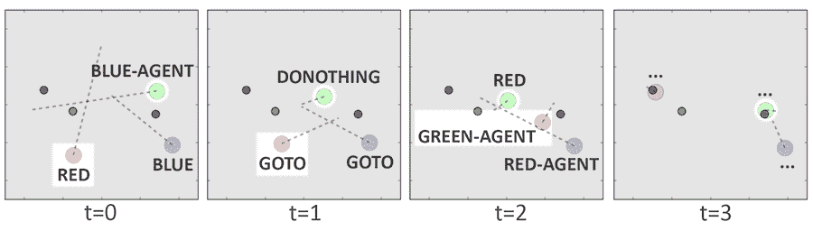

# 开放式人工智能机器人创造自己的语言相互交流

> 原文：<https://thenewstack.io/ai-bots-create-language-communicate/>

随着人工智能在复杂的游戏中击败人类，如[围棋](https://thenewstack.io/google-ai-beats-human-champion-complex-game-ever-invented/)和[扑克](https://thenewstack.io/computers-can-now-bluff/)以及开发“[做梦](https://thenewstack.io/deep-learning-neural-networks-google-deep-dream/)、[推理](https://thenewstack.io/googles-deepmind-ai-now-capable-deep-neural-reasoning/)和[自学](https://thenewstack.io/mits-new-ai-data-extraction-system-teaches-surfing-web/)的能力的消息，最近对人工智能的研究似乎正在以极快的速度发展。语言也不例外。在最近发布的[研究结果](https://arxiv.org/abs/1703.04908)中，非营利实验室 [OpenAI](https://openai.com/) 的研究人员现在表明，人工智能可能能够开发自己的语言，这种语言与经验和他们对世界的感知联系在一起，而不是吐出一些之前强行灌输给他们的东西。

像 Siri 这样的人工智能助理已经通过自然语言的处理与人类用户进行交流(至少是人类语言)，但是任何曾经与这些数字助理打交道的人都知道，即使有成堆的数据来训练它们，它们仍然感觉与它们交流不自然。

问题是，我们真的不确定机器是否真的理解它们使用的词语，至少在经验意义上。例如，当我们使用“太阳”这个词时，我们会联想到一个照亮天空的遥远的燃烧的氢气球的视觉图像。我们可能还会在脑海中回忆起太阳热量的记忆和经历，但这是机器在使用同一个词时所理解的吗？

为了解决这个问题，OpenAI 的研究人员训练这些机器人以一种特定的方式进行交流，这种方式鼓励了“根植”和“组合”语言的出现——根植于说话者对现实世界的体验，而组合是指说话者可以将多个单词串成一个句子来传达一个想法或意图。

## 自然语言

研究人员在一篇帖子中描述了他们如何将人工智能代理放置在一个简单的二维世界中，分配给他们简单的任务来完成。在[强化学习](https://thenewstack.io/reinforcement-learning-ready-real-world/)的训练框架内使用一个试错过程，在被要求查看或移动到白色空间内的指定地标或让另一个代理完成任务后，机器人被释放到这个白色正方形世界中执行任务。代理人之间的合作受到鼓励，使用共享奖励系统，如果每个代理人帮助了另一个代理人，奖励就会增加。人工智能机器人的紧急语言实际上是用数字表达的，研究人员不得不用英语单词来标记它，但尽管如此，观看这种人工智能培养皿还是很有趣的:

[https://www.youtube.com/embed/liVFy7ZO4OA?feature=oembed](https://www.youtube.com/embed/liVFy7ZO4OA?feature=oembed)

视频

代理可以四处移动或查看他们世界中的物体，或者与周围的其他机器人通信。这里最有趣的是，这种交流的语言不是由研究人员预先编程到机器人中的，而是似乎是自己出现的。部署到场景中的代理越多，代理的“句子”就变得越复杂。通过尝试不同的方式来完成任务，每个机器人都可以通过自己的递归神经网络来记录他们的失败、成功和奖励，这种神经网络充当了一种记忆存储。

在实验过程中，团队遇到了一些挑战。第一个是人工智能倾向于创造一种不可理解的“莫尔斯电码语言”,这种语言是非合成的。另一个障碍涉及代理人将整个句子的意思压缩成一个单一的“单词”，这可能是可行的，但不是一种容易被人类理解的语言。

在每种情况下，团队都相应地修改了奖励系统，以鼓励机器人更好地合作，并开发一种可理解的组合语言。更令人惊讶的是，该团队还观察到机器人之间自发的“非语言交流”形式，如在语言交流不可能的情况下指示和指导。

该团队的下一步是继续探索我们如何开发能够以他们自己的语言交流的机器，这种语言是基于他们对世界的感知。为了帮助人类理解这种新兴语言，该团队计划与加州大学伯克利分校的研究人员合作，建立这些机器人与讲英语的代理人交流，作为翻译这种新发现的人工智能语言的一种方式。

“我们认为，如果我们慢慢增加他们环境的复杂性和代理人本身被允许采取的行动范围，他们可能会创建一种表达性语言，其中包含的概念超出了在这里进化的基本动词和名词，”研究人员说。

在某种程度上，这个实验似乎很好地模仿了人类的经历。面对生存所需的许多任务，人类不得不学会如何合作，并不得不发展某种共同语言使之成为可能。现在，进化出自己语言的机器似乎离我们不远了。

在团队的[论文](https://arxiv.org/abs/1703.04908)和[公开赛](https://blog.openai.com/learning-to-communicate/)上阅读更多内容。

图片:OpenAI

<svg xmlns:xlink="http://www.w3.org/1999/xlink" viewBox="0 0 68 31" version="1.1"><title>Group</title> <desc>Created with Sketch.</desc></svg>