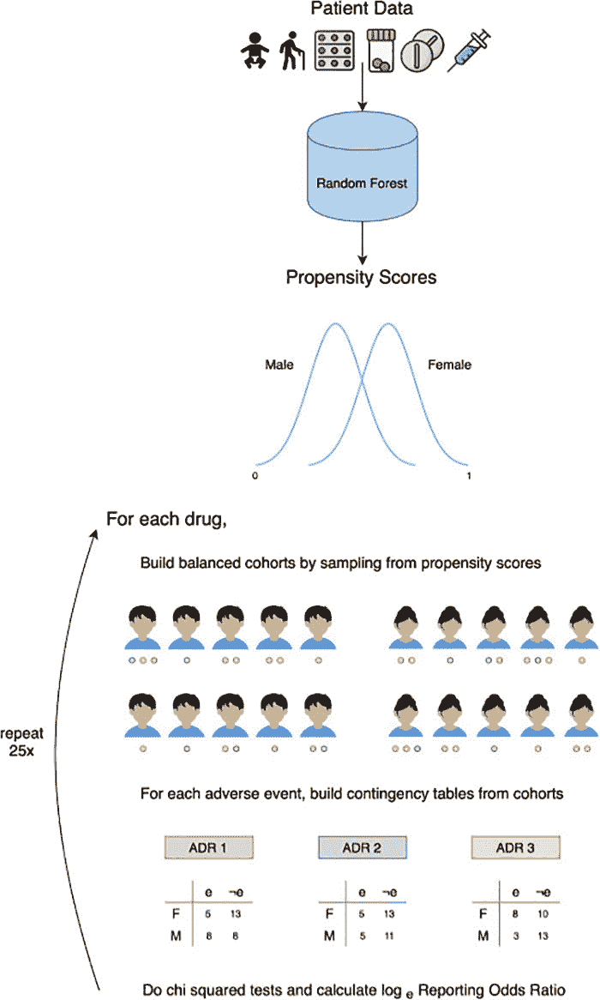

# 人工智能纠正药物安全试验中 50 年的性别偏见

> 原文：<https://thenewstack.io/ai-corrects-50-years-of-sex-bias-in-drug-safety-trials/>

今天的制药行业依靠临床研究试验中严格的测试方法来确保他们的产品对公众消费是安全的。公众可能不知道的是，这些临床试验的参与者绝大多数是男性，这意味着没有太多关于药物如何影响女性的数据——具体来说，某些药物如何可能在女性身上引发不良反应，而在男性身上却没有，或者反之亦然。

鉴于男女之间的生理差异，这种差异会对人们的健康以及药物的处方和营销产生巨大影响。

但是人工智能可能有助于弥合这一差距，这要归功于哥伦比亚大学研究人员开发的机器学习算法，该算法可以精确定位和预测男女之间的药物不良反应差异——这可能会拯救生命，并进一步推动人工智能驱动的精准医疗的发展。

“由于代谢差异，女性面临的药物副作用风险是男性的两倍，”哥伦比亚大学生物医学信息学副教授、[研究](https://www.cell.com/patterns/fulltext/S2666-3899(20)30142-2)的合著者 [Nicholas Tatonetti](https://datascience.columbia.edu/people/nicholas-p-tatonetti/) 解释道，该研究发表在 *Patterns* 上。“不幸的是，这些性别差异没有得到很好的研究。直到 90 年代初，美国食品和药物管理局将女性归类为临床试验的特殊“亚群”，就像儿童或老年人一样。这意味着他们在很大程度上被排除在前瞻性药物安全性研究之外。据我们所知，我们的算法是第一种预测药物反应性别差异的方法，并已得到[药物基因组学](https://en.wikipedia.org/wiki/Pharmacogenomics)数据的证实。”

## 消除临床试验中的偏倚

这种新算法被称为 [AwareDX](https://github.com/tatonetti-lab/sex_risks) (分析面临药物毒性风险的女性)，它利用了从[不良事件报告系统](https://www.fda.gov/drugs/questions-and-answers-fdas-adverse-event-reporting-system-faers/fda-adverse-event-reporting-system-faers-public-dashboard) (FAERS)中获取的 50 年数据，这是一个由用户、医疗保健专业人员和制药商报告的药物副作用的 FDA 数据库。虽然这类信息很有价值，但数据库也不是没有缺陷。

虽然 FAERS“提供了一个系统评估药物反应性别差异的机会，但它充满了许多偏见，”哥伦比亚大学生物医学信息学专业的大四学生兼论文合著者 Payal Chandak 指出。“例如，疾病发生(想想:前列腺癌)或药物处方(想想:避孕药)与性别高度相关。AwareDX 纠正了这些混杂因素[通过估计]基于他们的药物治疗与每个患者相关的性别偏见。然后，对于每种药物，我们建立平衡的队列，以减轻这些偏见并评估性风险。”

通过使用这些“平衡队列”——或包含同等数量男性和女性的数据子集——aware dx 可以进一步分析可用数据，以了解某种药物副作用的潜在性别特定模式。为了提高准确性，该算法然后进一步重复该过程 25 次。为了验证他们的算法，该团队将他们的结果与现有临床文献中发现的已知性别特异性药物副作用进行了交叉检查。

该团队现在已经将他们的结果汇编到一个数据库中，该数据库包含超过 20，000 种影响男性和女性的药物副作用，其中一些是以前未知的。然而，Tatonetti 警告说，这些新的发现将需要后续实验的证实，然后才能用于医疗实践。

研究人员说，通过使用这些方法，AwareDX 能够消除数据中 79%的潜在性别偏见。此外，由于男女之间的生理差异，他们的模型并不局限于预测潜在的副作用。

“我们的方法可以重新构建，以纠正任何感兴趣的离散变量的偏差，”Chandak 指出。“例如，在研究儿科[药物副作用]时，可以用年龄代替性别。我们减轻偏见的机器学习方法有可能推广到许多数据科学领域。”

该团队的目标是鼓励这一新兴领域的更多研究，为此，他们计划向其他研究人员提供他们的[数据和代码](http://tatonettilab.org/projects/)。

“这一资源可以极大地推进药物发现、重新定位和药物遗传学研究中对性别的考虑，”Tatonetti 说。"最终，我们希望这样的分析将推进在药物处方过程中对性别差异的考虑."

要了解更多信息，请访问 [Tatonetti 实验室](http://tatonettilab.org/projects/)和 [GitHub](https://github.com/tatonetti-lab/sex_risks) 。

图片:照片由 Pexels 的 Mari Monpari 拍摄；哥伦比亚大学

<svg xmlns:xlink="http://www.w3.org/1999/xlink" viewBox="0 0 68 31" version="1.1"><title>Group</title> <desc>Created with Sketch.</desc></svg>