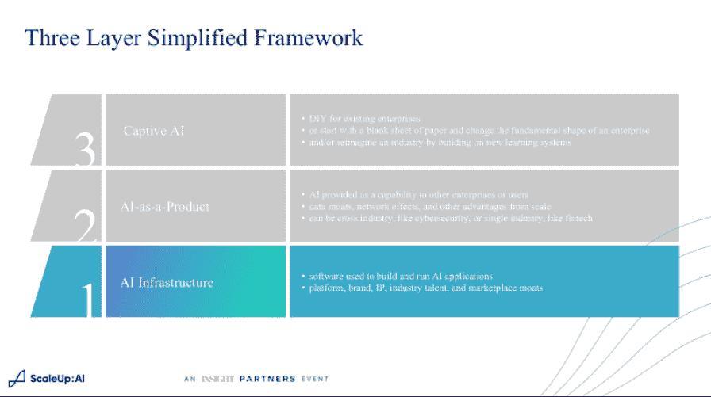

# 人工智能开发需要更多地关注数据，而不是模型

> 原文：<https://thenewstack.io/ai-development-needs-to-focus-more-on-data-less-on-models/>

本月早些时候，在 Insight Partners 的 [ScaleUp:AI](https://scaleup.events/agenda/) 会议上，[吴恩达](https://www.andrewng.org/)在他的[演讲](https://otter.ai/u/MX86pFhxZgZgi5ESc-7RHX4mVTE)中说，为了被大多数企业成功使用，人工智能需要更少地关注构建模型，而更多地关注数据。

迄今为止，人工智能的发展一直围绕着建立模型，在这种模型中，开发出一种尽可能接近数据的算法。为了测试，研究人员会从网上下载一些数据集。这导致了许多广泛使用的通用神经网络。

Ng 的以数据为中心的方法不同于这种方法。ng 说，它旨在将较少的精力集中在代码上，而更多地强调试图“系统地处理数据”。

Ng 认为，展望未来，这种方法将为构建人工智能应用程序提供一种“更有效的方式”。

Ng 在开创人工智能方面有很长的履历。Ng 共同创立了 Coursera 和 DeepLearning.ai 在线学习中心。他最近的冒险是[登陆 AI](https://landing.ai/) ，提供 AI 即服务。

## AI 为所有人

迄今为止，人工智能在行业中产生的许多影响都让大型互联网公司在搜索、推荐、用户识别等方面受益。人工智能在更普通的日常业务中取得的成功较少，比如医疗保健。即使在大公司中，也只有一小部分受益于人工智能。

Ng 认为，大型互联网公司开发和部署人工智能系统的方式对大多数传统企业来说并不实用。

首先，大多数企业需要处理的数据集要小得多。一项围绕消化 1 亿或更多图像而构建的技术对于来自工厂车间流程的大量图像可能不是非常有效，例如，这些图像可能只有几十张。

Ng 指出，好消息是，令人惊讶的是，可靠的人工智能系统可以围绕更小的数据集构建。“这与大数据无关，”他说。系统也不应该过于庞大。互联网规模的公司习惯于向一个整体项目投入数百万美元，但例如，一个拥有生产线的公司可能需要几十个较小规模的人工智能系统来检查每个阶段的产品。

换句话说，你不可能建立一个单一的平台来处理一个工厂或医院的所有需求。

Ng 建议为每个用例寻找高度定制的垂直平台。这不是由每个垂直行业的 IT 部门决定的，而是由主题专家决定的。他说，诀窍是构建工具，让专家不用写代码，而是“以一种让他们表达领域知识的方式设计数据”。

数据工程涉及什么？首先，它包括清理杂乱的数据。一个人标记为“芯片”的东西，另一个人可能会标记为“划痕”一个人可能会识别出一个划痕，而另一个人可能会将其标记为一系列划痕。

Ng 转述了他与杜邦公司合作的一个故事，杜邦公司试图改进其用于检测钢板缺陷的计算机视觉系统。当时，他们的准确率是 76%，但他们希望达到 90%。工程师们采用传统的方法改进模型，但几乎没有改进。Ng 自己的团队采取了相反的方法，研究数据质量的不一致性以及导致它们的原因。这种方法反过来又导致了一个更高精度的模型。让主题专家清楚地表达“缺陷”是由什么组成的，可以改进模型。

他说，以数据为中心的运营背后的想法是“建立工具，并从人工智能项目的所有阶段持续展示高质量的数据”。“因为如果你能展示出所有这些阶段，你就有合适的工具来持续提供高质量的数据，这通常能解决出现的许多实际问题。”

## 人工智能

投资公司 [Insight Partners](https://www.insightpartners.com/) (该公司拥有新的堆栈)的董事总经理[隆内·贾菲](https://www.linkedin.com/in/lonnejaffe)在会议的另一次演讲中指出，当谈到从人工智能中获取价值时，事实证明“人工智能基础设施作为差异化的来源，比我们想象的要重要得多”。

他说，诀窍在于让 ML 具有很强的可扩展性。这在边缘变得更加棘手，ML 系统可能需要消费者设备内的预处理和推理能力以及与后端数据中心的协调。今天的大多数数据库系统都不是为这些联邦架构构建的。

一家利用可扩展性的 Insight 投资组合公司是 [Run:AI](https://www.run.ai/) ，它提供了 Jaffe 所比喻的“GPU 的 VMware”这个想法不仅仅是降低服务的价格，而且是以一种“质的不同和更好”的方式来管理基础设施。由于其更高效的基础设施， [Hour One](https://www.hourone.ai/) ，本周[刚刚宣布了一轮融资](https://techcrunch.com/2022/04/25/heres-why-were-about-to-see-an-explosion-of-hyper-real-artificial-humans-online/)，让你只有在完成最终产品的迭代后才付费。

他指出，这个领域正在变得如此之大，以至于以各种方式分叉。例如，基于人工智能的分析“比我们最初想象的更不同于传统的数据分析堆栈，”他指着人工智能实验跟踪和超参数优化专家[权重&偏差](https://wandb.ai/site)说，这在传统分析中没有完美的模拟。

即使是结构化数据的 MLOps 堆栈也与非结构化数据的不同。 [Overjet](https://www.overjet.ai/) 采用的方法，为牙科检查等任务提供图像识别，与 [Zest AI](https://www.zest.ai/) 使用的方法非常不同，后者使用更多结构化数据来推动贷款决策。

Insight 投资软件已有约 20 年，Jaffe 担任该公司董事总经理已有约 5 年，建立了一个投资组合，其中包括人工智能基础设施支持公司以及那些使用人工智能提供特定服务的公司。

对于提供人工智能软件作为其产品的公司来说，所需的人才不同于通常的软件工程师，因为他们除了享受为商业机构工作的好处之外，还希望在学术界保持流行。

除了人工智能基础设施和人工智能产品，Jaffe 还看到了第三个新生但不断增长的类别:人工智能。

由于人工智能是战略的核心，使用人工智能，企业无法轻松地将人工智能作为服务从供应商处消费。“公司是学习系统，人类是学习系统。因此，如果一个组织的核心学习系统现在由人工智能驱动，要么现有的现任者将试图‘自己做’，要么如果他们不能雇用合适的人才或进行合适的投资，一类新的破坏性扩大可能会出现，我们开始越来越多地看到这一点，”贾菲说。

一个例子是网飞，该公司已转向原创节目，根据其客户群的偏好进行制作。此外，Insight 自己的投资公司之一， [Prose](https://prose.com/) ，根据对无数因素的个性化人工智能分析，为客户制定个性化的洗发水——头发类型和质地，生活习惯，环境暴露，甚至饮食和压力水平。如果没有人工智能，这样的建议至少在生产基础上是不可能实现的。

他说，有了人工智能，“公司或行业本身的形态就会改变”。

<svg xmlns:xlink="http://www.w3.org/1999/xlink" viewBox="0 0 68 31" version="1.1"><title>Group</title> <desc>Created with Sketch.</desc></svg>