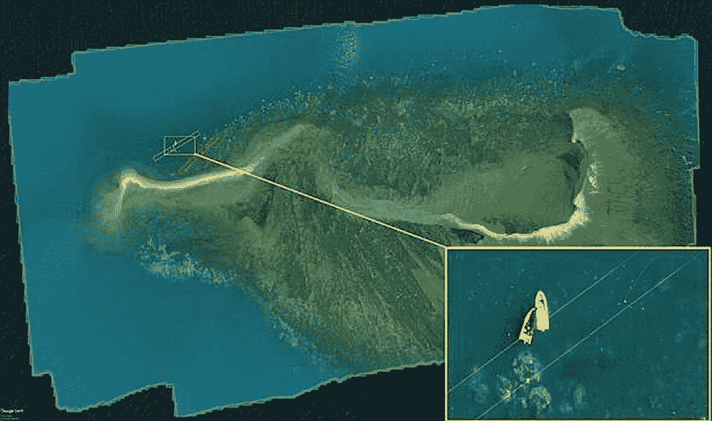

# 人工智能、无人机和云拯救大堡礁

> 原文：<https://thenewstack.io/ai-drones-and-the-cloud-work-to-save-the-great-barrier-coral-reef/>

如果追踪冰川融化和海洋变暖速度的发人深省的科学证据没有让你沮丧，那么这份最新的[联合国报告](https://www.apnews.com/aaf1091c5aae40b0a110daaf04950672)可能会让你沮丧，该报告是关于人类活动如何威胁到 100 万植物和动物物种走向灭绝的。消息相当可怕，而时间是关键:我们知道需要行动，但我们能足够快地行动吗？

毫不奇怪，新技术有助于在全球范围内实时发现负面环境影响，让我们能够更快地采取行动。在澳大利亚的大堡礁，来自布里斯班[昆士兰科技大学](https://www.qut.edu.au/) (QUT)的一组科学家正在使用无人机、人工智能和云的巨大计算能力来更好地处理海洋温度变暖和酸化如何影响这个巨大的珊瑚礁——这意味着政府和其他机构可以尽早采取行动。

研究人员正在与澳大利亚海洋科学研究所(AIMS)合作，这是一个海洋研究中心，多年来一直在监测珊瑚礁的健康状况——尽管使用更传统的方法来收集数据和图像，使用飞机、直升机、卫星和海洋调查。虽然这些方法可行，但它们成本高昂，而且收集的图像分辨率通常较低，梳理数据可能需要数周时间。

## 光谱特征

这就是人工智能和无人机技术可以发挥作用的地方，允许研究人员在短时间内廉价而快速地收集大量数据，此外还可以使用云计算来快速处理这些信息。为此，研究小组选择了一架商用无人机，并对其进行了改装，使其包括两个相机:一个高分辨率数码相机和一个高光谱相机。数码相机拍摄的图像是使用红色、绿色和蓝色光谱的光拍摄的，特别是在电磁光谱的 380 到 740 纳米范围内，然后用于在计算机上构建三维模型。除此之外，超光谱相机接收 270 个光谱带的反射光，并可以捕捉水面下 10 英尺的信息。

“高光谱成像极大地提高了我们根据光谱特性监测珊瑚礁状况的能力，”领导 QUT 研究小组的副教授 Felipe Gonzalez 在 [IEEE Spectrum](https://spectrum.ieee.org/tech-talk/energy/environment/how-to-keep-a-close-eye-on-australias-great-barrier-reef) 上解释道。“这是因为构成珊瑚礁环境的每一种成分——水、沙子、藻类等。——有自己的光谱特征，就像漂白和未漂白的珊瑚一样。”

但这一额外的信息层也带来了一个问题:虽然水下勘测可能会提供几十个数据点，但一幅超光谱图像可以产生数千个数据点，这意味着一次无人机勘测可以产生超过 1000 亿字节的数据，而在普通台式电脑上分析这些数据需要几周甚至几个月的时间。

为了解决这个问题，该团队转向了微软 Azure 的云计算服务，通过该公司的 [AI for Earth](https://www.microsoft.com/en-us/ai/ai-for-earth) 倡议提供的资助。通过利用云的力量，该团队现在能够快速有效地对无人机飞行图像的各种光谱特征进行分类，将处理时间从数周缩短到仅两三天。正如人们可能猜测的那样，及早发现不利变化对珊瑚礁栖息地的生存至关重要；如果处理数据需要几个月的时间，那么在此期间，该特定区域可能已经降级到无法恢复的程度。

高光谱成像不仅有助于跟踪生态系统的长期健康状况，而且现在还被用于农业和林业，以监测作物和树木的发育和健康状况，以及识别矿物、制图、天文学和军事监视。目前，该团队和 AIMS 计划继续监测珊瑚礁中的各个区域，并打算在今年晚些时候将他们的业务扩展到新的区域。

<svg xmlns:xlink="http://www.w3.org/1999/xlink" viewBox="0 0 68 31" version="1.1"><title>Group</title> <desc>Created with Sketch.</desc></svg>