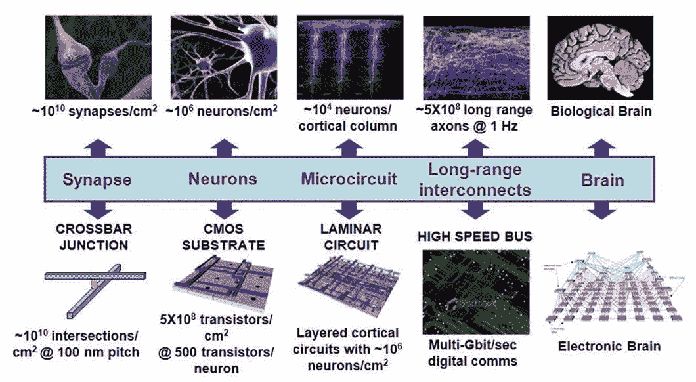
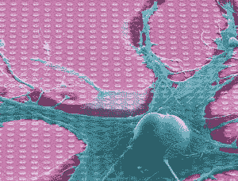
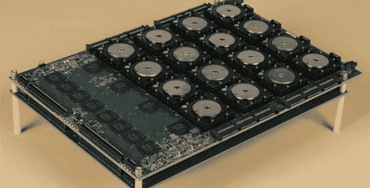

# 人工智能需要专门的处理器吗？

> 原文：<https://thenewstack.io/ai-hardware-software-dilemma/>

 [马西米利亚诺·范思哲

马西米利亚诺·范思哲是 Neurala Inc .和公司 visionary 的联合创始人兼首席执行官。在他对大脑启发的计算和深度网络的开创性研究之后，他继续激励和领导着自主机器人世界。他在许多活动和场合发表过演讲，包括 TedX、NASA、洛斯阿拉莫斯国家实验室、空军研究实验室、惠普、iRobot、三星、LG、高通、爱立信、BAE 系统、三菱、ABB 和埃森哲。此外，他的工作已被列入 IEEE Spectrum、New Scientist、Geek Magazine、CNN 和 MSNBC。范思哲是富布赖特学者，发表了数十篇学术论文，并拥有多项专利。他还拥有两个博士学位:的里雅斯特大学的实验心理学博士和波士顿大学的认知和神经系统博士。](https://www.neurala.com/) 

人工智能:每个人都在谈论它，这项技术尚未实现的可能性正在推动硬件和软件行业的复兴。硬件和软件公司——包括英特尔、英伟达、谷歌、IBM、微软、脸书、高通、ARM 和许多其他公司——正在竞相打造下一个人工智能硬件平台或努力保持领先地位。

人工智能，特别是深度学习(神经网络的一个子领域)是一个内在的非冯诺依曼过程，拥有一个更贴近神经网络特定需求的处理器的前景是有吸引力的。

但是，我喜欢三思而后行，尤其是在投入一个可能非常昂贵的硬件项目之前。我想遵循深度学习成功用于计算的相同范式——*从过去的例子中学习*——在考虑这个重要问题时确定最佳前进路径:

人工智能行业是否应该建立一个专门的深度学习芯片，如果应该，它应该是什么样的？

我们先看过去预测未来。

## 这个世界由智者管理，但却因疯狂而进步

美国国防高级研究计划局(DARPA)是由美国总统德怀特·艾森豪威尔于 1958 年创建的高级研究计划局(ARPA)，其目标是开发供军方使用的“疯狂创新”技术。这些机构在国防(和非国防)技术的发展中发挥了至关重要的作用，例如[阿帕网](https://en.wikipedia.org/wiki/ARPANET)，后来成为互联网的基础；GPS 技术；和许多其他人。

2008 年，DARPA 推出了神经形态自适应塑料可伸缩电子系统([突触](http://neurdon.wpengine.com/about-synapse/))。目标是创造一种新的非传统大脑启发的处理器，可以执行感知和行为任务，同时实现显著的节能。

> 生物学不区分记忆和计算。

该计划最初涉及我在波士顿大学的实验室以及惠普、HRL 实验室和 IBM 的研究人员，其目标是通过智能定位芯片上的数据和计算来实现能效，从而缓解远距离移动数据的需求。这个想法是从单个突触开始，并扩展到整个大脑(见图)。

一些版本的芯片采用了复杂的[忆阻](http://spectrum.ieee.org/robotics/artificial-intelligence/moneta-a-mind-made-from-memristors)设备技术来实现神经元和异步计算之间的密集连接——仅在需要时处理和传输数据，类似于神经元处理和交流信息的方式。

### 为什么选择 SyNAPSE？

SyNAPSE 是一个复杂的、多方面的项目，但它植根于两个基本问题。首先，传统算法在复杂的真实世界环境中表现不佳，生物制剂在这种环境中茁壮成长。相比之下，生物计算是高度分布式和数据密集型的。其次，传统的微处理器在执行高度分布式、数据密集型算法方面效率极低。SyNAPSE 寻求推进生物算法的最新发展水平，并开发高效实施这些算法所需的新一代纳米技术。

生物学不区分记忆和计算。事实上，每个神经元的每个突触都同时存储信息，并使用这些信息进行计算。相比之下，标准计算机将内存和处理分开放在两个漂亮整洁的盒子里。生物计算假设这些盒子是一样的东西。要理解为什么这个假设是个问题，需要回到数字计算机的核心设计原则。

绝大多数当代计算设备都基于冯·诺依曼架构(T4)。这种核心架构非常通用和多用途，是信息时代的特征。然而，冯·诺依曼的体系结构有一个很深的基本限制。冯诺依曼处理器可以对任意数据执行任意指令序列，从而实现可再编程性，但指令和数据必须通过连接处理器和主存储器的有限容量总线传输。因此，处理器执行程序的速度不能快于从内存中获取指令和数据的速度。这个极限被称为“冯·诺依曼瓶颈”

多核和大规模多核架构是部分解决方案，但仍符合相同的主题。额外的晶体管被换成更高的性能。然而，多核芯片让程序员可以更直接地控制硬件，而不是仅仅依赖自动机制。这对于许多类别的算法来说工作得很好，但不是所有的算法，当然也不是数据密集型的总线受限的算法。

不幸的是，在不触及基本物理极限的情况下，晶体管密度的指数增长曲线不可能永远持续下去，这些晶体管也不会达到让大脑在硅中高效运行的目的。进入 DARPA SyNAPSE 计划。

### 突触的结果

2014 年，经过大约 6 年的努力，其中一个小组——位于加利福尼亚州圣何塞的 IBM 宣布了其 SyNAPSE 芯片的“诞生”，该芯片装载了超过 50 亿个晶体管和超过 2.5 亿个突触(可编程逻辑点)。该芯片基于三星代工的 28 纳米工艺技术打造，运行时功耗不到 100 毫瓦。尽管这仍然比大脑突触的实际数量少几个数量级，但这是朝着构建更多类似大脑的芯片迈出的重要一步。

那么，在 DARPA 向 SyNAPSE 投入数千万美元后，神经形态——“大脑启发”——芯片今天在哪里？我可以在百思买找到它们吗，因为我可以找到今天用来运行 AI 的其他处理器？

他们无处可寻。

那么，能发现什么呢？AI 可以在哪些硬件上运行？

## CPU，GPU，VPU，TPU，【随便你】PU

虽然你不能购买一个花哨的 SyNAPSE 处理器来运行你的人工智能，但你肯定听说过——甚至可能已经购买了——CPU 或 GPU(图形处理器)。GPU 加速计算利用 GPU 来减少计算复杂应用程序的时间:它将应用程序的计算密集型部分卸载到 GPU，而其余代码仍在 CPU 上运行。理解这一点为什么更快的直观方法是了解 CPU 和 GPU 的计算方式:虽然 CPU 被设计为具有几个针对顺序串行处理进行优化的内核，但 GPU 被设计为由数千个更小的内核组成的大规模并行处理器，最擅长同时处理多个任务。

[Movidius](https://www.movidius.com/) ，现在是英特尔的一部分(作为 FPGA 公司 [Altera](https://www.altera.com/) 和 AI 硬件公司 [Nervana](https://www.intelnervana.com/) )，建造并成功商业化了一个视觉处理单元(VPU)。vpu 不同于 GPU，因为它们是从头开始设计的，允许移动设备处理密集的计算机视觉算法(而 GPU 是从处理图形到机器视觉的)。

除了[英伟达](http://www.nvidia.com/content/global/global.php)(GPU)和英特尔(CPU 和 VPUs)，[谷歌](https://cloud.google.com/kubernetes-engine)加入了与[张量处理单元](https://cloud.google.com/blog/big-data/2017/05/an-in-depth-look-at-googles-first-tensor-processing-unit-tpu) (TPU)的战斗。这是专门为 Google 的 TensorFlow 框架定制的 ASIC。通过更宽容地计算精度损失来实现能量/速度节省:通过允许芯片更能容忍降低的计算精度，TPU 每次操作需要更少的晶体管。由于神经网络可以通过适度降低性能(而不是“停止工作”)来容忍这样的精度损失，因此它是一个简单工作的处理器。

高通怎么样？该公司一直在谈论，然后显然放弃了其用于移动计算的 [Zeroth AI](https://www.zeroth.ai/) 软件平台，但很难清楚地了解高通在这一领域的努力，尽管最近在[骁龙](https://www.qualcomm.com/products/snapdragon)上的努力似乎表明兴趣的复苏。

最后，我们不应该忘记 [ARM](https://www.arm.com/) :芯片授权公司——以低功耗处理闻名——正在大力研究和投资人工智能。而且，老实说，我们已经可以在那些小而便宜的芯片上很好地运行 Neurala 的算法了！

所以，有足够的硬件来运行你的人工智能。这个硬件的共同线程是什么，硬件行业是不是该跳到另一个“专门的 AI 芯片”了？

## 从大脑启发的硬件中学到的 3 个教训

可编程，可编程，可编程。

NVidia 的成功只是部分归功于性能。NVidia 处理器有更快、功耗更低或两者兼而有之的替代产品。但是 NVidia 的甜蜜点是性能、价格和易用性的明智结合。该公司在无缝开发、测试和部署神经网络算法方面做得非常好。

那么，为什么可编程性对 AI 如此重要？

因为 AI 还是一个很年轻很有活力的领域。神经网络、深度学习和强化学习:这些都是研究密集型企业。在研究中，灵活性和易用性是缩短研究周期的关键。人工智能算法中的新范式或新变化可能会修改潜在的数学和计算假设，足以使任何专门的硬件无可救药地过时。

我真的相信，为了推进人工智能的最大利益，硬件和软件应该以某种方式分解，以便给算法开发者最大的灵活性，特别是在人工智能快速创新并找到其路径的时候。

我相信，了解这一趋势并把灵活性作为首要特征的硬件公司将成功地抓住这一领域的心脏和大脑。

<svg xmlns:xlink="http://www.w3.org/1999/xlink" viewBox="0 0 68 31" version="1.1"><title>Group</title> <desc>Created with Sketch.</desc></svg>